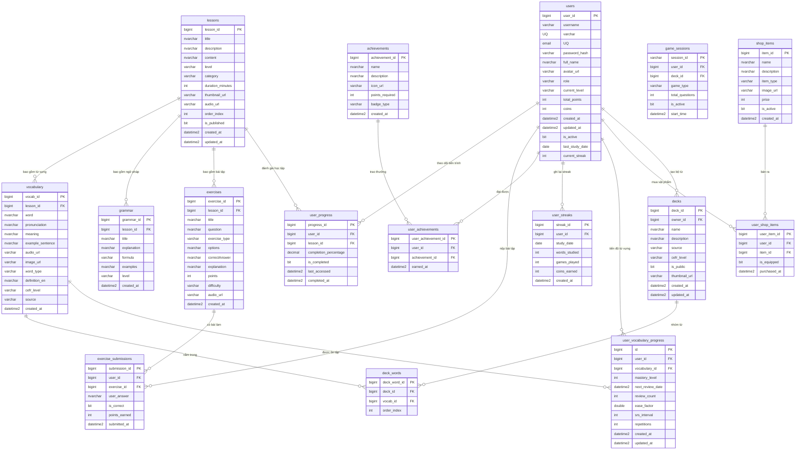
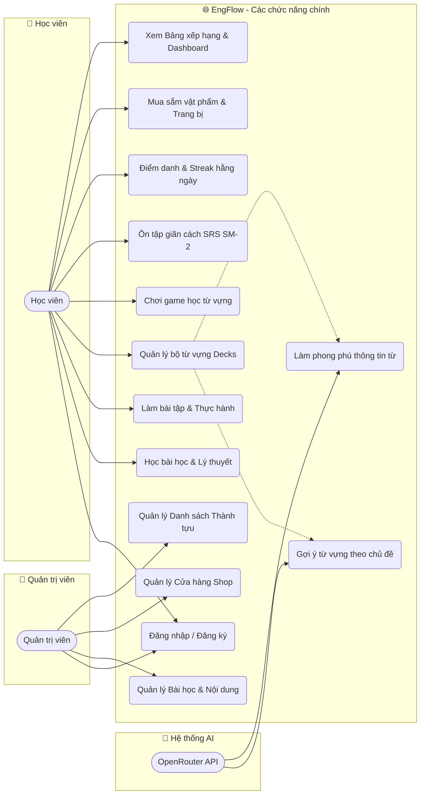

# 📚 EngFlow - Website Tự Học Ngoại Ngữ (Tiếng Anh)

---

## 📋 Tổng Quan Dự Án

**EngFlow** là một nền tảng tự học tiếng Anh trực tuyến hiện đại, kết hợp giữa việc học lý thuyết bài bản, ôn tập từ vựng bằng thuật toán thông minh, luyện tập qua các trò chơi tương tác cao (Gamification), và tích hợp trí tuệ nhân tạo (AI) để tối ưu hóa lộ trình học tập cá nhân hóa.

### Mục Tiêu Dự Án
- **Cá nhân hóa việc học từ vựng**: Sử dụng thuật toán ôn tập giãn cách **SuperMemo-2 (SM-2)** giúp học viên ghi nhớ từ vựng lâu dài với số lần ôn tập tối thiểu.
- **Tăng cường tương tác**: Thay thế các bài kiểm tra nhàm chán bằng **5 chế độ chơi game tương tác** (Flashcards, Trắc nghiệm, Lật thẻ nhớ, Gõ từ, Nghe viết).
- **Trải nghiệm Game hóa (Gamification)**: Thúc đẩy động lực học tập hằng ngày thông qua chuỗi ngày học liên tục (Streak), tích lũy Coins, Cửa hàng vật phẩm (Shop) để mua trang bị Avatar/Huy hiệu, và Bảng xếp hạng học tập (Leaderboard).
- **Tích hợp trí tuệ nhân tạo (AI)**: Cho phép tạo bộ từ vựng cá nhân hóa theo chủ đề và trình độ mong muốn, tự động làm phong phú định nghĩa tiếng Anh, phát âm IPA, và câu ví dụ thông qua **API OpenRouter**.
- **Ngôn ngữ thiết kế trực quan**: Giao diện mang phong cách **Neobrutalism (Bauhaus)** độc đáo, cá tính với các mảng màu tương phản, viền đen dày nổi bật và hiệu ứng nhấn cơ học (hard shadows).

---

## 🛠️ Công Nghệ Sử Dụng

### Backend (Spring Boot 4.0.6)
- **Java 25**: Phiên bản JDK mới nhất hỗ trợ các tính năng ngôn ngữ hiện đại.
- **Spring Boot 4.0.x**: Framework chính phát triển Backend RESTful APIs.
- **Spring Security**: Xác thực và phân quyền dựa trên **JWT (JSON Web Token)**.
- **Spring Data JPA**: Quản lý truy xuất dữ liệu database.
- **Hibernate**: ORM framework thực hiện ánh xạ thực thể xuống cơ sở dữ liệu.
- **Spring WebFlux (WebClient)**: Giao tiếp bất đồng bộ, tối ưu cho việc gọi API OpenRouter sinh nội dung từ AI.
- **Lombok**: Giảm thiểu mã boilerplate (Getter, Setter, Builder).
- **Microsoft SQL Server**: Hệ quản trị cơ sở dữ liệu quan hệ (chạy trên Docker).
- **Redis**: Caching dữ liệu tĩnh và quản lý session.

### Frontend (Vue 3 + Vite)
- **Vue 3 (Composition API)**: Framework Javascript xây dựng giao diện Single Page Application (SPA).
- **Vite**: Build tool thế hệ mới giúp tăng tốc độ phát triển và hot reload.
- **Pinia**: State Management chính thức của Vue 3, quản lý trạng thái đăng nhập, profile người dùng.
- **Vue Router**: Điều hướng các trang SPA linh hoạt.
- **Tailwind CSS**: Utility-first CSS framework hỗ trợ tùy biến giao diện nhanh chóng.
- **Lucide Icons**: Bộ thư viện vector icons phong cách hiện đại.
- **Axios**: HTTP client gửi yêu cầu lên REST API Backend.

---

## 🏗️ Kiến Trúc Hệ Thống

Dự án áp dụng kiến trúc Client-Server phân lớp rõ ràng:

```
┌─────────────────────────────────────────────────────────┐
│                    Client Layer                         │
│       (Vue 3 SPA + Vite + Tailwind CSS + Pinia)        │
└──────────────────────────┬──────────────────────────────┘
                           │ HTTP / HTTPS (REST API)
                           │ Bearer JWT Token
┌──────────────────────────▼──────────────────────────────┐
│                    Controller Layer                     │
│  (Xử lý Auth, Lesson, Deck, Game, Srs, Coin, Streak, AI)│
└──────────────────────────┬──────────────────────────────┘
                           │ Data Transfer Objects (DTO)
┌──────────────────────────▼──────────────────────────────┐
│                     Service Layer                       │
│  (Chứa Business Logic, SM-2 Algorithm, OpenRouter API)  │
└──────────────────────────┬──────────────────────────────┘
                           │ Entity Mapping / JPA Queries
┌──────────────────────────▼──────────────────────────────┐
│                    Repository Layer                     │
│         (16 Spring Data JPA Repositories)               │
└──────────────────────────┬──────────────────────────────┘
                           │
             ┌─────────────┴─────────────┐
             │                           │
┌────────────▼───────────┐   ┌───────────▼───────────┐
│  MS SQL Server         │   │  Redis                │
│  (English_learning DB) │   │  (Caching & Session)  │
└────────────────────────┘   └───────────────────────┘
```

---

## 📁 Cấu Trúc Thư Mục Dự Án

### Backend Directory Structure
```
engflow/
├── src/
│   ├── main/
│   │   ├── java/com/datn/engflow/
│   │   │   ├── config/               # Cấu hình Security, CORS, Redis, WebClient
│   │   │   ├── controller/           # REST API Controllers (14 controllers)
│   │   │   ├── exception/            # Xử lý ngoại lệ toàn cục (Global Exception Handler)
│   │   │   ├── model/
│   │   │   │   ├── dto/              # DTOs cho Requests và Responses
│   │   │   │   ├── entity/           # JPA Entities (16 thực thể ánh xạ DB)
│   │   │   │   └── enums/            # Các enum (UserRole, GameType, LessonLevel, v.v.)
│   │   │   ├── repository/           # JPA Repositories (16 interfaces)
│   │   │   ├── security/             # Cấu hình JWT Provider, Filter, UserPrincipal
│   │   │   └── service/              # Interfaces và Implementations (Logic nghiệp vụ)
│   │   └── resources/
│   │       ├── application.properties # Cấu hình môi trường (port, db, openrouter, redis)
│   │       └── data.sql              # Script chèn dữ liệu mẫu ban đầu (seed data)
├── docker-compose.yml                # Khởi động SQL Server và Redis trên container
└── pom.xml                           # Quản lý dependencies của Maven
```

### Frontend Directory Structure
```
frontend/
├── src/
│   ├── assets/                       # Chứa ảnh, css toàn cục (Tailwind & Bauhaus CSS)
│   ├── components/
│   │   ├── bauhaus/                  # Các component UI phong cách Bauhaus (FlashcardFlip, StreakCalendar, v.v.)
│   │   └── common/                   # Header, Footer, Loading chung
│   ├── composables/                  # Toast notification, hooks dùng chung
│   ├── router/                       # Định tuyến router điều hướng các trang
│   ├── services/                     # Lớp kết nối HTTP API thông qua Axios
│   ├── store/                        # Quản lý State toàn cục bằng Pinia
│   └── views/                        # Các trang giao diện chính
│       ├── Home.vue
│       ├── Lessons.vue               # Danh sách bài học lý thuyết
│       ├── LessonDetail.vue          # Xem lý thuyết bài học, bài tập ngữ pháp
│       ├── Profile.vue               # Profile cá nhân, Coin Shop, Streak Calendar
│       ├── Leaderboard.vue           # Bảng xếp hạng người học
│       ├── SearchVocabulary.vue      # Tìm kiếm từ vựng trong hệ thống
│       └── luyentu/                  # Học từ vựng theo Decks qua Games
│           ├── Decks.vue             # Bộ từ vựng hệ thống và cá nhân
│           ├── DeckDetail.vue        # Lựa chọn chế độ Game học tập
│           ├── AiVocabGenerator.vue  # Giao diện tạo từ vựng bằng AI
│           ├── FlashcardGame.vue     # Chế độ học thẻ ghi nhớ (SRS)
│           ├── QuizGame.vue          # Trắc nghiệm nghĩa từ vựng
│           ├── MemoryMatchGame.vue   # Lật thẻ ghép đôi từ - nghĩa
│           ├── TypingGame.vue        # Điền từ viết chính xác
│           └── ListeningGame.vue     # Nghe audio gõ lại từ vựng
```

---

## 🗄️ Thiết Kế Database (MS SQL Server)

Dự án sử dụng cơ sở dữ liệu quan hệ Microsoft SQL Server gồm **16 bảng** (đã tối ưu hóa, loại bỏ bảng rác `study_sessions` và bổ sung thêm các index/unique constraint mới để nâng cao hiệu năng).

### Sơ đồ thực thể quan hệ ERD (Entity Relationship Diagram)



### Các Ràng Buộc (Constraint) và Index Tối Ưu Mới

Để bảo vệ tính toàn vẹn dữ liệu ở tầng DB và tối ưu hóa tốc độ truy vấn, các cấu hình sau đã được thiết lập:
- **`user_streaks`**: Unique constraint trên cặp `(user_id, study_date)`. Điều này ngăn ngừa việc một tài khoản bị ghi nhận trùng lắp streak điểm danh trong cùng một ngày.
- **`deck_words`**: Unique constraint trên cặp `(deck_id, vocab_id)`. Đảm bảo một từ vựng chỉ xuất hiện duy nhất một lần trong một bộ từ.
- **`user_shop_items`**: Unique constraint trên cặp `(user_id, item_id)`. Ngăn chặn việc mua trùng lặp một vật phẩm không tiêu hao.
- **`game_sessions`**: Thêm index `idx_game_session_user_active` trên `(user_id, is_active)` giúp tăng hiệu suất khi kiểm tra và lấy các game session đang diễn ra của người dùng.

---

## 🎯 Phân Tích Chức Năng (Use Case)

### Sơ đồ Use Case tổng quát



### Các Tính Năng Nổi Bật Đặc Thù

#### 1. Thuật toán Ôn tập Giãn cách (Spaced Repetition System - SRS)
Khi người dùng ôn tập từ vựng qua chế độ Flashcards, sau khi lật thẻ, họ sẽ tự đánh giá mức độ ghi nhớ từ `0` đến `5`:
- **0 - 2**: Quên từ. Thuật toán thiết lập lại số lần lặp (`repetitions = 0`), khoảng thời gian ôn tập tiếp theo là 1 ngày (`interval = 1`).
- **3**: Nhớ từ nhưng mất nhiều nỗ lực ôn tập.
- **4**: Nhớ tốt, phản xạ nhanh.
- **5**: Nhớ cực kỳ sâu sắc, hoàn hảo.

Hệ thống cài đặt giải thuật **SM-2** tiêu chuẩn để tính toán độ khó của từ (`easeFactor`) và tự động lên lịch ngày học tiếp theo:
$$NextReviewDate = CurrentDate + Interval$$
Với $Interval$ tiếp theo được nhân với $easeFactor$ tương ứng, tối ưu thời gian học giúp từ vựng đi thẳng vào trí nhớ dài hạn.

#### 2. AI Vocabulary Generator & Enrichment
- Người dùng chỉ cần nhập một **Chủ đề** (ví dụ: *"Job Interview"*, *"Travel at Airport"*) và chọn **Trình độ CEFR** (A1 - C2), hệ thống sẽ gửi prompt đến AI qua API OpenRouter để tạo nhanh tối đa 50 từ vựng.
- AI phản hồi cấu trúc JSON chứa đầy đủ: Từ vựng, Phiên âm quốc tế IPA, loại từ, Định nghĩa tiếng Anh, Nghĩa tiếng Việt, và Câu ví dụ thực tế.
- Chức năng **Enrich Word** tự động tra cứu, bổ sung thông tin chi tiết cho một từ bất kỳ do người dùng tự nhập tay vào Deck của mình.

#### 3. Chế độ Game Học Tập Đa Dạng
- **Flashcard**: Xem thẻ từ vựng với hoạt ảnh quay 3D mượt mà.
- **Quiz Game**: Bài tập trắc nghiệm chọn nghĩa đúng của từ trong 4 phương án.
- **Memory Match**: Thử thách trí nhớ tìm cặp tương ứng giữa từ tiếng Anh và nghĩa tiếng Việt bằng cách lật các ô bài úp ngược.
- **Typing Practice**: Cho biết định nghĩa, người học phải gõ lại chính xác ký tự cấu thành từ để luyện chính tả.
- **Listening Game**: Phát âm thanh giọng đọc bản xứ từ vựng, người học lắng nghe và gõ lại đúng từ.
- **Mixed Mode**: Trộn lẫn ngẫu nhiên tất cả các chế độ chơi trên để kiểm tra toàn diện.

#### 4. Game hóa (Gamification) & Cửa hàng (Shop)
- Học tập hoặc làm bài tập đúng sẽ được thưởng Coins.
- Người dùng dùng Coins để mua các vật phẩm độc đáo trong Shop như: Ảnh đại diện động, Màu nền chủ đề hồ sơ, danh hiệu đặc biệt.
- **Daily Streak**: Theo dõi số ngày liên tục học tập. Chỉ cần hoàn thành học từ vựng hoặc chơi game trong ngày, hệ thống sẽ thực hiện điểm danh tự động duy trì Streak tăng dần.

---

## 🔌 Danh Sách API Endpoints Thực Tế

### 1. Authentication (`/api/auth`)
- `POST /api/auth/register`: Đăng ký tài khoản mới.
- `POST /api/auth/login`: Đăng nhập hệ thống (trả về JWT Token).

### 2. User & Progress (`/api/users`)
- `GET /api/users/profile`: Lấy thông tin tài khoản đang đăng nhập.
- `GET /api/users/progress`: Lấy tổng hợp tiến độ học tập (bài học đã học, tỷ lệ hoàn thành).

### 3. Bài Học (`/api/lessons`)
- `GET /api/lessons`: Lấy tất cả bài học (kèm trạng thái hoàn thành cá nhân).
- `GET /api/lessons/{id}`: Xem chi tiết lý thuyết, danh sách từ vựng, ngữ pháp của bài học.
- `POST /api/lessons` *(Admin)*: Tạo mới bài học.
- `PUT /api/lessons/{id}` *(Admin)*: Cập nhật bài học.
- `DELETE /api/lessons/{id}` *(Admin)*: Xóa bài học.

### 4. Bài Tập (`/api/exercises`)
- `POST /api/exercises/submit`: Nộp đáp án bài tập để chấm điểm và cộng Points.
- `GET /api/exercises/submissions`: Lấy lịch sử nộp bài tập của người dùng.

### 5. Từ Vựng & Ngữ Pháp (`/api/vocabulary`, `/api/grammar`)
- `GET /api/vocabulary/search`: Tìm kiếm từ vựng theo từ khóa.
- `POST /api/vocabulary`: Thêm mới từ vựng hệ thống.

### 6. Quản Lý Bộ Từ Vựng Decks (`/api/decks`)
- `GET /api/decks`: Lấy danh sách Decks công khai của hệ thống.
- `GET /api/decks/my`: Lấy danh sách Decks do cá nhân tự tạo/sở hữu.
- `GET /api/decks/{id}`: Xem chi tiết danh sách từ vựng nằm trong Deck.
- `POST /api/decks`: Tạo mới một Deck cá nhân.
- `PUT /api/decks/{id}`: Sửa tên/mô tả bộ Deck.
- `DELETE /api/decks/{id}`: Xóa Deck cá nhân.
- `POST /api/decks/{id}/words`: Thêm một từ vựng vào bộ Deck.

### 7. AI API (`/api/ai`)
- `POST /api/ai/generate-vocab`: Sử dụng AI tạo nhanh danh sách từ vựng theo Topic, CEFR, số lượng yêu cầu.
- `POST /api/ai/enrich-word`: Yêu cầu AI điền tự động định nghĩa, ví dụ, phiên âm IPA cho từ vựng.

### 8. Luyện Tập Game (`/api/games`)
- `GET /api/games/quiz/{deckId}`: Lấy danh sách câu hỏi cho game Trắc nghiệm từ bộ Deck.
- `GET /api/games/memory/{deckId}`: Lấy danh sách thẻ ghép đôi cho game Lật hình.
- `GET /api/games/typing/{deckId}`: Lấy câu hỏi game Gõ từ.
- `GET /api/games/listening/{deckId}`: Lấy câu hỏi game Nghe.
- `GET /api/games/mixed/{deckId}`: Lấy danh sách câu hỏi tổng hợp.
- `POST /api/games/submit`: Lưu kết quả game, cộng Coins và duy trì Streak điểm danh.

### 9. Hệ Thống Ôn Tập Giãn Cách (`/api/srs`)
- `POST /api/srs/review`: Đăng ký kết quả tự đánh giá chất lượng (0-5) cho từ vựng.
- `GET /api/srs/due/{deckId}`: Lấy danh sách từ đến hạn cần ôn tập hôm nay trong Deck.
- `GET /api/srs/stats`: Lấy thống kê số từ đã thuộc (Mastered), đang học (Learning), từ mới (New).

### 10. Điểm Danh & Streak (`/api/streak`)
- `POST /api/streak/checkin`: Điểm danh thủ công hoặc ghi nhận tiến trình học tập.
- `GET /api/streak/history`: Lấy lịch sử học tập (số từ đã học, số game đã chơi, coin kiếm được) theo số ngày được yêu cầu.
- `GET /api/streak/current`: Lấy số ngày Streak hiện tại.

### 11. Cửa Hàng & Coins (`/api/coins`, `/api/shop`)
- `GET /api/coins/balance`: Lấy số lượng coins hiện tại của người dùng.
- `POST /api/coins/earn`: Cộng thêm coins khi hoàn thành thử thách.
- `GET /api/shop/items`: Lấy các vật phẩm đang bán trong Cửa hàng.
- `POST /api/shop/buy/{itemId}`: Mua vật phẩm từ shop bằng Coins.
- `GET /api/shop/owned`: Lấy các vật phẩm người dùng đã mua.
- `POST /api/shop/equip/{itemId}`: Trang bị vật phẩm (Avatar, khung viền, màu nền profile).

### 12. Bảng Xếp Hạng (`/api/leaderboard`, `/api/dashboard`)
- `GET /api/leaderboard`: Lấy danh sách xếp hạng người học dựa trên tổng Points tích lũy.
- `GET /api/dashboard/stats`: Lấy thống kê biểu đồ học tập cá nhân.

---

## 🚀 Hướng Dẫn Khởi Chạy Dự Án

### Yêu Cầu Cài Đặt Sẵn
- **Docker / Docker Desktop** (Chạy SQL Server và Redis).
- **Java JDK 21 hoặc 25** (Cấu hình JAVA_HOME).
- **Node.js 18+ và npm**.
- **Maven 3.8+**.

### Bước 1: Khởi Chạy Các Container (Docker)
Di chuyển đến thư mục gốc của dự án chứa file `docker-compose.yml`, chạy lệnh sau để chạy SQL Server và Redis ngầm:
```bash
docker-compose up -d
```
- SQL Server sẽ lắng nghe tại cổng `1433`.
- Redis lắng nghe tại cổng `6379`.

### Bước 2: Tạo Cơ Sở Dữ Liệu
Kết nối tới SQL Server bằng các phần mềm quản lý (Azure Data Studio, SSMS, DBeaver) qua thông tin đăng nhập:
- **Host**: `localhost,1433`
- **Username**: `sa`
- **Password**: `YourPassword123`

Tạo mới database có tên:
```sql
CREATE DATABASE english_learning;
```

### Bước 3: Cấu Hình Môi Trường Backend (`.env`)
Tạo file `.env` tại thư mục gốc của dự án để cấu hình các biến bảo mật cho ứng dụng Spring Boot:
```properties
DB_PASSWORD=YourPassword123
JWT_SECRET=ChuanBiMotKeyRatDaiVaBaoMatDeMaHoaTokenChongHack1234567890!
OPENROUTER_API_KEY=sk-or-v1-xxxxxxxxxx
```

### Bước 4: Khởi Chạy Backend (Spring Boot)
Thực hiện build dự án và chạy dev server bằng Maven Wrapper:
```bash
# Windows
.\mvnw.cmd clean install
.\mvnw.cmd spring-boot:run

# Linux / macOS
chmod +x mvnw
./mvnw clean install
./mvnw spring-boot:run
```
*Lưu ý: Do `spring.jpa.hibernate.ddl-auto=update` và `spring.sql.init.mode=always` đang được kích hoạt, các bảng dữ liệu sẽ tự động tạo và dữ liệu mẫu (seed data) trong file `src/main/resources/data.sql` sẽ được chèn tự động.*

Backend REST API sẽ chạy thành công tại: `http://localhost:8080`.

### Bước 5: Khởi Chạy Frontend (Vue 3 + Vite)
Mở một terminal mới, chuyển hướng vào thư mục `/frontend`:
```bash
cd frontend
npm install
npm run dev
```
Giao diện người dùng sẽ chạy trực tiếp tại: `http://localhost:5173`.

---

## 👥 Tài Khoản Kiểm Thử Mặc Định (Seed Accounts)

Bạn có thể dùng các tài khoản mẫu sau để đăng nhập trực tiếp trải nghiệm dự án:

| Email | Mật Khẩu | Quyền Hạn (Role) |
|-------|----------|------------------|
| `user@gmail.com` | `123456` | Học viên (USER) |
| `admin@gmail.com` | `123456` | Quản trị viên (ADMIN) |
