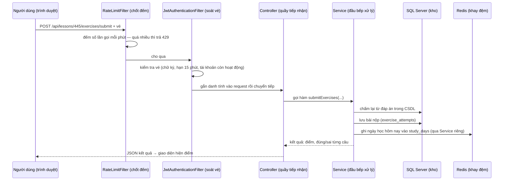
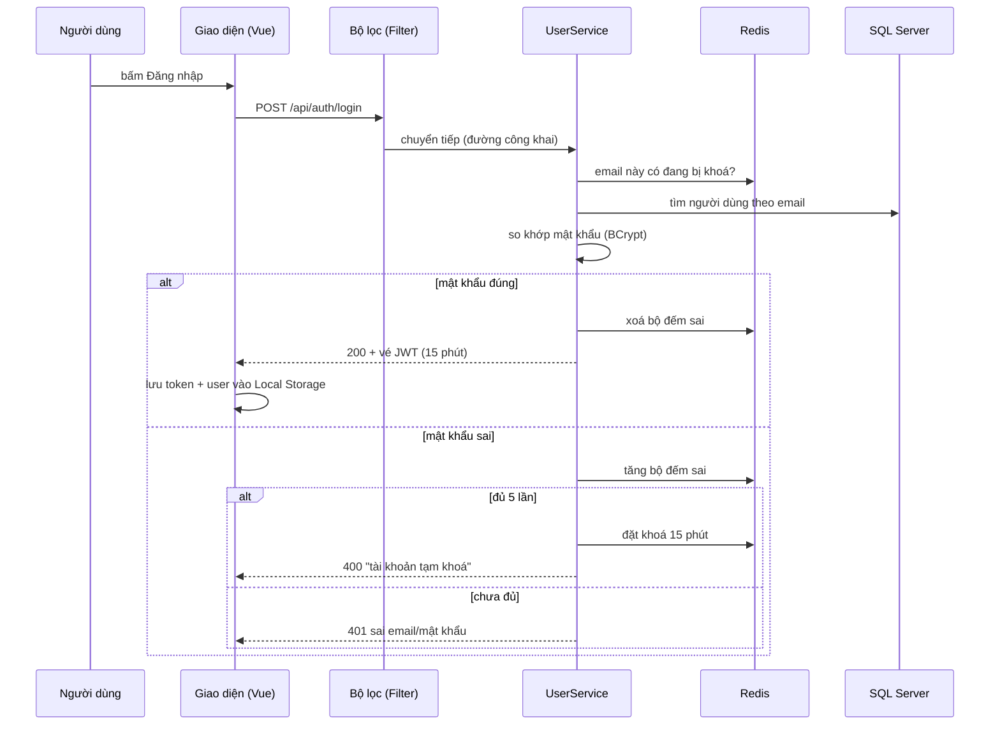
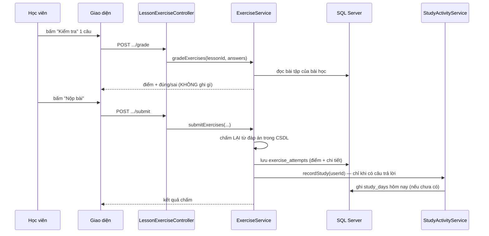
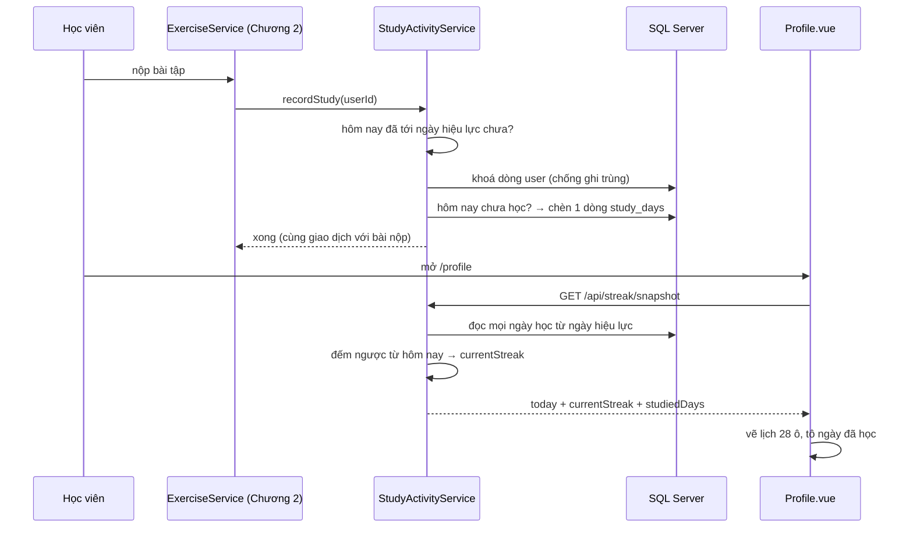
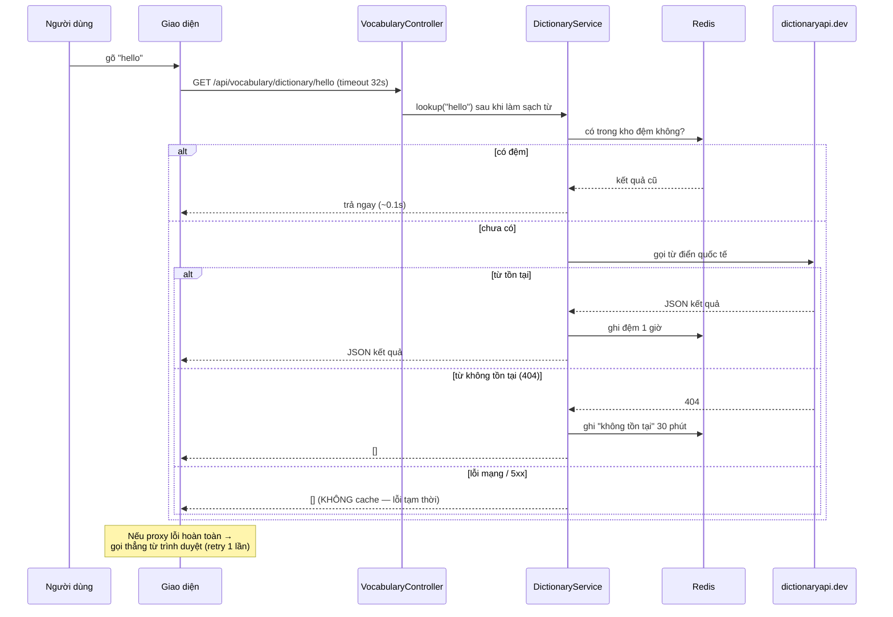

# EngFlow — Cẩm nang demo đồ án tốt nghiệp (4 chức năng)

<!-- doc-citation-remap: đã map (audit-v21) -->

> **Ai đọc cũng hiểu.** Tài liệu này viết cho **cả người không biết lập trình**: mỗi chức năng được giải thích
> bằng lời thường trước, rồi mới tới phần kỹ thuật (có **file + đoạn code thật, comment từng dòng** để đối chiếu
> khi hội đồng hỏi sâu).
>
> **Đã kiểm chứng lại toàn bộ ngày 28/09/2026 (đối chiếu lại sau audit-v21)** bằng cách đọc trực tiếp source,
> chạy lại **toàn bộ test + build**, đo lại mọi con số trong tài liệu (SQL/API/docker) và **hand-verify toàn bộ
> trích dẫn dòng**. Lần kiểm chứng trước: 28/09/2026 (audit-v20).
> Tài khoản demo: `user@gmail.com` / `admin@gmail.com`, mật khẩu `123456`.
>
> **Ghi chú kỹ thuật:** tài liệu trích code bằng **167 chỗ dạng `File.java:số-dòng`**. Các trích dẫn đã được
> kiểm tra lại và **hiện trỏ đúng** (chạy `python sweep/harness/doc_citation_remap.py --force` → *giữ nguyên
> 167/167*, không lệch). Một số đoạn code được **lược trích** (`...`) cho gọn; khi cần đối chiếu chính xác,
> mở thẳng file nguồn theo số dòng ghi trong tài liệu.
> Nếu bạn sửa source lần nữa, hãy chạy lại bước map này **và** đọc lại khối code in ra trước khi demo.
>
> **Số liệu đã đo lại ngày 28/09/2026:** lessons 1470 (1465 xuất bản) · exercises 43 738 · users 5 ·
> vocabulary 118 · test backend **541/0/0/11** · test frontend **194/1 (32 file)** · build **177.75 kB**.
> Riêng dữ liệu "hoạt động" trong CSDL có tăng thật (không phải rác): `video_attempts` 4→5,
> `study_days` 4→5, `exercise_attempts` 33→34 — xem [Phụ lục D](#phu-luc-d).

**4 chức năng trọng tâm của tài liệu** (đánh số theo đề cương gốc, thứ tự *dạy* thì khác — xem bảng dưới):

| # | Chức năng | Chương trong tài liệu | Vì sao dạy thứ tự này |
|---|---|---|---|
| Flow 3 | Đăng nhập / Đăng ký | [Chương 1](#flow-auth) | Phải hiểu đăng nhập trước, vì 3 chức năng kia đều cần đăng nhập |
| Flow 1 | Bài học / Bài tập | [Chương 2](#flow-bai-hoc) | Chức năng lớn nhất, nhiều code nhất |
| Flow 2 | Cơ chế Streak | [Chương 3](#flow-streak) | Dùng lại kiến thức "ghi dữ liệu" của Chương 2 |
| Flow 4 | Tìm kiếm / Sắp xếp | [Chương 4](#flow-tim-kiem) | Nhẹ nhất, để cuối cho dễ thở |

---

## Mục lục

**Phần nền tảng — đọc trước khi vào 4 chức năng:**

- [Phần I — Chuẩn bị trước khi demo (10 phút)](#chuan-bi)
- [Phần II — Từ điển thuật ngữ cho người không biết lập trình](#thuat-ngu)
- [Phần III — Kiến trúc hệ thống trong 10 phút](#kien-truc)

**4 chức năng trọng tâm** (mỗi chương có 7 mục theo cùng một khuôn):

- [Chương 1 — Đăng nhập / Đăng ký (Flow 3)](#flow-auth)
  - [1.1. Nó là gì (lời thường)](#flow-auth-plain) · [1.2. Kịch bản bấm](#flow-auth-demo) · [1.3. Trả lời 30 giây](#flow-auth-30s)
  - [1.4. Luồng end-to-end](#flow-auth-e2e) · [1.5. Đọc code từng dòng](#flow-auth-code) · [1.6. Bẫy & mini-FAQ](#flow-auth-trap) · [1.7. Bảng endpoint](#flow-auth-endpoints)
- [Chương 2 — Bài học / Bài tập (Flow 1)](#flow-bai-hoc)
  - [2.1. Nó là gì (lời thường)](#flow-bai-hoc-plain) · [2.2. Kịch bản bấm](#flow-bai-hoc-demo) · [2.3. Trả lời 30 giây](#flow-bai-hoc-30s)
  - [2.4. Luồng end-to-end](#flow-bai-hoc-e2e) · [2.5. Đọc code từng dòng](#flow-bai-hoc-code) · [2.6. Bẫy & mini-FAQ](#flow-bai-hoc-trap) · [2.7. Bảng endpoint](#flow-bai-hoc-endpoints)
- [Chương 3 — Cơ chế Streak (Flow 2)](#flow-streak)
  - [3.1. Nó là gì (lời thường)](#flow-streak-plain) · [3.2. Kịch bản bấm](#flow-streak-demo) · [3.3. Trả lời 30 giây](#flow-streak-30s)
  - [3.4. Luồng end-to-end](#flow-streak-e2e) · [3.5. Đọc code từng dòng](#flow-streak-code) · [3.6. Bẫy & mini-FAQ](#flow-streak-trap) · [3.7. Bảng endpoint](#flow-streak-endpoints)
- [Chương 4 — Tìm kiếm / Sắp xếp (Flow 4)](#flow-tim-kiem)
  - [4.1. Nó là gì (lời thường)](#flow-tim-kiem-plain) · [4.2. Kịch bản bấm](#flow-tim-kiem-demo) · [4.3. Trả lời 30 giây](#flow-tim-kiem-30s)
  - [4.4. Luồng end-to-end](#flow-tim-kiem-e2e) · [4.5. Đọc code từng dòng](#flow-tim-kiem-code) · [4.6. Bẫy & mini-FAQ](#flow-tim-kiem-trap) · [4.7. Bảng endpoint](#flow-tim-kiem-endpoints)

**Câu hỏi & trả lời:**

- [Chương 5 — Câu hỏi xoáy liên luồng](#lien-flow)
- [Chương 6 — Q&A A — 25 câu sát 4 chức năng](#qa-gan)
- [Chương 7 — Q&A B — 25 câu mở rộng](#qa-mo-rong)
- [Chương 8 — Hạn chế đã biết + cách trả lời khéo](#han-che)

**Phụ lục — dùng ngay trước và trong buổi bảo vệ:**

- [Phụ lục A — Kịch bản demo 5 phút](#phu-luc-a)
- [Phụ lục B — Kịch bản demo 10 phút](#phu-luc-b)
- [Phụ lục C — Checklist tổng duyệt + xử lý sự cố](#phu-luc-c)
- [Phụ lục D — Số liệu phải đo lại trước khi chốt slide](#phu-luc-d)
- [Phụ lục E — Cheat card 1 trang (đọc 5 phút trước khi vào phòng)](#phu-luc-e)

---

> ⚠️ **Số dòng có thể lệch vài dòng** sau mỗi lần sửa code. Mỗi đoạn đều ghi `file:dòng`. Nếu lệch, tìm lại bằng:
> `grep -n "existsByEmail" src/main/java/com/datn/engflow/service/UserService.java`
>
> **Cách dùng tài liệu:** khi demo, chỉ cần thuộc mục **"Kịch bản bấm"** và **"Trả lời 30 giây"**. Phần
> **"Kỹ thuật"** chỉ mở ra khi hội đồng hỏi sâu.

---

<a id="chuan-bi"></a>
## Phần I — Chuẩn bị trước khi demo (làm trước 10 phút)

### I.1. Bảng kiểm nhanh

| Việc | Lệnh / cách làm | Phải thấy gì |
|---|---|---|
| Bật hệ thống | Mở Docker Desktop, chờ 8 dịch vụ "Up": `docker ps` | 8 dòng: `sqlserver`, `redis`, `backend`, `minio`, `whisper`, `tts`, `frontend`, `tailscale` |
| Kiểm tra web sống | Mở `http://localhost:5173` | Trang chủ EngFlow hiện ra |
| Kiểm tra máy chủ sống | `Invoke-RestMethod "http://localhost:8080/api/lessons?size=1"` | Trả về dữ liệu JSON (không báo lỗi đỏ) |
| **Làm ấm kho tra từ** (quan trọng) | Vào `/search`, tra trước 2–3 từ quen: `hello`, `book`, `study` | Kết quả hiện ra; các lần demo sau sẽ nhanh (~0.1 giây) |
| Đăng nhập thử 2 tài khoản | Học viên `user@gmail.com`, quản trị `admin@gmail.com` — mật khẩu `123456` | Vào được trang chủ, góc phải hiện tên |
| Mở sẵn các tab sẽ dùng | Tab 1: `/lessons` · Tab 2: `/profile` · Tab 3: `/search` | — |

> 💡 **Mẹo demo:** nếu vừa sửa code backend, phải dựng lại hộp Docker: `docker compose up -d --build backend`
> (code trong hộp Docker chỉ đổi khi dựng lại). Quên bước này là demo sẽ chạy code cũ.

### I.2. An toàn khi demo — 3 cái bẫy làm hỏng buổi demo

**Bẫy 1 — Bấm quá nhanh có thể bị chặn tạm (429).** Hệ thống giới hạn số lần gọi mỗi phút:

| Nhóm | Giới hạn | Nghĩa là |
|---|---|---|
| Đăng nhập / đăng ký | 20 lần / phút / mỗi địa chỉ mạng | Đừng thử login sai liên tục |
| Gửi email (quên mật khẩu) | 5 lần / phút | Đừng bấm "quên mật khẩu" nhiều lần |
| Tải file lên (ảnh/audio/video) | 15 lần / phút | Đừng upload nhiều file liên tiếp |
| Tạo đơn thanh toán | 10 lần / phút | Đừng bấm "Tạo đơn" nhiều lần |
| AI (sinh từ vựng) | 10 lần / phút | — |
| Toàn hệ thống (mọi thứ còn lại) | 100 lần / phút | Bấm chậm rãi, không F5 liên tục |

> 💡 **Mẹo nhớ:** 6 dòng trên là **6 "chốt đếm"** trong `RateLimitFilter.java` — endpoint nào càng đắt
> tài nguyên thì hạn mức càng hẹp; phần còn lại chịu chung hạn mức 100/phút.

> ⚠️ **Bẫy:** nếu thấy lỗi **429** ("quá nhiều yêu cầu"), đừng hoảng — chỉ cần **chờ ~1 phút** rồi làm tiếp.
> Đừng F5 liên tục vì càng F5 càng bị chặn lâu hơn.

**Bẫy 2 — Thử đăng nhập sai 5 lần sẽ KHOÁ tài khoản 15 phút.** Đây là tính năng chống dò mật khẩu.

> ⚠️ **Bẫy:** khi demo tính năng khoá tài khoản, **TUYỆT ĐỐI không dùng `user@gmail.com`** — sẽ khoá mất
> tài khoản chính của buổi demo. Hãy dùng một email rác (ví dụ `thu-nghiem@example.com`) hoặc bỏ qua bước này.
> Ngoài ra: lần sai thứ 5 trả về **400** (không phải 401) kèm câu "Tài khoản tạm khóa do đăng nhập sai 5 lần" —
> đây là điều đúng, không phải lỗi.

**Bẫy 3 — Vé đăng nhập (JWT) chỉ sống 15 phút.** Hết hạn thì mọi thao tác bị đá về trang đăng nhập.

> 💡 **Mẹo demo:** trước khi bắt đầu nói, đăng nhập lại một lần cho chắc. Nếu đang demo mà bị đá về `/login`,
> chỉ cần nói: *"Vé 15 phút đã hết hạn, hệ thống tự bảo vệ — em đăng nhập lại"* rồi đăng nhập lại bình thường.

### I.3. Câu nói mở đầu buổi demo (thuộc lòng)

> "EngFlow là nền tảng tự học tiếng Anh. Em xin demo 4 chức năng: đăng nhập, học bài và làm bài tập,
> chuỗi ngày học (streak), và tìm kiếm. Máy chủ chạy Spring Boot, giao diện Vue 3, dữ liệu trong SQL Server,
> bộ đệm Redis — tất cả đóng gói bằng Docker nên chỉ cần một lệnh là chạy được."

---

<a id="thuat-ngu"></a>
## Phần II — Từ điển thuật ngữ (cho người không biết lập trình)

> 🧭 **Bối cảnh:** phần này không cần thuộc lòng. Khi gặp một từ lạ ở các chương sau, quay lại đây tra.
> Mỗi từ đều có: **nghĩa lời thường** → **ví dụ thật trong EngFlow** → **xuất hiện lần đầu ở đâu**.

### II.1. Ba mươi thuật ngữ nền tảng

| # | Thuật ngữ | Nghĩa trong lời thường | Ví dụ trong EngFlow |
|---|---|---|---|
| 1 | **API** | "Cửa phục vụ" của máy chủ: giao diện để phần mềm khác gửi yêu cầu và nhận kết quả, giống quầy tiếp tân của toà nhà | Giao diện web gọi API để lấy danh sách bài học |
| 2 | **Endpoint** | Một "quầy" cụ thể trong cái cửa phục vụ đó — mỗi việc một quầy | `POST /api/auth/login` là quầy "đăng nhập" |
| 3 | **HTTP method** | "Động từ" của yêu cầu: GET = hỏi lấy dữ liệu, POST = gửi tạo mới, PUT = sửa, DELETE = xoá | Mở trang bài học dùng GET, bấm nộp bài dùng POST |
| 4 | **Status code** | "Mã trả lời" 3 chữ số của máy chủ: 200 = xong, 400 = bạn gửi sai, 401 = chưa đăng nhập, 403 = không có quyền, 404 = không tìm thấy, 409 = trùng dữ liệu, 429 = bị chặn vì gọi quá nhanh, 500 = máy chủ lỗi | Đăng ký trùng email → 409 |
| 5 | **JSON** | "Phiếu dữ liệu" dạng văn bản có cấu trúc, máy đọc được — giống phiếu khám bệnh có các ô cố định | Máy chủ trả `{"token": "...", "user": {...}}` khi đăng nhập |
| 6 | **Request / Response body** | "Phần nội dung" gửi đi / nhận về (phần còn lại chỉ là phong bì) | Body đăng nhập chứa email + mật khẩu |
| 7 | **Header** | "Phần phong bì" của yêu cầu: thông tin phụ như danh tính, loại dữ liệu | `Authorization: Bearer <vé>` đính kèm mỗi lần gọi API |
| 8 | **Bearer token** | "Vé đeo thẻ": chuỗi ký tự chứng minh bạn đã đăng nhập, đính kèm mỗi yêu cầu | Sau khi login, mọi API gọi kèm vé này |
| 9 | **JWT** | Loại vé điện tử có chữ ký số, gồm 3 phần ngăn bởi dấu chấm; ai sửa nội dung là chữ ký hỏng ngay | Vé 15 phút phát khi đăng nhập thành công |
| 10 | **Claim** | "Ô thông tin" ghi trên vé | Vé EngFlow ghi: email, vai trò (`ADMIN`/`USER`), có premium hay không |
| 11 | **Hash** (băm) | Biến mật khẩu thành chuỗi loạn xạ **một chiều** — không thể dịch ngược, chỉ so khớp | Mật khẩu `123456` lưu thành `$2a$10$...` (BCrypt) |
| 12 | **Salt** (muối) | Chuỗi ngẫu nhiên trộn thêm trước khi băm, để 2 người cùng mật khẩu vẫn ra 2 chuỗi khác nhau | Không ai nhìn vào CSDL đoán được mật khẩu |
| 13 | **Validation** (`@Valid`) | "Kiểm tra đầu vào" tự động: thiếu email, mật khẩu ngắn... bị chặn ngay cửa | Đăng ký thiếu email → 400 kèm danh sách lỗi |
| 14 | **Entity / Table / Row / Column** | Entity = bản thiết kế bảng trong code; Table = bảng thật trong CSDL; Row = một dòng (một bản ghi); Column = một cột | Bảng `users` có 5 dòng (5 người dùng) |
| 15 | **Primary key / Foreign key** | Khoá chính = số căn cước của dòng; khoá ngoại = "số căn cước người khác" để nối 2 bảng | `study_days.user_id` trỏ về `users.id` |
| 16 | **ORM / JPA / JPQL** | Cầu nối giữa code Java và bảng SQL: viết code kiểu đối tượng, hệ thống tự dịch thành câu SQL | `userRepository.save(user)` tự thành `INSERT INTO users...` |
| 17 | **Migration & `ddl-auto`** | "Quản lý phiên bản cấu trúc bảng". EngFlow tắt Flyway, dùng Hibernate `ddl-auto=update` tự cập nhật bảng theo entity | Thêm cột mới vào entity → khởi động là bảng tự có cột |
| 18 | **Transaction** (giao dịch) | "Làm trọn gói": một loạt thao tác hoặc thành công hết, hoặc hỏng hết — không làm nửa vời | Nộp bài: lưu điểm + ghi ngày học phải cùng thành công |
| 19 | **Propagation (MANDATORY)** | Luật "phải đi cùng gói": hàm ghi ngày học bắt buộc nằm trong giao dịch của người gọi, không tự mở gói riêng | `recordStudy` chạy chung giao dịch với lúc lưu bài nộp |
| 20 | **Pessimistic lock** | "Khoá cửa phòng": trong lúc một người đang ghi, người khác phải chờ — chống 2 người ghi đè nhau | Chống tạo trùng 2 dòng điểm danh cùng ngày |
| 21 | **Redis** | "Kho siêu nhanh" lưu tạm ngoài CSDL chính: giỏ đựng đồ cần truy cập liên tục | Lưu bộ đếm đăng nhập sai, kho đệm tra từ |
| 22 | **Cache & hit/miss** | Kho đệm: "hit" = có sẵn lấy ngay (~0.1s); "miss" = chưa có, phải đi lấy rồi cất vào (~20s lần đầu) | Tra từ lần 2 lấy từ đệm Redis (1 giờ) |
| 23 | **Negative cache** | "Ghi nhớ cả cái không có": từ điển xác nhận không có từ đó thì ghi nhớ 30 phút, khỏi hỏi lại | Tra từ sai chính tả không làm chậm lần sau |
| 24 | **Rate limit** (giới hạn tần suất) | "Chốt bảo vệ đếm số lần": quá N lần mỗi phút thì chặn tạm | Đăng nhập quá 20 lần/phút → 429 |
| 25 | **Debounce** (chờ gõ xong) | "Đợi người ta gõ xong mới phản hồi" — thay vì gọi máy chủ mỗi ký tự | Ô tìm kiếm chờ 0.35 giây sau ký tự cuối |
| 26 | **Pagination** (phân trang) | "Chia tập kết quả thành từng trang", mỗi lần chỉ lấy một trang cho nhẹ | Danh sách bài học: 12 bài/trang |
| 27 | **Projection** | "Chỉ lấy các cột cần dùng" thay vì cả dòng to — nhẹ hơn nhiều | Danh sách bài học bỏ qua cột nội dung dài |
| 28 | **N+1 query** | "Lỗi hỏi từng dòng một": hiển thị 20 dòng mà gọi 21 câu SQL thay vì 1 câu | Trang leaderboard đọc streak 1 câu cho cả trang |
| 29 | **Lazy / Eager + JOIN FETCH** | "Lấy kèm hay lấy sau": dữ liệu liên quan có thể lấy ngay khi cần (JOIN FETCH) hoặc để lúc nào dùng mới lấy | Mở bài học lấy kèm luôn danh sách từ vựng |
| 30 | **Scheduler / cron** | "Đồng hồ hẹn giờ": công việc tự chạy theo lịch | 20:00 mỗi tối gửi email nhắc học |

### II.2. Mười hai chữ viết tắt hay gặp

| Viết tắt | Đọc là | Nghĩa |
|---|---|---|
| **JWT** | "giâu-ti" | JSON Web Token — vé điện tử có chữ ký (mục 9 ở trên) |
| **JPA** | "giây-pê-a" | Java Persistence API — chuẩn ORM của Java (mục 16) |
| **JPQL** | "giây-pê-quy-en" | Ngôn ngữ truy vấn kiểu đối tượng của JPA (viết giống SQL nhưng làm việc với entity) |
| **DTO** | "đê-tê-ô" | Data Transfer Object — "hộp đựng dữ liệu" để gửi qua lại giữa giao diện và máy chủ |
| **ORM** | "o-rom" | Object-Relational Mapping — cầu nối code ↔ bảng (mục 16) |
| **SQL** | "ét-quy-en" | Structured Query Language — ngôn ngữ hỏi CSDL |
| **TTL** | "tê-tê-en" | Time To Live — "hạn sử dụng" của dữ liệu trong kho đệm Redis |
| **SMTP** | "ét-em-tê-pê" | Giao thức gửi email (EngFlow dùng Gmail) |
| **CSP** | "xê-ét-pê" | Content Security Policy — "luật chặn script lạ" trên trình duyệt |
| **XSS** | "xờ-xờ-ét" | Cross-Site Scripting — lỗ hổng chèn mã độc vào trang web |
| **SPA** | "ét-pê-a" | Single Page Application — web một trang, không tải lại toàn bộ khi chuyển màn hình |
| **SRS** | "ét-a-rét" | Spaced Repetition System — ôn tập ngắt quãng (tính năng flashcard) |

---

<a id="kien-truc"></a>
## Phần III — Kiến trúc hệ thống trong 10 phút

> 🧭 **Bối cảnh:** hội đồng gần như luôn hỏi "kiến trúc hệ thống của em là gì?" và "một request đi qua đâu?".
> Phần này trang bị đủ để trả lời cả hai, kể cả khi bạn không biết code.

### III.1. Bức tranh lớn — 4 tầng

Hãy hình dung hệ thống như **một nhà hàng**:

| Tầng | Trong nhà hàng | Trong EngFlow | Công nghệ |
|---|---|---|---|
| **Giao diện** (Frontend) | Thực đơn, phòng ăn | Những gì người dùng nhìn thấy và bấm | Vue 3 + Vite + Tailwind |
| **Máy chủ** (Backend) | Đầu bếp + người phục vụ | Nơi xử lý mọi luật lệ: chấm điểm, đếm streak, phát vé | Spring Boot 4.0.6 (Java 25) |
| **Kho dữ liệu** (Database) | Kho nguyên liệu | Nơi cất dữ liệu vĩnh viễn: người dùng, bài học, bài nộp | Microsoft SQL Server 2019 |
| **Kho đệm** (Cache) | Khay nguyên liệu để gần bếp | Nơi giữ tạm thứ cần truy cập nhanh: bộ đếm đăng nhập, kho tra từ | Redis |

Ngoài ra còn **8 dịch vụ con** chạy chung trong Docker (mục III.3), và **AI chạy hoàn toàn cục bộ** trên máy (mục III.6).

### III.2. Một cú click đi qua đâu?

Ví dụ: học viên bấm **"Nộp bài"**. Hành trình như sau:



> 💡 **Mẹo demo:** có thể mở sơ đồ này trên slide và nói: *"Mọi request đều đi qua 2 chốt: chốt đếm tốc độ
> và chốt soát vé, trước khi tới quầy xử lý. Sau đó máy chủ mới làm việc với CSDL và kho đệm."*

**Điểm mấu chốt để trả lời hội đồng:** giao diện (trình duyệt) **không bao giờ** tự quyết định điểm số,
quyền hạn, hay streak — mọi luật đều nằm ở máy chủ. Sửa code trên trình duyệt cũng vô ích.

### III.3. Tám dịch vụ đang chạy (docker ps)

| # | Dịch vụ | Vai trò trong lời thường |
|---|---|---|
| 1 | `engflow-sqlserver` | Kho dữ liệu chính (SQL Server 2019, CSDL `english_learning`) |
| 2 | `engflow-redis` | Kho đệm (bộ đếm, khoá đăng nhập, cache tra từ) |
| 3 | `engflow-backend` | Máy chủ chính — cổng 8080 |
| 4 | `engflow-frontend` | Giao diện web — cổng 5173 |
| 5 | `engflow-minio` | Kho file (audio/video bài nói của tính năng speaking) |
| 6 | `engflow-whisper` | "Tai nghe" AI — nghe file ghi âm thành văn bản — cổng 9002 |
| 7 | `engflow-tts` | "Giọng đọc" AI — đọc văn bản thành tiếng |
| 8 | `engflow-tailscale` | "Cổng kết nối" cho webhook thanh toán SePay từ Internet vào máy |

> 💡 **Nếu hội đồng đếm thấy 9 dòng `docker ps`:** `docker-compose.yml` khai **9 service**, nhưng dòng thứ 9
> là `sqlserver-init` — container **chạy một lần rồi thoát** (`restart: "no"`) để tạo CSDL/lược đồ lúc khởi
> động, **không phải dịch vụ thường trực**. 8 dòng "Up" ở trên mới là các dịch vụ đang chạy. Nói:
> *"Có 8 dịch vụ thường trực; thêm một container khởi tạo CSDL chạy một lần lúc dựng."*

### III.4. Cơ sở dữ liệu — 18 bảng chia 7 nhóm

> Nguồn chi tiết: `docs/erd-sql-guide.md` (tài liệu ERD đầy đủ để đưa vào luận văn).
>
> **Đếm cho đúng (đo 28/09/2026):** DB có **18 bảng thật** = **17 bảng nghiệp vụ** (bảng dưới đây)
> **+ `user_streaks`** (bảng legacy, xem bẫy cuối mục). Ngoài ra còn `sysdiagrams` (bảng nội bộ của
> SQL Server, không tính). Đừng đưa `user_streaks`/`sysdiagrams` vào ERD luận văn.

| # | Nhóm | Bảng | Vai trò |
|---|---|---|---|
| 1 | Người dùng & đăng nhập | `users` | Một bảng duy nhất: tài khoản, vai trò, premium |
| 2 | Bài học | `lessons` | Nội dung bài học (1465 bài đã xuất bản — đo 28/09/2026) |
| 3 | Từ vựng & bộ từ | `vocabulary`, `decks`, `deck_words` | Kho từ và các bộ từ (deck) |
| 4 | Tiến độ & ôn tập | `user_progress`, `user_vocabulary_progress` | Tiến độ đọc bài + engine ôn tập ngắt quãng |
| 5 | Streak & chính sách học | `study_days`, `study_policy` | Điểm danh từng ngày — nguồn sự thật của streak |
| 6 | Bài tập | `exercises`, `exercise_attempts`, `lesson_submissions` | 43 738 câu hỏi (bảng lớn nhất — đo 28/09/2026) + lịch sử nộp bài + bài nộp lesson |
| 7 | Premium | `speaking_prompts`, `speaking_submissions`, `payment_transactions`, `video_lessons`, `video_attempts` | Luyện nói, thanh toán, video |

> ⚠️ **Bẫy khi bị hỏi về ERD:** trong CSDL thật còn sót bảng `user_streaks` (1 dòng) là **bảng cũ** —
> không code nào đọc nó, streak thật nằm ở `study_days`. **Đừng đưa bảng này vào ERD luận văn.**

### III.5. Redis — 3 việc chính

| Việc | Key (tên trong Redis) | Hạn sử dụng | Vì sao cần |
|---|---|---|---|
| Đếm đăng nhập sai | `login_fail:<email>` | 15 phút | Sai 5 lần → khoá tài khoản |
| Khoá tạm tài khoản | `login_lock:<email>` | 15 phút | Chặn dò mật khẩu |
| Kho đệm tra từ điển | `dict:<từ>` | 1 giờ (404: 30 phút) | Lần tra thứ 2 nhanh ~0.1s thay vì ~20s |

Ngoài ra Redis còn giữ **chống trùng email nhắc streak** (mỗi tối chỉ gửi 1 lần/người) — chi tiết ở [Chương 3](#flow-streak).

### III.6. AI chạy hoàn toàn cục bộ

Không dùng API AI đám mây trả tiền — tất cả chạy trên máy:

| Con AI | Nhiệm vụ | Công nghệ |
|---|---|---|
| `qwen2.5:1.5b` | Sinh bài tập, sinh từ vựng theo chủ đề | Ollama (cổng 11434) |
| `qwen2.5:3b` | Chấm điểm bài nói theo tiêu chí | Ollama |
| Faster-Whisper | Nghe file ghi âm → văn bản | Dịch vụ `engflow-whisper` (cổng 9002) |

> 🎯 **Nếu bị hỏi "vì sao AI chạy local?"** → xem [Q&A B câu 1](#qa-mo-rong) (trả lời theo khuôn ADR:
> bối cảnh → quyết định → phương án đã cân nhắc → hệ quả).

### III.7. Ba câu tóm tắt kiến trúc (thuộc để trả lời)

> 1. "Hệ thống theo kiến trúc **3 lớp**: giao diện Vue 3 — máy chủ Spring Boot — CSDL SQL Server, thêm Redis làm kho đệm."
> 2. "Mọi request đi qua **2 chốt lọc**: chống spam theo phút và soát vé đăng nhập, trước khi tới controller."
> 3. "Toàn bộ đóng gói bằng **Docker Compose 8 dịch vụ**, chạy bằng một lệnh `docker compose up -d`."

---

<a id="flow-auth"></a>
## Chương 1 — Đăng nhập / Đăng ký (Flow 3)

> **Nguồn:** `AuthController.java`, `UserService.java`, `JwtTokenProvider.java`, `JwtAuthenticationFilter.java`,
> `SecurityConfig.java`, `store/modules/auth.js`, `views/Login.vue`, `utils/safeRedirect.js`.
> **Cập nhật:** 2026-09-28.

<a id="flow-auth-plain"></a>
### 1.1. Nó là gì (lời thường)

Hãy hình dung toà nhà có **thẻ ra vào**:

- **Đăng ký** = làm thẻ mới. Hệ thống kiểm tra email/tên đăng nhập chưa ai dùng, rồi cất mật khẩu đã **mã hoá**
  (không ai đọc được, kể cả người quản trị cơ sở dữ liệu). Làm thẻ xong thì **được vào luôn** — không phải xếp hàng lại.
- **Đăng nhập** = quẹt thẻ. Nếu đúng, hệ thống phát một **vé điện tử (JWT)** có hạn **15 phút** để đi lại trong
  toà nhà mà không phải quẹt lại mỗi bước.
- **Vé có ghi thông tin** (**claim**): bạn là ai, vai trò gì (học viên hay quản trị), có gói premium hay không.
  Vé có **chữ ký số** — ai sửa nội dung vé là chữ ký hỏng ngay, hệ thống biết liền.
- **Chống dò mã** = gõ sai 5 lần thì cửa **tạm khoá 15 phút** (đếm bằng **Redis**).
- **Vé hết hạn** = hệ thống tự đưa về trang đăng nhập (không phải lỗi — là tính năng bảo vệ).

> 🧭 **Bối cảnh:** ba chức năng còn lại (bài học, streak, tìm kiếm) đều **cần vé** cho các thao tác ghi
> (nộp bài, xem lịch sử). Vì vậy hiểu chương này là nền tảng cho cả tài liệu.

<a id="flow-auth-demo"></a>
### 1.2. Kịch bản bấm (trên UI)

1. Mở `/register` → nhập email, tên đăng nhập, mật khẩu → bấm **Đăng ký**.
   - **Phải thấy gì:** vào thẳng trang chủ **không cần đăng nhập lại** (hệ thống tự đăng nhập sau khi đăng ký).
2. Mở `/login` → nhập `user@gmail.com` / `123456` → bấm **Đăng nhập**.
   - **Phải thấy gì:** vào trang `/lessons`, góc phải hiện tên người dùng.
3. Mở DevTools (F12) → tab **Application → Local Storage** → chỉ cho hội đồng thấy 2 mục `token` và `user` vừa xuất hiện.
   - **Câu nói kèm:** *"Giao diện lưu vé và thông tin người dùng ở đây; mỗi lần gọi máy chủ, vé được đính kèm
     ở phần phong bì (header) của yêu cầu."*
4. **(Điểm nhấn phân quyền)** Đang đăng nhập bằng tài khoản học viên, gõ thẳng `/admin/users` → **bị đá về trang chủ**
   (khu quản trị chặn học viên).
   - **Câu nói kèm:** *"Đây là lớp chặn phía giao diện; phía máy chủ cũng có lớp chặn riêng — sửa URL cũng vô ích."*
5. **(Điểm nhấn bảo mật — xem bẫy dưới)** Đăng xuất, thử đăng nhập sai mật khẩu **5 lần**.
   - **Phải thấy gì:** ngay lần thứ 5 báo **"Tài khoản tạm khóa do đăng nhập sai 5 lần. Thử lại sau 15 phút."**
   - ⚠️ **An toàn demo:** dùng email rác (ví dụ `thu-nghiem@example.com`) hoặc **bỏ qua bước này** — TUYỆT ĐỐI
     không thử với `user@gmail.com` kẻo khoá mất tài khoản demo chính.

> 💡 **Mẹo demo:** bước 4 nên làm **trước** bước 5. Nếu lỡ khoá tài khoản học viên, tài khoản quản trị
> `admin@gmail.com` vẫn còn nguyên — có thể dùng admin tiếp tục demo các phần khác.

<a id="flow-auth-30s"></a>
### 1.3. Trả lời 30 giây

> "Đăng ký chặn trùng email và tên đăng nhập, mật khẩu mã hoá bằng BCrypt nên không đọc ngược được.
> Đăng nhập sai 5 lần thì khoá 15 phút (đếm trong Redis). Khi đăng nhập thành công, hệ thống phát vé JWT
> hết hạn sau 15 phút, trong vé có ghi vai trò và quyền premium. Mỗi yêu cầu sau đó được một bộ lọc soát vé
> trước khi tới xử lý — giao diện chặn ở một lớp, máy chủ chặn thêm một lớp nữa."

<a id="flow-auth-e2e"></a>
### 1.4. Luồng end-to-end (đánh số)

**Luồng A — Đăng ký:**

1. Người dùng bấm **Đăng ký** → trình duyệt gọi `POST /api/auth/register` với `{username, email, password, fullName}`.
2. `SecurityConfig` cho phép đường này đi qua **không cần vé** (`permitAll`) — `SecurityConfig.java:121`.
3. `AuthController.registerUser` nhận request, từ chối ngay nếu dữ liệu sai định dạng (`@Valid`) — `AuthController.java:43-47`.
4. `UserService.register` hỏi CSDL "email này có chưa?" và "tên đăng nhập này có chưa?" — `UserService.java:194-200`.
5. Nếu trùng → ném lỗi → `GlobalExceptionHandler` đổi thành **HTTP 409** kèm thông báo tiếng Việt.
6. Nếu chưa trùng → **băm mật khẩu bằng BCrypt** rồi lưu người dùng mới — `UserService.java:201-211`.
7. Máy chủ **phát vé JWT luôn** cho người vừa đăng ký (tự đăng nhập) — `UserService.java:212-214`.
8. Giao diện nhận `{token, user}`, cất vào Local Storage và chuyển vào trang chủ — `auth.js:76-94`.

**Luồng B — Đăng nhập:**

1. Người dùng bấm **Đăng nhập** → `POST /api/auth/login` với `{email, password}`.
2. `UserService.login` **chuẩn hoá email** (cắt khoảng trắng, chuyển chữ thường) rồi kiểm tra **có đang bị khoá không?**
   — `UserService.java:235-251`. Redis hỏng thì bỏ qua bước này (**fail-open**) chứ không chặn người dùng.
3. Kiểm tra mật khẩu qua `AuthenticationManager` (bên trong là BCrypt so khớp) — `UserService.java:254-257`.
4. **Đúng** → xoá bộ đếm sai, phát vé JWT mới — `UserService.java:260-268`.
5. **Sai** → tăng bộ đếm `login_fail:<email>` trong Redis; đủ **5 lần** thì đặt khoá `login_lock:<email>` 15 phút
   và trả **HTTP 400** kèm số phút còn lại — `UserService.java:269-286`.
6. Giao diện lưu vé + người dùng, chuyển tới trang đã bị chặn trước đó (nếu có) — `Login.vue:67-81`.

**Luồng C — Mỗi yêu cầu sau đó (ví dụ mở `/lessons`):**

1. Giao diện đính vé vào header: `Authorization: Bearer <vé>` — `api.js:54`.
2. **Trước khi gửi**, giao diện tự kiểm tra hạn vé; hết hạn thì tự đăng xuất và đưa về `/login` — `api.js:37-48`.
3. `RateLimitFilter` đếm số yêu cầu mỗi phút (quá nhiều → 429).
4. `JwtAuthenticationFilter` kiểm tra chữ ký + hạn vé; vé hợp lệ thì nạp thông tin người dùng vào yêu cầu
   — `JwtAuthenticationFilter.java:62-87`.
5. `SecurityConfig` đối chiếu **đường dẫn + vai trò**: `/api/admin/**` chỉ ADMIN; còn lại phải có vé
   — `SecurityConfig.java:120-163`.
6. Controller xử lý như bình thường (Chương 2).



<a id="flow-auth-code"></a>
### 1.5. Đọc code từng dòng

#### a) Hai endpoint chính — `src/main/java/com/datn/engflow/controller/AuthController.java:28-59`

**Hợp đồng hàm `registerUser`:** Nhận: thông tin đăng ký (username, email, mật khẩu) · Trả: **201** + thông tin
người dùng kèm vé · Lỗi: **400** dữ liệu sai định dạng, **409** trùng email/tên đăng nhập.

```java
@RestController                       // Đánh dấu class này là "quầy API": mọi hàm trả JSON thay vì trang HTML
@RequestMapping("/api/auth")          // Tiền tố chung: mọi endpoint trong class đều bắt đầu bằng /api/auth
@RequiredArgsConstructor              // Lombok tự sinh hàm khởi tạo cho các field "final" bên dưới
@Slf4j                                // Lombok tự sinh biến `log` để ghi nhật ký
public class AuthController {

    private final UserService userService;              // "Đầu bếp" xử lý nghiệp vụ đăng nhập/đăng ký
    private final CloudinaryService cloudinaryService;  // Dịch vụ upload ảnh đại diện (dùng ở cuối class)

    @PostMapping("/register")         // Khai báo endpoint: POST /api/auth/register
    public ResponseEntity<UserResponse> registerUser(@Valid @RequestBody RegisterRequest registerRequest) {
        // @Valid: kích hoạt kiểm tra đầu vào (xem mục b bên dưới) — sai là chặn ngay, không vào trong hàm
        // @RequestBody: đọc JSON trong "phần nội dung" của yêu cầu và biến thành đối tượng Java
        UserResponse response = userService.register(registerRequest);   // Giao toàn bộ nghiệp vụ cho Service
        return new ResponseEntity<>(response, HttpStatus.CREATED);       // 201 Created — "đã tạo tài khoản mới"
    }

    @PostMapping("/login")            // POST /api/auth/login
    public ResponseEntity<UserResponse> authenticateUser(@Valid @RequestBody LoginRequest loginRequest) {
        UserResponse response = userService.login(loginRequest);         // Service làm hết: khoá, so khớp, phát vé
        return ResponseEntity.ok(response);                              // 200 OK — "thành công, đây là vé của bạn"
    }
}
```

**Tóm lại:** Controller chỉ làm 2 việc: **định tuyến URL** và **giao việc cho Service**. Không có logic nghiệp vụ
nào ở đây — nhờ vậy luật "khoá 5 lần" nằm một chỗ duy nhất, dễ kiểm thử.

> 🎯 **Nếu bị hỏi "sao đăng ký trả 201 còn đăng nhập trả 200?"** → 201 nghĩa là "tạo mới một tài nguyên thành công"
> (đúng chuẩn REST); đăng nhập không tạo gì mới nên dùng 200. Xem [Q&A A câu 1](#qa-gan).

#### b) Kiểm tra dữ liệu đầu vào — `src/main/java/com/datn/engflow/model/dto/request/RegisterRequest.java:23-38`

**Hợp đồng:** Nhận: 4 trường từ form đăng ký · Trả: chính nó (đã kiểm tra) · Lỗi: ném lỗi kiểm tra để
`@Valid` chuyển thành **400** kèm danh sách lỗi tiếng Việt.

```java
public class RegisterRequest {

    @NotBlank(message = "Tên đăng nhập không được để trống")     // Không được null/rỗng/toàn khoảng trắng
    @Size(min = 3, max = 50, message = "Tên đăng nhập từ 3 đến 50 ký tự")  // Độ dài hợp lệ
    private String username;

    @NotBlank(message = "Email không được để trống")             // Bắt buộc có
    @Email(message = "Email không đúng định dạng")               // Phải đúng dạng ...@... (máy kiểm, không phải người)
    private String email;

    @NotBlank(message = "Mật khẩu không được để trống")          // Bắt buộc có
    @Size(min = 6, message = "Mật khẩu phải tối thiểu 6 ký tự")  // Tối thiểu 6 ký tự
    private String password;

    private String fullName;                                      // Không bắt buộc — có thể để trống
}
```

**Tóm lại:** Mỗi dòng `@...` là một "luật cửa vào". Giao diện cũng kiểm tra, nhưng **máy chủ mới là trọng tài
cuối** — ai gọi thẳng API cũng phải qua đây.

#### c) Đăng ký: chặn trùng + băm mật khẩu + tự phát vé — `src/main/java/com/datn/engflow/service/UserService.java:193-215`

**Hợp đồng hàm `register`:** Nhận: `RegisterRequest` · Trả: `UserResponse` (kèm vé JWT) · Lỗi: **409** trùng
email/username.

```java
@Transactional                                    // Cả hàm là một "gói": hỏng giữa chừng thì hủy hết, không lưu nửa vời
public UserResponse register(RegisterRequest request) {
    if (userRepository.existsByEmail(request.getEmail())) {          // Hỏi CSDL: email này đã có ai dùng chưa?
        throw new ConflictException("Email đã tồn tại");             // Có rồi → lỗi 409 (Conflict = xung đột dữ liệu)
    }
    if (userRepository.existsByUsername(request.getUsername())) {    // Tương tự cho tên đăng nhập
        throw new ConflictException("Tên đăng nhập đã tồn tại");     // → 409
    }
    User user = User.builder()                                       // Bắt đầu "lắp ráp" người dùng mới
            .username(request.getUsername())                         // Lấy tên đăng nhập từ yêu cầu
            .email(request.getEmail())                               // Lấy email
            .passwordHash(passwordEncoder.encode(request.getPassword()))  // BĂM mật khẩu — không bao giờ lưu chữ gốc
            .fullName(request.getFullName())                         // Họ tên (có thể trống)
            .currentLevel(LessonLevel.ELEMENTARY)                    // Trình độ khởi điểm: Sơ cấp
            .avatarUrl("https://api.dicebear.com/7.x/adventurer/svg?seed=" + request.getUsername())
            // Ảnh đại diện tự sinh theo tên — người dùng mới không bị "mặt trắng" khi vào trang cá nhân
            .totalPoints(0)                                          // Điểm khởi điểm
            .isActive(true)                                          // Tài khoản đang hoạt động (admin có thể tắt sau)
            .build();                                                // Đóng gói thành đối tượng User
    User savedUser = userRepository.save(user);                      // Ghi xuống CSDL → có id do CSDL cấp
    log.info("Đăng ký thành công user: id={}, tự động tạo token đăng nhập", savedUser.getId());
    // Dòng nhật ký: khi vận hành có thể đối chiếu "ai đăng ký lúc nào" mà không cần mở CSDL
    String jwt = tokenProvider.generateToken(savedUser.getEmail(), Boolean.TRUE.equals(savedUser.getIsAdmin()) ? "ADMIN" : "USER", savedUser.getIsPremium());
    // PHÁT VÉ NGAY: chọn vai trò theo isAdmin; người mới luôn là "USER" vì isAdmin mặc định null
    return mapToUserResponse(savedUser, jwt);                        // Đóng gói câu trả lời: thông tin + vé
}
```

**Tóm lại:** Đăng ký = kiểm tra trùng → băm mật khẩu → lưu → **phát vé luôn**. Chính vì dòng cuối này mà
người dùng không phải đăng nhập lại sau khi đăng ký.

#### d) Đăng nhập — chống dò mật khẩu (phần 1: kiểm tra khoá) — `UserService.java:232-251`

**Hợp đồng hàm `login`:** Nhận: `LoginRequest` (email + mật khẩu) · Trả: `UserResponse` kèm vé mới · Lỗi:
**401** sai thông tin, **400** đang bị khoá.

```java
@Transactional
public UserResponse login(LoginRequest request) {
    log.info("Bắt đầu đăng nhập cho email: {}", request.getEmail());     // Ghi nhật ký (không ghi mật khẩu!)
    String normalizedEmail = request.getEmail() == null ? "" : request.getEmail().trim().toLowerCase();
    // CHUẨN HOÁ email: "  User@Gmail.COM  " → "user@gmail.com" — để "User@..." và "user@..." là MỘT tài khoản
    String lockKey = RedisConstants.LOGIN_LOCK_PREFIX + normalizedEmail;  // Chìa khoá Redis: "login_lock:user@gmail.com"
    String failKey = RedisConstants.LOGIN_FAIL_PREFIX + normalizedEmail;  // Chìa khoá Redis: "login_fail:user@gmail.com"

    // 1. Check lockout - fail-open if Redis down
    try {
        String locked = redisTemplate.opsForValue().get(lockKey);         // Hỏi Redis: tài khoản này có đang bị khoá?
        if (locked != null) {                                             // Có khoá → không cho thử tiếp
            long ttl = redisTemplate.getExpire(lockKey);                  // Còn bao nhiêu giây nữa mới hết khoá?
            throw new BadRequestException("Tài khoản tạm khóa do đăng nhập sai nhiều lần. Thử lại sau "
                    + Math.max(1, (ttl + 59) / 60) + " phút.");
            // Đổi giây → phút, làm tròn LÊN ((ttl+59)/60) và tối thiểu 1 phút — tránh hiện "0 phút"
        }
    } catch (BadRequestException e) {
        throw e;                                                          // Lỗi "đang khoá" là cố ý → ném tiếp
    } catch (Exception e) {
        log.warn("Redis unavailable for lock check {}: {} - fail-open", lockKey, e.getMessage());
        // Redis CHẾT → BỎ QUA bước kiểm khoá (fail-open) và vẫn cho đăng nhập bình thường.
        // Vì sao: thà cho người dùng vào còn hơn sập cả hệ thống chỉ vì Redis hỏng.
    }
```

> ⚠️ **Bẫy khi bị hỏi:** "Redis hỏng thì có khoá được tài khoản không?" → **Không** — hệ thống chọn *fail-open*:
> bảo vệ tính khả dụng lên trước. Đây là quyết định có chủ đích, ghi rõ trong code (xem [Q&A A câu 4](#qa-gan)).

#### e) Đăng nhập — so khớp và phát vé (phần 2) — `UserService.java:253-268`

```java
    try {
        Authentication authentication = authenticationManager.authenticate(
                new UsernamePasswordAuthenticationToken(request.getEmail(), request.getPassword())
        );
        // So khớp mật khẩu: AuthenticationManager tự tìm người dùng theo email rồi BCrypt-verify mật khẩu.
        // Sai mật khẩu → ném BadCredentialsException (nhảy xuống khối catch phía dưới).
        SecurityContextHolder.getContext().setAuthentication(authentication);   // Đánh dấu "đã xác thực" trong request này
        User user = userRepository.findByEmail(request.getEmail())              // Lấy đủ thông tin người dùng
                .orElseThrow(() -> new ResourceNotFoundException("User", "email", request.getEmail()));
        // 2. Success -> reset fail counter (best-effort)
        try {
            redisTemplate.delete(failKey);                                      // Đăng nhập đúng → xoá sạch bộ đếm sai
        } catch (Exception e) {
            log.warn("Redis unavailable for delete {}: {} - ignore", failKey, e.getMessage());
            // Redis hỏng khi xoá → chỉ ghi log, KHÔNG làm hỏng việc đăng nhập (best-effort)
        }
        String jwt = tokenProvider.generateToken(user.getEmail(), Boolean.TRUE.equals(user.getIsAdmin()) ? "ADMIN" : "USER", user.getIsPremium());
        // Phát vé mới: vai trò lấy từ CSDL (không tin gì từ trình duyệt), kèm cờ premium
        log.info("Đăng nhập thành công cho user: id={}, isAdmin={}", user.getId(), user.getIsAdmin());
        return mapToUserResponse(user, jwt);                                    // Trả về thông tin + vé
```

#### f) Đăng nhập — đếm sai và khoá tài khoản (phần 3) — `UserService.java:269-287`

```java
    } catch (BadCredentialsException ex) {                       // Rơi vào đây khi mật khẩu SAI
        // 3. Wrong password -> increment fail counter (fail-open)
        try {
            long fails = redisTemplate.opsForValue().increment(failKey);   // Tăng bộ đếm: 1, 2, 3...
            if (fails == 1) {
                redisTemplate.expire(failKey, RedisConstants.LOGIN_FAIL_TTL);
                // Lần sai ĐẦU TIÊN mới đặt hạn 15 phút cho bộ đếm — để bộ đếm tự "quên" sau 15 phút
            }
            if (fails >= RedisConstants.MAX_LOGIN_FAILS) {                 // Đủ 5 lần sai
                redisTemplate.opsForValue().set(lockKey, "1", Duration.ofMinutes(RedisConstants.LOGIN_LOCKOUT_MINUTES));
                // Đặt KHOÁ 15 phút — từ giờ mọi lần thử (kể cả mật khẩu đúng) đều bị chặn ở phần (d)
                log.warn("Tài khoản {} bị khóa {} phút do {} lần đăng nhập sai", normalizedEmail, RedisConstants.LOGIN_LOCKOUT_MINUTES, fails);
                throw new BadRequestException("Tài khoản tạm khóa do đăng nhập sai " + RedisConstants.MAX_LOGIN_FAILS + " lần. Thử lại sau " + RedisConstants.LOGIN_LOCKOUT_MINUTES + " phút.");
                // Lần thứ 5 trả 400 kèm thông báo rõ ràng — khác 401 của các lần sai trước
            }
        } catch (BadRequestException e) {
            throw e;                                                  // Lỗi "vừa khoá" là cố ý → ném tiếp
        } catch (Exception e) {
            log.warn("Redis unavailable for fail counter {}: {} - fail-open, propagate BadCredentials", failKey, e.getMessage());
            // Redis hỏng → bỏ qua việc đếm, vẫn trả 401 sai mật khẩu bình thường
        }
        throw ex;                                                     // Chưa đủ 5 lần → trả 401 (BadCredentials → 401)
    }
}
```

**Tóm lại:** 4 lần sai đầu trả **401** ("sai thông tin"); lần thứ **5 trả 400** ("đã khoá 15 phút").
Phân biệt này quan trọng khi hội đồng hỏi — xem [Q&A A câu 3](#qa-gan).

#### g) Bộ đếm và thời hạn nằm ở đâu — `src/main/java/com/datn/engflow/config/RedisConstants.java` (trích)

**Hợp đồng:** Nhận: không · Trả: các hằng số dùng chung · Lỗi: không có.

```java
    // Auth / rate limit / OTP
    public static final String LOGIN_FAIL_PREFIX = "login_fail:";   // Tiền tố chìa khoá đếm số lần sai
    public static final String LOGIN_LOCK_PREFIX = "login_lock:";   // Tiền tố chìa khoá đánh dấu đang khoá
    public static final Duration LOGIN_FAIL_TTL = Duration.ofMinutes(15);   // Bộ đếm tự hết hạn sau 15 phút
    public static final long LOGIN_LOCKOUT_MINUTES = 15L;                   // Thời gian khoá: 15 phút
    public static final int MAX_LOGIN_FAILS = 5;                            // Ngưỡng khoá: 5 lần sai
```

> 💡 **Mẹo trả lời:** "Mọi con số cấu hình nằm tập trung một file `RedisConstants` — muốn đổi 5 lần thành 3 lần
> chỉ sửa một dòng, không săn trong code."

#### h) Phát vé JWT — `src/main/java/com/datn/engflow/security/JwtTokenProvider.java:42-70`

**Hợp đồng hàm `generateToken`:** Nhận: email + vai trò + cờ premium · Trả: chuỗi vé có chữ ký · Lỗi: không
(cấu hình sai thì lỗi lúc khởi động).

```java
    private SecretKey getSigningKey() {
        return Keys.hmacShaKeyFor(jwtSecret.getBytes(StandardCharsets.UTF_8));
        // Biến "chìa khoá bí mật" (đọc từ biến môi trường JWT_SECRET) thành khoá ký HS256.
        // Ai không có chìa này thì không thể giả vé — đây là gốc của toàn bộ bảo mật.
    }

    public String generateToken(String email, String role, Boolean isPremium) {
        Date now = new Date();                                              // Thời điểm phát vé
        Date expiryDate = new Date(now.getTime() + jwtExpirationInMs);      // Hạn = bây giờ + 900 000 ms = 15 phút

        return Jwts.builder()
                .subject(email)                                             // "Chủ vé" = email — danh tính chính
                .claim("role", role)                                        // Ghi thêm ô "vai trò": ADMIN hoặc USER
                .claim("isPremium", isPremium != null && isPremium)         // Ô "có premium không" (null → false)
                .issuedAt(now)                                              // Thời điểm phát
                .expiration(expiryDate)                                     // Thời điểm hết hạn — filter sẽ kiểm ô này
                .signWith(getSigningKey())                                  // KÝ bằng HS256 — chống sửa nội dung
                .compact();                                                 // Đóng gói thành chuỗi "a.b.c"
    }
```

**Tóm lại:** Vé gồm 3 phần ngăn bởi dấu chấm; phần cuối là chữ ký. Sửa một chữ trong phần giữa là chữ ký hỏng,
máy chủ từ chối ngay.

#### i) Soát vé mỗi yêu cầu — `src/main/java/com/datn/engflow/security/JwtAuthenticationFilter.java:58-88`

**Hợp đồng hàm `doFilterInternal`:** Nhận: mọi yêu cầu HTTP · Trả: yêu cầu đã gắn danh tính (nếu vé hợp lệ)
hoặc **401** · Lỗi: 401 vé hết hạn/không hợp lệ/tài khoản bị tắt.

```java
    @Override
    protected void doFilterInternal(HttpServletRequest request, HttpServletResponse response, FilterChain filterChain) {
        try {
            String jwt = getJwtFromRequest(request);                    // Lấy vé từ header "Authorization: Bearer ..."

            if (StringUtils.hasText(jwt) && tokenProvider.validateToken(jwt)) {
                // Có vé VÀ chữ ký + hạn còn hợp lệ → đi tiếp; ngược lại bỏ qua (coi như khách vãng lai)
                String email = tokenProvider.getEmailFromJWT(jwt);      // Đọc danh tính từ vé (đã xác thực chữ ký)

                UserDetails userDetails = customUserDetailsService.loadUserByUsername(email);
                // Nạp lại thông tin người dùng từ CSDL — vé chỉ nói "là ai", CSDL mới nói "còn hoạt động không"
                // User bị admin tắt (is_active=0) vẫn giữ JWT hợp lệ cho tới khi hết
                // hạn (900s). Filter tự dựng AuthenticationToken thay vì đi qua
                // DaoAuthenticationProvider, nên isEnabled() không bao giờ được hỏi —
                // nếu không chặn ở đây, user bị tắt đi nộp bài sẽ gây 500 và cuốn theo
                // kết quả học tập (recordStudy chạy MANDATORY trong transaction caller).
                if (!userDetails.isEnabled()) {                         // Tài khoản đã bị quản trị viên tắt?
                    logger.warn("Disabled account attempted access: " + request.getRequestURI());
                    response.setStatus(HttpServletResponse.SC_UNAUTHORIZED);          // 401
                    response.setContentType(MediaType.APPLICATION_JSON_VALUE);        // Trả JSON, không phải trang HTML
                    response.setCharacterEncoding(StandardCharsets.UTF_8.name());     // Để tiếng Việt không bị lỗi font
                    response.getWriter().write("{\"status\":401,\"message\":\"Tài khoản đã bị vô hiệu hoá. Vui lòng liên hệ quản trị viên.\",\"errors\":null}");
                    return;                                             // DỪNG HẲN — không cho yêu cầu đi tiếp
                }
                UsernamePasswordAuthenticationToken authentication = new UsernamePasswordAuthenticationToken(
                        userDetails, null, userDetails.getAuthorities());
                // Đóng gói danh tính + quyền (ROLE_ADMIN / ROLE_USER) để phần sau dùng
                authentication.setDetails(new WebAuthenticationDetailsSource().buildDetails(request));
                // Ghi thêm chi tiết yêu cầu (địa chỉ IP...) — phục vụ nhật ký/kiểm toán

                SecurityContextHolder.getContext().setAuthentication(authentication);
                // GẮN danh tính vào yêu cầu hiện tại — từ đây controller gọi authentication.getName() là có email
            }
        } catch (ExpiredJwtException ex) {
            // ... (xem mục j)
```

> 🎯 **Nếu bị hỏi "vì sao phải nạp lại user từ CSDL mỗi request, sao không tin vé?"** → Vì vé sống 15 phút, mà
> quyền có thể đổi trong 15 phút đó (admin khoá tài khoản, cấp/thu premium). Nạp lại để quyền **luôn tươi**.
> Xem [Q&A A câu 7](#qa-gan).

#### j) Vé hỏng / hết hạn thì trả gì — `JwtAuthenticationFilter.java:88-119`

```java
        } catch (ExpiredJwtException ex) {                                  // Vé QUÁ HẠN
            logger.warn("JWT token expired for request: " + request.getRequestURI());
            // F7-BUG02 FIX: Return 401 for expired token instead of letting request continue unauthenticated (which causes 403)
            response.setStatus(HttpServletResponse.SC_UNAUTHORIZED);        // 401 — đúng ngữ nghĩa "chưa xác thực"
            response.setContentType(MediaType.APPLICATION_JSON_VALUE);
            response.setCharacterEncoding(StandardCharsets.UTF_8.name());
            response.getWriter().write("{\"status\":401,\"message\":\"Token đã hết hạn. Vui lòng đăng nhập lại.\",\"errors\":null}");
            // Thông báo riêng cho hết hạn → giao diện phân biệt được để tự đăng xuất
            return;                                                          // Dừng — không chạy tiếp filter chain
        } catch (JwtException | IllegalArgumentException ex) {              // Vé bị SỬA hoặc rác
            logger.warn("JWT token validation failed: " + ex.getMessage());
            // F7-BUG02 FIX: Return 401 for malformed/invalid tokens
            response.setStatus(HttpServletResponse.SC_UNAUTHORIZED);        // Cũng 401 nhưng thông báo khác
            response.setContentType(MediaType.APPLICATION_JSON_VALUE);
            response.setCharacterEncoding(StandardCharsets.UTF_8.name());
            response.getWriter().write("{\"status\":401,\"message\":\"Token không hợp lệ. Vui lòng đăng nhập lại.\",\"errors\":null}");
            return;
        } catch (Exception ex) {
            logger.error("Cannot set user authentication: " + ex.getMessage());
            // Added per F7-BUG01
            logger.warn("JWT authentication failed: " + ex.getMessage());
            // Lỗi bất ngờ → ghi log nhưng VẪN cho yêu cầu đi tiếp ở dạng "khách vãng lai";
            // endpoint nào cần đăng nhập sẽ tự chặn bằng 401 ở SecurityConfig
        }

        filterChain.doFilter(request, response);                            // Chuyển yêu cầu cho trạm kế tiếp
    }

    private String getJwtFromRequest(HttpServletRequest request) {
        String bearerToken = request.getHeader("Authorization");            // Đọc "phong bì" Authorization
        if (StringUtils.hasText(bearerToken) && bearerToken.startsWith("Bearer ")) {
            return bearerToken.substring(7);                                // Cắt 7 ký tự "Bearer " → còn lại là vé
        }
        return null;                                                        // Không có vé → trả null (khách vãng lai)
    }
```

**Tóm lại:** 3 nhánh lỗi — hết hạn (401 "hết hạn"), vé sửa/rác (401 "không hợp lệ"), lỗi bất ngờ (đi tiếp,
để lớp sau chặn). Đây là lý do giao diện phân biệt được và tự đưa người dùng về trang đăng nhập.

#### k) Băm mật khẩu bằng BCrypt — `src/main/java/com/datn/engflow/config/SecurityConfig.java:58-74`

```java
    @Bean                                            // "Khai báo nhà máy": Spring tạo MỘT đối tượng dùng chung toàn hệ thống
    public PasswordEncoder passwordEncoder() {
        return new BCryptPasswordEncoder();
        // BCrypt: băm một chiều + tự trộn "muối" (salt) ngẫu nhiên.
        // Cùng mật khẩu "123456" của 2 người → 2 chuỗi hash KHÁC NHAU; không thể dịch ngược.
    }

    @Bean
    public AuthenticationManager authenticationManager(AuthenticationConfiguration authenticationConfiguration) {
        return authenticationConfiguration.getAuthenticationManager();
        // Bộ "so khớp mật khẩu" chuẩn của Spring — UserService dùng nó ở bước đăng nhập
    }
```

#### l) Bảng phân quyền — `SecurityConfig.java:114-163` (trích — đây là chỗ dễ hiểu sai nhất)

**Hợp đồng:** Nhận: mọi yêu cầu HTTP · Trả: cho qua / chặn 401 / chặn 403 · Lỗi: 401 chưa đăng nhập, 403 sai vai trò.

```java
    @Bean
    public SecurityFilterChain securityFilterChain(HttpSecurity http) throws Exception {
        http
            .csrf(AbstractHttpConfigurer::disable)     // Tắt CSRF: vì vé nằm ở header (không dùng cookie phiên)
            .cors(cors -> cors.configurationSource(corsConfigurationSource()))   // Cho phép web :5173 gọi API :8080
            .sessionManagement(session -> session.sessionCreationPolicy(SessionCreationPolicy.STATELESS))
            // STATELESS: máy chủ KHÔNG nhớ phiên — mọi thứ nằm trong vé, đúng tinh thần JWT
            .authorizeHttpRequests(auth -> auth
                .requestMatchers("/api/auth/register", "/api/auth/login", "/api/auth/forgot-password", "/api/auth/reset-password").permitAll()
                // 4 endpoint công khai: phải vào được khi CHƯA có vé
                .requestMatchers(HttpMethod.GET, "/api/vocabulary/search", "/api/vocabulary/dictionary/*").permitAll()
                .requestMatchers(HttpMethod.GET, "/api/leaderboard").permitAll()     // Bảng xếp hạng cho khách xem
                // audit-v7 F54: Spring chọn rule KHỚP ĐẦU TIÊN. Rule GET /api/lessons/**
                // permitAll bên dưới đá chết rule attempts authenticated (trước đây đặt
                // sau) → attempts history thành PUBLIC, principal null → NPE 500.
                // Phải đặt rule cụ thể TRƯỚC rule phủ rộng.
                .requestMatchers(HttpMethod.GET, "/api/lessons/*/exercises/attempts/**").authenticated()
                // ↑ RULE HẸP đứng TRƯỚC — "lịch sử làm bài phải đăng nhập"
                .requestMatchers(HttpMethod.GET, "/api/lessons/**").permitAll()
                // ↑ RULE RỘNG đứng SAU — "bài học ai cũng xem được". Đảo thứ tự = lộ lịch sử làm bài!
                // ... (các rule GET công khai khác: speaking-prompts, video-prompts, video-lessons, decks — bỏ 6 dòng)
                .requestMatchers("/api/webhook/sepay").permitAll()   // SePay gọi vào, không thể có vé của ta
                .requestMatchers(HttpMethod.POST, "/api/ai/generate-vocab", "/api/ai/enrich-word").authenticated()
                .requestMatchers(HttpMethod.POST, "/api/ai/save-vocab").authenticated()   // Lưu từ AI sinh ra — cần vé
                .requestMatchers(HttpMethod.POST, "/api/lessons/*/exercises/submit").authenticated()   // Nộp bài cần vé
                .requestMatchers(HttpMethod.POST, "/api/lessons/*/exercises/grade").authenticated()    // Chấm thử cần vé
                .requestMatchers(HttpMethod.GET, "/api/lessons/*/exercises/attempts/**").authenticated()  // Lịch sử cần vé
                .requestMatchers(HttpMethod.POST, "/api/lessons", "/api/lessons/**").hasRole("ADMIN")   // Tạo/sửa bài: ADMIN
                .requestMatchers("/api/admin/**").hasRole("ADMIN")   // Toàn bộ khu quản trị: ADMIN
                // ... (các rule vocabulary/exercises/media/admin khác — bỏ 9 dòng)
                .anyRequest().authenticated()                        // Mặc định: MỌI thứ còn lại đều cần vé
            )
            // ... (CSP + frame options + referrer policy — xem mục m)
            .addFilterBefore(jwtAuthenticationFilter, UsernamePasswordAuthenticationFilter.class)
            // Gắn "trạm soát vé" vào trước trạm xác thực mặc định của Spring — để nó chạy ĐẦU TIÊN
            // ... (2 handler lỗi 401/403 — xem mục m)
        );
        return http.build();
    }
```

> ⚠️ **Bẫy lớn nhất của chương (F54):** Spring duyệt các rule **từ trên xuống, khớp cái đầu tiên rồi DỪNG**.
> Rule "lịch sử làm bài phải đăng nhập" **bắt buộc** đứng trước rule "bài học công khai" — từng bị đặt sai
> và làm lịch sử làm bài của mọi người thành công khai. Đây là câu chuyện bug thật để kể khi hội đồng hỏi
> "bug khó nhất" — xem [Q&A B câu 24](#qa-mo-rong).

#### m) Chính sách bảo mật trình duyệt + handler 401/403 — `SecurityConfig.java:165-190`

```java
            .headers(headers -> headers
                .contentSecurityPolicy(csp -> csp
                    .policyDirectives("default-src 'self'; " +
                        "script-src 'self' https://fonts.googleapis.com; " +
                        "style-src 'self' 'unsafe-inline' https://fonts.googleapis.com https://fonts.gstatic.com; " +
                        "img-src 'self' data: blob: https:; " +
                        "font-src 'self' https://fonts.gstatic.com data:; " +
                        "media-src 'self' blob: data: https:; " +
                        "connect-src 'self' https://api.dictionaryapi.dev http://localhost:* ws://localhost:*")
                )
                // CSP = "luật chặn script lạ": trình duyệt chỉ cho phép tải script từ chính hệ thống
                // và fonts.googleapis.com. Kẻ chèn được thẻ <script> lạ cũng không chạy được → chống XSS.
                // connect-src: chỉ được gọi API nội bộ + từ điển + localhost (WebSocket thông báo)
                .frameOptions(frame -> frame.sameOrigin())   // Chống bị nhúng vào trang khác (clickjacking)
                .referrerPolicy(referrer -> referrer.policy(ReferrerPolicy.STRICT_ORIGIN_WHEN_CROSS_ORIGIN))
                // Khi bấm link sang trang khác, chỉ gửi tên miền chứ không gửi cả URL (tránh lộ thông tin)
            )
            .addFilterBefore(jwtAuthenticationFilter, UsernamePasswordAuthenticationFilter.class)
            .exceptionHandling(ex -> ex
                .authenticationEntryPoint((request, response, authException) -> {          // Khi CHƯA đăng nhập
                    response.setStatus(HttpServletResponse.SC_UNAUTHORIZED);               // → 401
                    response.setContentType("application/json;charset=UTF-8");
                    response.getWriter().write("{\"status\":401,\"title\":\"Unauthorized\",\"detail\":\"Authentication required to access this resource\"}");
                })
                .accessDeniedHandler((request, response, accessDeniedException) -> {        // Khi đã đăng nhập nhưng SAI QUYỀN
                    response.setStatus(HttpServletResponse.SC_FORBIDDEN);                  // → 403
                    response.setContentType("application/json;charset=UTF-8");
                    response.getWriter().write("{\"status\":403,\"title\":\"Forbidden\",\"detail\":\"Access Denied\"}");
                })
            );
```

**Tóm lại:** 401 = "chưa cho biết bạn là ai" (chưa đăng nhập / vé hỏng). 403 = "biết bạn là ai nhưng bạn
không có quyền" (học viên gọi API quản trị). Hai mã này khác nhau — hội đồng hay hỏi.

#### n) Giao diện: lưu vé và đính vé vào mỗi yêu cầu — `frontend/src/store/modules/auth.js:59-74` + `frontend/src/services/api.js:34-59`

**Hợp đồng `login` (store):** Nhận: email + mật khẩu · Trả: cập nhật state + Local Storage · Lỗi: ném tiếp
để màn hình hiển thị.

```js
  async function login(credentials) {
    loading.value = true            // Bật cờ "đang xử lý" — nút đăng nhập hiện vòng xoay
    error.value = null              // Xoá lỗi cũ (nếu có)
    try {
      const data = await authService.login(credentials)   // Gọi API POST /api/auth/login
      token.value = data.token                            // Cất vé vào bộ nhớ của ứng dụng
      user.value = mapUser(data)                          // Chuẩn hoá thông tin người dùng (một chỗ duy nhất)
      localStorage.setItem('token', token.value)          // Cất vé xuống Local Storage — F5 vẫn còn đăng nhập
      localStorage.setItem('user', JSON.stringify(user.value))   // Cất thông tin hiển thị (tên, avatar)
    } catch (e) {
      error.value = e.response?.data?.error || 'Đăng nhập thất bại'   // Hiện thông báo lỗi từ máy chủ
      throw e                                                          // Ném tiếp để màn hình Login biết mà dừng
    } finally {
      loading.value = false         // Dù thành công hay lỗi, luôn tắt cờ "đang xử lý"
    }
  }
```

```js
api.interceptors.request.use(config => {          // "Trạm gác" chạy TRƯỚC mỗi yêu cầu gửi đi
  const token = localStorage.getItem('token')    // Lấy vé từ Local Storage
  // F7-BUG02 FIX: Proactively check token expiry before sending request
  if (token) {
    try {
      const parts = token.split('.')[1]          // Vé có 3 phần "a.b.c" — phần [1] là nội dung (base64)
      if (parts) {
        const payload = JSON.parse(atob(parts))  // Giải mã phần nội dung để đọc hạn
        const now = Math.floor(Date.now() / 1000)   // Thời gian hiện tại (giây)
        if (payload.exp && payload.exp < now) {     // Vé ĐÃ HẾT HẠN?
          useAuthStore().logout()                   // → tự đăng xuất ngay
          router.push({ path: '/login', query: loginRedirectQuery() })   // → về trang đăng nhập, nhớ đích đến
          return Promise.reject(new Error('Token expired'))              // Chặn yêu cầu, không gửi đi vô ích
        }
      }
    } catch (e) {
      useAuthStore().logout()                    // Vé hỏng không đọc được → coi như mất vé
      router.push({ path: '/login', query: loginRedirectQuery() })
      return Promise.reject(new Error('Invalid token'))
    }
    config.headers.Authorization = `Bearer ${token}`   // ĐÍNH VÉ vào phong bì của yêu cầu
  }
  return config
})
```

**Tóm lại:** Giao diện **tự kiểm hạn vé trước khi gửi** — người dùng được đưa về trang đăng nhập một cách
êm ái, không thấy lỗi 401 khó hiểu giữa màn hình.

#### o) Quay lại đúng trang bị chặn — `frontend/src/views/Login.vue:67-81` + `utils/safeRedirect.js`

**Hợp đồng `safeRedirect`:** Nhận: giá trị `?redirect=` từ URL (có thể do kẻ xấu đặt) · Trả: đường dẫn nội bộ
an toàn · Lỗi: không (giá trị xấu → trả mặc định `/lessons`).

```js
async function handleLogin() {
  error.value = ''
  loading.value = true
  try {
    await auth.login({ email: email.value, password: password.value, remember: remember.value })
    // audit-v13 F-13-20: return to the page the guard bounced the user off, when there is
    // one. safeRedirect() rejects anything that is not an internal path, so a hostile
    // ?redirect=//evil.com cannot turn this into an open redirect.
    router.replace(safeRedirect(route.query.redirect))
    // Đăng nhập xong quay về đúng trang bị chặn trước đó (ví dụ /admin) — NHƯNG chỉ khi
    // đích đến là đường dẫn nội bộ. "?redirect=//evil.com" sẽ bị từ chối.
  } catch (e) {
    error.value = e.response?.data?.message || 'Đăng nhập thất bại'   // Hiện lỗi cho người dùng
  } finally {
    loading.value = false
  }
}
```

```js
export function safeRedirect(candidate) {
  if (typeof candidate !== 'string') return DEFAULT_REDIRECT   // Không phải chuỗi → về /lessons
  // Reject RAW control characters or whitespace: a browser may strip them and change the
  // target (e.g. "/speak\ting" -> "/speaking").
  if (/[\u0000-\u001F\u007F\s]/.test(candidate)) return DEFAULT_REDIRECT   // Chặn ký tự điều khiển/khoảng trắng
  // Decode once so `%2F%2Fevil.com` cannot slip through as a protocol-relative URL.
  let decoded = candidate
  try {
    decoded = decodeURIComponent(candidate)     // Giải mã %XX để nhìn thấy đích thật
  } catch {
    return DEFAULT_REDIRECT                     // Chuỗi mã hoá hỏng → về mặc định
  }
  if (!decoded.startsWith('/')) return DEFAULT_REDIRECT       // Phải bắt đầu bằng "/" (nội bộ)
  if (decoded.startsWith('//') || decoded.includes('\\')) return DEFAULT_REDIRECT
  // Chặn "//evil.com" (URL tương đối giao thức) và mọi kiểu dùng dấu "\" để lách
  return candidate                              // Hợp lệ → trả về NGUYÊN BẢN (không phải bản đã giải mã)
}
```

> 🎯 **Nếu bị hỏi "sao phải kiểm tra redirect?"** → Đây là lỗ hổng **open-redirect**: kẻ xấu gửi link
> `.../login?redirect=//evil.com`, người dùng đăng nhập xong bị đưa sang trang giả mạo. Hàm này chặn đứng.
> Xem [Q&A B câu 13](#qa-mo-rong).

#### p) Chặn ở giao diện theo vai trò — `frontend/src/router/index.js:202-231` (trích)

**Hợp đồng:** Nhận: mỗi lần chuyển trang · Trả: cho vào / chuyển hướng · Lỗi: không (chuyển hướng thay vì lỗi).

```js
router.beforeEach((to, from, next) => {                 // "Trạm gác" chạy trước MỌI lần chuyển trang
  const auth = useAuthStore()                           // Đọc trạng thái đăng nhập (vai trò, premium)

  if (to.meta.requiresPremium && !auth.isAdmin && !auth.isPremium) {
    next('/premium?redirect=' + encodeURIComponent(to.fullPath))
    // Trang premium mà chưa mua → về trang nâng cấp; mang theo đích đến để quay lại sau khi mua
    return
  }

  if (to.meta.requiresAuth && !auth.isLoggedIn) {
    // audit-v13 F-13-20: mang theo đích đến để Login đưa người dùng về đúng đó sau khi đăng nhập.
    next('/login?redirect=' + encodeURIComponent(to.fullPath))
    return                                              // Chưa đăng nhập → về /login KÈM địa chỉ đang muốn vào
  }

  if (to.meta.guestOnly && auth.isLoggedIn) {
    // Đã đăng nhập mà vào /login?redirect=/profile → vẫn tôn trọng đích đến,
    // nhưng chặn đích tự tham chiếu (ví dụ /login?redirect=/login) để không lặp vô hạn.
    const target = safeRedirect(to.query.redirect)
    next(target === to.path ? '/lessons' : target)
    return
  }

  if (to.meta.requiresAdmin && !auth.isAdmin) {
    next('/')                                           // KHÔNG phải admin mà vào /admin/** → đá về trang chủ
    return
  }

  next()                                                // Qua hết các cửa → cho vào trang
})
```

**Tóm lại:** Giao diện chặn **trước** (nhanh, thân thiện), máy chủ chặn **sau** (không thể lách).
Đây là mô hình "2 lớp" — nhớ để trả lời.

#### q) Tầng cuối: lỗi được dịch thành mã HTTP — `GlobalExceptionHandler.java` (trích)

```java
@ExceptionHandler(BadRequestException.class)            // Bắt mọi lỗi loại BadRequestException
public ResponseEntity<ProblemDetail> handleBadRequestException(BadRequestException ex) {
    return ResponseEntity.status(HttpStatus.BAD_REQUEST).body(problem);   // → HTTP 400
}

@ExceptionHandler(ConflictException.class)              // Bắt lỗi xung đột dữ liệu (trùng email...)
public ResponseEntity<ProblemDetail> handleConflictException(ConflictException ex) {
    return ResponseEntity.status(HttpStatus.CONFLICT).body(problem);      // → HTTP 409
}

@ExceptionHandler(MethodArgumentNotValidException.class)   // Bắt lỗi kiểm tra đầu vào (@Valid)
public ResponseEntity<ProblemDetail> handleValidationExceptions(MethodArgumentNotValidException ex) {
    // Gom từng lỗi field thành danh sách "field → thông báo" (tiếng Việt)
    return ResponseEntity.status(HttpStatus.BAD_REQUEST).body(problem);   // → HTTP 400 kèm errors{}
}

@ExceptionHandler(AuthenticationException.class)        // Bắt lỗi xác thực (sai mật khẩu)
public ResponseEntity<ProblemDetail> handleAuthenticationException(...) {
    return ResponseEntity.status(HttpStatus.UNAUTHORIZED).body(problem);  // → HTTP 401
}
```

**Tóm lại:** Service chỉ ném **lỗi nghiệp vụ** (`ConflictException`, `BadRequestException`...), còn việc
dịch thành mã HTTP nằm ở **một chỗ duy nhất** — `GlobalExceptionHandler`. Đây là lý do mọi API trả lỗi
cùng một hình dạng (ProblemDetail chuẩn RFC 7807).

<a id="flow-auth-trap"></a>
### 1.6. Bẫy & mini-FAQ

> ⚠️ **Bẫy 1 — Khoá tài khoản khi demo:** đừng thử "sai 5 lần" bằng tài khoản demo chính. Dùng email rác.
> Lần sai thứ 5 trả **400** (không phải 401) — đúng thiết kế.
> 🧪 **Kiểm chứng:** đăng xuất, nhập email rác + mật khẩu sai 5 lần, quan sát thông báo lần 5.

> ⚠️ **Bẫy 2 — Nhầm 401 với 403:** 401 = "chưa biết bạn là ai"; 403 = "biết bạn là ai nhưng không đủ quyền".
> Học viên gọi API quản trị nhận **403**; gọi khi chưa đăng nhập nhận **401**.
> 🧪 **Kiểm chứng:** DevTools → Network → mở `/api/admin/users` bằng tài khoản học viên → thấy 403.

> ⚠️ **Bẫy 3 — Vé 15 phút hết hạn giữa demo:** giao diện tự đưa về trang đăng nhập, không phải lỗi.
> 🧪 **Kiểm chứng:** đăng nhập, chờ 15 phút, bấm một trang cần đăng nhập → bị đưa về `/login`.

> ⚠️ **Bẫy 4 — Checkbox "Ghi nhớ đăng nhập" không có tác dụng thật.** Giao diện có gửi trường `remember`,
> nhưng **máy chủ không có trường này** — vé vẫn 15 phút như thường. Nếu hội đồng hỏi, nói thẳng:
> *"Đây là hạn chế đã biết — hiện chưa có refresh token; em ghi trong mục hạn chế."* Xem [Chương 8](#han-che).
> 🧪 **Kiểm chứng:** `grep -rn "remember" src/main/java/com/datn/engflow/model/dto/request/LoginRequest.java` → **0 kết quả**
> (không có trường `remember` trong DTO đăng nhập; giao diện gửi lên nhưng máy chủ bỏ qua).

> ⚠️ **Bẫy 5 — Bấm nút đăng nhập quá nhiều lần:** rate limit 20 lần/phút → **429**. Chờ 1 phút là hết.
> 🧪 **Kiểm chứng:** `RateLimitFilter.java:36-43` (các ngưỡng), hoặc bấm liên tục và quan sát.

> 🎯 **Nếu bị hỏi "tại sao không dùng session/cookie như truyền thống?"** → Xem [Q&A B câu 13](#qa-mo-rong)
> (JWT hợp với SPA + nhiều máy chủ; đổi lại phải chấp nhận rủi ro localStorage và bù bằng CSP).

> 🎯 **Nếu bị hỏi "mật khẩu có an toàn không?"** → BCrypt + salt; CSDL lộ cũng không đọc được mật khẩu gốc;
> `passwordHash` còn có `@JsonIgnore` nên không bao giờ lọt ra JSON — xem [Q&A A câu 2](#qa-gan).

<a id="flow-auth-endpoints"></a>
### 1.7. Bảng endpoint thuộc lòng

| Method | Đường dẫn | Cần đăng nhập? | Nhận gì | Thành công | Lỗi thường gặp | Dùng ở đâu |
|---|---|---|---|---|---|---|
| POST | `/api/auth/register` | Không | `{username, email, password, fullName?}` | **201** + user + vé | 400 (dữ liệu sai), 409 (trùng) | Trang `/register` |
| POST | `/api/auth/login` | Không | `{email, password}` | **200** + user + vé | 400 (đang khoá), 401 (sai) | Trang `/login` |
| GET | `/api/auth/me` | Có | — | 200 + thông tin mới nhất | 401 | Đồng bộ người dùng lúc mở app |
| POST | `/api/auth/forgot-password` | Không | `{email}` | 200 (luôn trung tính) | 429 (quá nhiều) | Quên mật khẩu |
| POST | `/api/auth/reset-password` | Không | `{email, otp, newPassword}` | 200 | 400 (OTP sai/hết hạn) | Đặt lại mật khẩu |
| POST | `/api/auth/change-password` | Có | `{oldPassword, newPassword}` | 200 | 400/401 | Trang cá nhân |
| PUT | `/api/auth/avatar` | Có | `{avatarUrl}` | 200 | 400/401 | Đổi ảnh đại diện |
| POST | `/api/auth/avatar/upload` | Có | file ảnh (multipart) | 200 | 400 (file lỗi), 500 (Cloudinary) | Tải ảnh lên |

> 💡 **Mẹo nhớ:** 4 endpoint **công khai** (không cần vé) là `register`, `login`, `forgot-password`,
> `reset-password` — đúng 4 đường trong dòng `permitAll` đầu tiên của `SecurityConfig`. Các endpoint còn
> lại trong bảng (kể cả `/api/auth/me`) đều cần vé trở lên.

---

<a id="flow-bai-hoc"></a>
## Chương 2 — Bài học / Bài tập (Flow 1)

> **Nguồn:** `LessonController.java`, `LessonExerciseController.java`, `LessonService.java`, `ExerciseService.java`,
> `LessonRepository.java`, `LessonLayout.vue`, `LessonExerciseTab.vue`, `Lessons.vue`, `lessonService.js`.
> **Cập nhật:** 2026-09-28.

<a id="flow-bai-hoc-plain"></a>
### 2.1. Nó là gì (lời thường)

Hãy hình dung một **cuốn giáo trình có phiếu bài tập kèm theo**:

- **Bài học** = một chương đọc (lý thuyết). Hiển thị ở tab **"Nội dung"**.
- **Bài tập** = phiếu câu hỏi của chương đó, ở tab **"Bài tập"**. Hai phần này **tách hẳn** nhau:
  đọc xong mới làm bài, làm lại được nhiều lần.
- **Lịch sử** = sổ ghi các lần đã nộp, ở tab **"Lịch sử"** — chỉ hiện với người đã đăng nhập.
- Khi làm bài, có **2 nút khác nhau**:
  - **Kiểm tra** (từng câu) = làm nháp, xem đúng/sai ngay nhưng **không lưu** — như nháp giấy.
  - **Nộp bài** = chấm **và lưu vào sổ lịch sử** — như nộp bài chính thức cho giáo viên.
- **Chấm điểm do máy chủ làm**, không phải trình duyệt — nên không thể gian lận bằng cách sửa code trên máy khách.
  Đáp án chỉ **quản trị viên** mới xem được.
- **Bài thiếu đáp án** bị **loại khỏi điểm** (không chấm oan là sai) — một chi tiết nhỏ nhưng hội đồng
  rất thích hỏi vì nó chứng minh đã lường trước dữ liệu bẩn.

<a id="flow-bai-hoc-demo"></a>
### 2.2. Kịch bản bấm (trên UI)

1. Mở `/lessons` → thấy danh sách chương, có ô tìm kiếm + nút chọn trình độ + phân trang.
   - **Phải thấy gì:** 12 bài mỗi trang; gõ vào ô tìm kiếm thì danh sách lọc lại sau ~0.35 giây.
2. Mở một bài (ví dụ `/lessons/445`) → thấy 3 tab: **Nội dung** · **Bài tập** · **Lịch sử**.
   - **Phải thấy gì:** tab Nội dung là nội dung đọc; chưa thấy câu hỏi.
3. Bấm tab **Bài tập** → làm vài câu → bấm **Kiểm tra** ở từng câu → hiện đúng/sai ngay.
4. **Điểm nhấn 1 — "Kiểm tra không lưu":** bấm F5 tải lại → mở tab **Lịch sử** → **không thấy** lần kiểm tra vừa rồi.
   - **Câu nói kèm:** *"Kiểm tra chỉ là làm nháp — không ghi vào sổ. Chỉ khi bấm Nộp bài mới lưu."*
5. Bấm **Nộp bài** → mở tab **Lịch sử** → **thấy đúng lần nộp** kèm điểm và chi tiết từng câu.
   - **Câu nói kèm:** *"Lần nộp này được ghi lại kèm chi tiết — xem lại được từng câu đúng/sai."*
6. **(Điểm nhấn chống lộ đáp án)** Mở DevTools → Network → xem response của `/exercises` khi đăng nhập bằng học viên
   → trường `correctAnswer` **có mặt nhưng luôn `null`**.
   - **Câu nói kèm:** *"Máy chủ trả về trường đáp án nhưng để rỗng với học viên — chỉ sau khi chấm, đáp án
     mới xuất hiện trong kết quả chấm. Đây là 3 lớp bảo vệ."*

> 💡 **Mẹo demo:** bài 445 (6 câu, đủ 5 loại, tất cả đều chấm được) là bài demo đẹp nhất. **Tránh bài 91900**
> (41 câu, có 1 câu không chấm được — dễ gây rối khi giải thích điểm).

> ⚠️ **Bẫy khi demo bước 6:** phải mở tab **Bài tập** của học viên **trước** khi mở DevTools, và tìm đúng
> request `GET .../exercises` (không có `includeAnswers`). Nếu đang đăng nhập admin, request sẽ có
> `includeAnswers=true` và đáp án hiện đầy đủ — ngược ý muốn.

<a id="flow-bai-hoc-30s"></a>
### 2.3. Trả lời 30 giây

> "Bài học và bài tập sắp theo thứ tự trong lộ trình. Máy chủ chấm điểm: chuẩn hoá chữ thường và khoảng trắng,
> bài nào thiếu đáp án thì bị loại khỏi điểm thay vì chấm oan. Nút 'Kiểm tra' không lưu, nút 'Nộp bài' lưu lại
> lịch sử kèm chi tiết. Đáp án chỉ quản trị viên lấy được — học viên luôn nhận trường đáp án rỗng cho tới khi chấm."

<a id="flow-bai-hoc-e2e"></a>
### 2.4. Luồng end-to-end (đánh số)

**Luồng A — Xem danh sách bài học:**

1. Mở `/lessons` → giao diện gọi `GET /api/lessons?page=0&size=12` (kèm `q`/`level` nếu có lọc) — `Lessons.vue:178-183`.
2. `LessonController.getAllLessons` nhận tham số, **kẹp size trong khoảng 1..100**, đặt thứ tự cố định
   `orderIndex` tăng dần — `LessonController.java:42-54`.
3. `LessonService.getPublishedLessonPage` dùng **projection** (chỉ lấy cột cần hiển thị, bỏ cột nội dung dài)
   — `LessonService.java:134-139`.
4. Nếu người dùng **đã đăng nhập**, máy chủ đọc tiến độ của **cả trang trong MỘT câu SQL** rồi ghép vào kết quả
   — `LessonService.java:162-165`. (Không đăng nhập thì mọi bài hiện `isCompleted=false`.)
5. Trả về JSON phân trang: `{content: [...], totalElements, totalPages}` — giao diện hiện 12 thẻ bài.

**Luồng B — Mở một bài học:**

1. Mở `/lessons/445` → `GET /api/lessons/445` — `LessonController.java:68-76`.
2. `LessonService.getLessonDetails` kiểm tra bài **có xuất bản không**; bài nháp → **404** (không phải 403)
   — `LessonService.java:228-237`.
3. Đọc bài kèm **toàn bộ từ vựng** trong một câu (JOIN FETCH, tránh N+1) — `LessonService.java:232-233`.
4. Nếu đã đăng nhập: lấy hoặc **tạo mới** dòng tiến độ, cập nhật `lastAccessed = bây giờ` rồi lưu
   — `LessonService.java:264-273`.
5. Giao diện hiện 3 tab; tab **Bài tập** mới gọi tiếp `GET /api/lessons/445/exercises` — `LessonLayout.vue:22-32`.

**Luồng C — Kiểm tra một câu (không lưu):**

1. Học viên chọn đáp án, bấm **Kiểm tra** → `POST /api/lessons/445/exercises/grade` với `{answers:[{exerciseId, userAnswer}]}`
   — `LessonExerciseTab.vue:290-297`.
2. `LessonExerciseController.gradeExercises` kiểm tra bài còn hiển thị được không (chặn bài nháp — F105)
   rồi giao cho service — `LessonExerciseController.java:72-80`.
3. `ExerciseService.gradeExercises` chấm từng câu: bài thiếu đáp án → đánh dấu `ungradeable` và **bỏ khỏi tử/mẫu**
   — `ExerciseService.java:327-367`.
4. Trả về `{results:[...], score, total, percentage}` — giao diện tô màu đúng/sai cho từng câu.
5. **Không có gì được ghi xuống CSDL** — đây là điểm khác biệt với luồng D.

**Luồng D — Nộp bài (lưu + tính streak):**

1. Học viên bấm **Nộp bài** → `POST /api/lessons/445/exercises/submit` — `LessonExerciseTab.vue:328-336`.
2. `ExerciseService.submitExercises` **chấm lại từ đầu** (không tin điểm trình duyệt gửi lên) — `ExerciseService.java:588`.
3. Gom toàn bộ bài tập của các câu trả lời trong **một query** `findAllById` (tránh N+1) — `ExerciseService.java:600-601`.
4. Tự dựng chuỗi JSON chi tiết từng câu (câu hỏi, trả lời, đáp án, đúng/sai, giải thích) — `ExerciseService.java:604-615`.
5. Lưu một dòng `exercise_attempts` với điểm, phần trăm, chi tiết — `ExerciseService.java:620-630`.
6. **Nếu có ít nhất 1 câu trả lời khác rỗng** → gọi `recordStudy` ghi ngày học hôm nay (tính streak)
   — `ExerciseService.java:632-635`.
7. Trả kết quả chấm về giao diện; lần sau mở tab Lịch sử sẽ thấy lần nộp này.



<a id="flow-bai-hoc-code"></a>
### 2.5. Đọc code từng dòng

#### a) Danh sách bài học — kẹp tham số + thứ tự cố định — `src/main/java/com/datn/engflow/controller/LessonController.java:42-54`

**Hợp đồng hàm `getAllLessons`:** Nhận: `q` (từ khoá), `level` (trình độ), `page`, `size` · Trả: một trang
bài học (JSON) · Lỗi: không (tham số xấu được kẹp về hợp lệ).

```java
    @GetMapping                                            // GET /api/lessons — đường CÔNG KHAI (ai cũng xem được)
    public ResponseEntity<Page<LessonListItemResponse>> getAllLessons(
            Authentication authentication,                 // Danh tính người gọi (null nếu là khách) — do filter gắn vào
            @RequestParam(required = false) String q,      // Từ khoá tìm kiếm — không bắt buộc
            @RequestParam(required = false) LessonLevel level,  // Trình độ — không bắt buộc
            @RequestParam(defaultValue = "0") int page,    // Trang thứ mấy (bắt đầu từ 0) — mặc định trang đầu
            @RequestParam(defaultValue = "12") int size) { // Mỗi trang bao nhiêu bài — mặc định 12
        String email = authentication != null ? authentication.getName() : null;
        // Khách vãng lai → email null (Service sẽ trả tiến độ rỗng); người đã đăng nhập → có email để tra tiến độ
        size = Math.min(Math.max(size, 1), 100);
        // KẸP size: nhỏ nhất 1, lớn nhất 100. Vì sao? Nếu không kẹp, ai đó gọi ?size=999999 sẽ bắt máy chủ
        // đọc cả bảng 1470 bài một lần → tự làm sập hệ thống. Đây là "van an toàn" chống lạm dụng.
        Page<LessonListItemResponse> lessons = lessonService.getPublishedLessonPage(
                email, q, level, PageRequest.of(Math.max(page, 0), size, Sort.by("orderIndex").ascending().and(Sort.by("id"))));
        // PageRequest.of(...): yêu cầu trang, với thứ tự CỐ ĐỊNH "orderIndex tăng dần, cùng thứ tự thì theo id".
        // Thứ tự do MÁY CHỦ quyết — không có tham số sort từ trình duyệt (xem Chương 4).
        // Math.max(page, 0): chặn số trang âm.
        return ResponseEntity.ok(lessons);                 // 200 + dữ liệu trang
    }
```

**Tóm lại:** Hai "van an toàn" ở đây: kẹp `size` (1..100) và chặn `page` âm. Hội đồng rất hay hỏi
"nếu người dùng truyền size khổng lồ thì sao?" — đây là câu trả lời.

#### b) Câu truy vấn danh sách — `src/main/java/com/datn/engflow/repository/LessonRepository.java:103-123`

**Hợp đồng:** Nhận: keyword (có thể null), level (có thể null), thông tin trang · Trả: trang projection
(chỉ cột cần dùng) · Lỗi: không.

```java
    /**
     * Truy vấn danh sách nhẹ — chỉ chọn các cột màn danh sách bài học thật sự render,
     * bỏ qua hai cột {@code NVARCHAR(MAX)} của bảng này (tiết kiệm rất nhiều read).
     * Đây là đường chính của danh sách bài công khai.
     */
    @Query("""
            SELECT l.id AS id, l.title AS title, l.description AS description,
                   l.level AS level, l.category AS category,
                   l.durationMinutes AS durationMinutes, l.thumbnailUrl AS thumbnailUrl,
                   l.audioUrl AS audioUrl, l.skillType AS skillType, l.orderIndex AS orderIndex
            FROM Lesson l
            """)
    // PROJECTION: chỉ chọn 10 cột cần hiển thị thẻ bài — KHÔNG lấy cột `content` (nội dung bài, kiểu
    // NVARCHAR(MAX) rất nặng). Danh sách 12 bài mà kéo cả nội dung về là lãng phí khủng khiếp.
            WHERE l.isPublished = true
            // Chỉ bài đã xuất bản — bài nháp không bao giờ lọt vào danh sách công khai
              AND (:level IS NULL OR l.level = :level)
            // MẸO JPQL: ":level IS NULL" nghĩa là "nếu client không lọc trình độ thì bỏ qua điều kiện này".
            // Nhờ vậy MỘT câu query phục vụ cả 2 trường hợp có lọc / không lọc — không cần viết 2 hàm.
              AND (:keyword IS NULL OR :keyword = ''
                OR LOWER(l.title) LIKE LOWER(CONCAT('%', :keyword, '%'))
                OR LOWER(COALESCE(l.description, '')) LIKE LOWER(CONCAT('%', :keyword, '%'))
                OR LOWER(COALESCE(l.category, '')) LIKE LOWER(CONCAT('%', :keyword, '%')))
            // Tìm từ khoá trong 3 cột: tiêu đề, mô tả, danh mục.
            // LOWER(...) cả 2 vế → tìm "Present" ra cả "present" (không phân biệt hoa thường).
            // COALESCE(x, '') → cột null coi như chuỗi rỗng, tránh null làm hỏng phép LIKE.
            // CONCAT('%', :keyword, '%') → tìm "chứa" từ khoá ở bất kỳ đâu, không chỉ đầu/cuối.
            """)
    Page<LessonListProjection> findPublishedPageProjection(@Param("keyword") String keyword,
                                                           @Param("level") LessonLevel level,
                                                           Pageable pageable);
```

> 🎯 **Nếu bị hỏi "tại sao dùng projection?"** → Vì bảng bài học có 2 cột nội dung kiểu `NVARCHAR(MAX)`
> (rất nặng). Đo được: lấy cả entity = **320 lượt đọc LOB**, lấy đúng cột = **0 lượt** — xem
> [Q&A B câu 11](#qa-mo-rong).

#### c) Tiến độ của cả trang — MỘT query thay vì 12 — `src/main/java/com/datn/engflow/service/LessonService.java:159-183` (trích)

```java
        User user = userRepository.findByEmail(userEmail)
                .orElseThrow(() -> new ResourceNotFoundException("User", "email", userEmail));   // Người dùng phải tồn tại

        List<Long> lessonIds = page.getContent().stream().map(LessonListProjection::getId).toList();
        // Lấy danh sách id của 12 bài trên trang hiện tại

        Map<Long, Progress> progressByLesson = lessonIds.isEmpty() ? Map.of()
                : progressRepository.findByUserIdAndLessonIdIn(user.getId(), lessonIds).stream()
                        .collect(Collectors.toMap(p -> p.getLesson().getId(), p -> p, (a, b) -> a));
        // MỘT câu SQL "WHERE lesson_id IN (12 id)" → trả về map {lessonId → tiến độ}.
        // Nếu gọi từng bài một sẽ là 12 câu SQL (lỗi N+1) — với 12 bài thì chậm 12 lần,
        // với trang 100 bài thì chậm 100 lần. Đây là cách chống N+1 chuẩn.

        return page.map(p -> {
            Progress progress = progressByLesson.get(p.getId());        // Tra tiến độ của bài này từ map
            return LessonListItemResponse.builder()
                    .id(p.getId())
                    // ... (gán các cột hiển thị — bỏ 8 dòng)
                    .isCompleted(progress != null && Boolean.TRUE.equals(progress.getIsCompleted()))
                    // "Đã hoàn thành" — hiện tại luôn false vì chưa có code nào set true (xem mục hạn chế!)
                    .completionPercentage(progress != null ? progress.getCompletionPercentage() : BigDecimal.ZERO)
                    // Phần trăm — hiện tại luôn 0.0 vì cùng lý do
                    .build();
        });
```

> ⚠️ **Bẫy quan trọng:** `isCompleted` và `completionPercentage` **chưa có code nào ghi giá trị thật**
> (tìm `setIsCompleted` trong toàn bộ source = **0 kết quả**). Nghĩa là thanh tiến độ luôn 0%.
> Đây là **hạn chế đã biết** — chủ động nói ra trước khi bị hỏi, xem [Chương 8](#han-che).

#### d) Mở bài học — chặn bài nháp bằng 404 — `LessonService.java:186-212`

**Hợp đồng hàm `assertLessonVisible`:** Nhận: id bài + người gọi có phải admin không · Trả: không (chỉ kiểm tra)
· Lỗi: **404** nếu bài nháp mà người gọi không phải admin.

```java
    /**
     * audit-v8 F88: chan doc noi dung nhap (is_published=false) qua cac endpoint public.
     * Nem 404 thay vi 403 de khong tiet lo su ton tai cua ban nhap.
     */
    @Transactional(readOnly = true)                     // Chỉ đọc — không khoá gì, cho phép nhiều người đọc cùng lúc
    public void assertLessonVisible(Long lessonId, boolean requesterIsAdmin) {
        Lesson lesson = lessonRepository.findById(lessonId)
                .orElseThrow(() -> new ResourceNotFoundException("Lesson", "id", lessonId));
        // Không tìm thấy bài → 404 (đúng ngữ nghĩa "không tồn tại")
        assertVisible(lesson, requesterIsAdmin);        // Kiểm tra xuất bản hay chưa
    }

    private void assertVisible(Lesson lesson, boolean requesterIsAdmin) {
        if (!requesterIsAdmin && !Boolean.TRUE.equals(lesson.getIsPublished())) {
            throw new ResourceNotFoundException("Lesson", "id", lesson.getId());
            // BÀI NHÁP + người thường → 404 "không tồn tại", KHÔNG PHẢI 403 "cấm truy cập".
            // Vì sao 404? Nếu trả 403, kẻ tò mò biết "bài này CÓ tồn tại nhưng bị cấm" — lộ thông tin.
            // 404 nói "không có gì ở đây" → không tiết lộ sự tồn tại của bản nháp.
            // Admin bỏ qua guard để preview trước khi xuất bản.
        }
    }
```

**Tóm lại:** 404 vs 403 không phải ngẫu nhiên — 404 **giấu sự tồn tại** của bản nháp. Hội đồng bảo mật
rất thích chi tiết này.

#### e) Mở bài học — ghi nhận "vừa ghé thăm" — `LessonService.java:261-273`

```java
        User user = userRepository.findByEmail(userEmail)
                .orElseThrow(() -> new ResourceNotFoundException("User", "email", userEmail));   // Xác định người đọc

        Progress progress = progressRepository.findByUserIdAndLessonId(user.getId(), lessonId)
                .orElseGet(() -> Progress.builder()
                        .user(user)
                        .lesson(lesson)
                        .completionPercentage(BigDecimal.ZERO)     // Bài mới: 0%
                        .isCompleted(false)                        // Bài mới: chưa xong
                        .build());
        // "Lấy hoặc tạo": đã có dòng tiến độ thì lấy; chưa có thì TẠO MỚI (nhưng chưa lưu vội)

        progress.setLastAccessed(LocalDateTime.now());   // Ghi dấu "lần cuối ghé thăm = bây giờ"
        progressRepository.save(progress);               // Lưu xuống CSDL — lần đầu mở bài là có dòng ngay

        // Lưu ý: chỗ này CHỈ cập nhật lastAccessed. Không set isCompleted / completionPercentage —
        // đó là lý do thanh tiến độ luôn 0% (xem bẫy ở mục c).
```

#### f) Lấy bài tập — đáp án bị "rút ruột" với học viên — `src/main/java/com/datn/engflow/controller/LessonExerciseController.java:42-62`

**Hợp đồng hàm `getExercises`:** Nhận: id bài + cờ `includeAnswers` · Trả: danh sách câu hỏi · Lỗi: **403**
nếu học viên đòi kèm đáp án; **404** nếu bài nháp.

```java
    @GetMapping                                        // GET /api/lessons/{lessonId}/exercises
    public ResponseEntity<List<ExerciseResponse>> getExercises(
            @PathVariable Long lessonId,               // id bài học lấy từ đường dẫn
            @RequestParam(defaultValue = "false") boolean includeAnswers,   // Cờ "kèm đáp án?" — mặc định KHÔNG
            Authentication authentication) {           // Danh tính người gọi
        if (includeAnswers) {                          // Nếu ai đó ĐÒI kèm đáp án...
            if (authentication == null) {
                authentication = org.springframework.security.core.context.SecurityContextHolder.getContext().getAuthentication();
                // Lấy danh tính dự phòng từ "ngữ cảnh bảo mật" (phòng trường hợp tham số chưa được gắn)
            }
            boolean isAdmin = authentication != null && authentication.isAuthenticated()
                    && authentication.getAuthorities() != null
                    && authentication.getAuthorities().stream().anyMatch(a -> "ROLE_ADMIN".equals(a.getAuthority()));
            // Kiểm tra vai trò: chỉ ADMIN thật (không phải khách vãng lai, không phải anonymous) mới được kèm đáp án
            if (!isAdmin) {
                return ResponseEntity.status(403).build();   // Học viên đòi đáp án → 403 CẤM — lớp bảo vệ thứ 2
            }
        }
        // audit-v8 F88: bai nhap khong duoc doc cong khai (admin bo qua de preview).
        lessonService.assertLessonVisible(lessonId, isAdmin(authentication));   // Chặn bài nháp (404)
        List<ExerciseResponse> exercises = exerciseService.getExercisesByLesson(lessonId, includeAnswers);
        return ResponseEntity.ok(exercises);           // Trả danh sách câu hỏi
    }
```

#### g) Rút ruột đáp án ở tầng Service — `src/main/java/com/datn/engflow/service/ExerciseService.java:80-112`

```java
    public List<ExerciseResponse> getExercisesByLesson(Long lessonId, boolean includeAnswers) {
        // audit-v9 F108: read path only. The JOIN FETCH entity variant is kept for
        // the grading path (it needs managed entities, not a read model) but the
        // list must not carry lesson.content/content_original per row.
        return exerciseRepository.findLessonExercisesProjection(lessonId).stream()
                .map(p -> toResponse(p, includeAnswers))       // Chuyển từng dòng CSDL thành dạng trả về
                .toList();
    }

    /** audit-v9 F108: mapping from the flat list projection (no lesson LOBs). */
    private ExerciseResponse toResponse(ExerciseLessonProjection p, boolean includeAnswers) {
        return ExerciseResponse.builder()
                .id(p.getId())
                .lessonId(p.getLessonId())
                .lessonTitle(p.getLessonTitle())
                .question(p.getQuestion())
                .options(p.getOptions())
                .correctAnswer(includeAnswers ? p.getCorrectAnswer() : null)
                // LỚP BẢO VỆ THỨ 3: kể cả dữ liệu đã đọc lên, nếu includeAnswers=false thì đáp án bị ĐẶT NULL.
                // Trường vẫn xuất hiện trong JSON (để giao diện không lỗi) nhưng giá trị luôn rỗng.
                .exerciseType(p.getExerciseType() != null ? p.getExerciseType().name() : null)
                .difficulty(p.getDifficulty() != null ? p.getDifficulty().name() : null)
                .explanation(includeAnswers ? p.getExplanation() : null)
                // Giải thích cũng bị ẩn cùng — vì giải thích thường tiết lộ đáp án
                .imageUrl(p.getImageUrl())
                .audioUrl(p.getAudioUrl())
                .orderIndex(p.getOrderIndex())
                .build();
    }
```

> 🎯 **Nếu bị hỏi "bảo vệ đáp án bằng mấy lớp?"** → **3 lớp**: (1) luật bảo mật theo method ở `SecurityConfig`;
> (2) controller chặn 403 khi đòi `includeAnswers`; (3) service đặt null giá trị đáp án. Xem [Q&A A câu 11](#qa-gan).

#### h) Chấm điểm — trái tim của chương — `ExerciseService.java:293-378`

**Hợp đồng hàm `gradeExercises`:** Nhận: id bài + danh sách câu trả lời · Trả: `GradeResponse` (điểm, tổng,
phần trăm, chi tiết từng câu) · Lỗi: không (bài thiếu đáp án bị đánh dấu `ungradeable`).

```java
    @Transactional                                     // Cả hàm trong một "gói" — đọc bài tập + chấm là một khối
    public GradeResponse gradeExercises(Long lessonId, GradeRequest request) {
        List<Exercise> exercises = findExercisesForLesson(lessonId);   // Nạp TOÀN BỘ bài tập của bài học
        List<ExerciseGradeItem> results = new ArrayList<>();           // Kết quả chấm từng câu
        int score = 0;                                  // Số câu đúng
        int total = 0;                                  // Tổng số câu ĐƯỢC TÍNH ĐIỂM (không phải tổng số câu hỏi!)

        if (request.getAnswers() == null) {             // Không gửi câu trả lời nào
            return GradeResponse.builder().results(results).score(0).total(0).percentage(0).build();
            // Trả về "0/0" thay vì lỗi — giao diện xử lý được trạng thái rỗng
        }

        for (GradeRequest.AnswerItem item : request.getAnswers()) {    // Duyệt từng câu trả lời người dùng gửi
            if (item.getExerciseId() == null) continue;                // Bỏ qua câu trả lời rác (thiếu id)

            Exercise ex = exercises.stream()
                    .filter(e -> e.getId().equals(item.getExerciseId()))
                    .findFirst().orElse(null);
            // Tìm bài tập tương ứng trong danh sách đã nạp. Không tìm thấy → bỏ qua câu đó
            // (chống trường hợp client gửi id bài tập của bài khác)

            if (ex == null) continue;                   // id không thuộc bài học này → bỏ qua, không chấm

            // Ungradeable: exercise has a null/blank answer key. Comparing "" to ""
            // would mark an empty user answer as correct (false-positive), so the item
            // is excluded from the score/total denominator instead.
            // audit-v10 F127: MATCHING co nguon dap an rieng (options), nen no
            // khong chiu rang buoc correct_answer. Mot bai MATCHING voi options
            // hong cung phai duoc coi la khong cham duoc, dung nhu bai thieu
            // correct_answer — neu khong se bi tinh la SAI thay vi bi loai.
            boolean ungradeable = (ex.getCorrectAnswer() == null || ex.getCorrectAnswer().isBlank())
                    || isMatchingUngradeable(ex);
            // BÀI KHÔNG CHẤM ĐƯỢC: đáp án trống (so "" với "" sẽ thành ĐÚNG oan!)
            // hoặc bài MATCHING mà options hỏng (không dựng được cặp đáp án).
            // Giải pháp: LOẠI khỏi cả tử số lẫn mẫu số — không tính là đúng, cũng không tính là sai.

            boolean correct = false;
            if (ungradeable) {
                results.add(ExerciseGradeItem.builder()
                        .exerciseId(ex.getId())
                        .correct(false)                 // Không tính là đúng
                        .ungradeable(true)              // GẮN CỜ để giao diện hiện "không chấm được"
                        .userAnswer(item.getUserAnswer())
                        .correctAnswer(ex.getCorrectAnswer())
                        .build());
                continue;                               // BỎ QUA phần tăng score/total bên dưới
            }

            correct = isCorrectAnswer(ex, item.getUserAnswer());   // So khớp câu trả lời (xem mục i)
            if (correct) score++;                       // Đúng → tăng tử số
            total++;                                    // Chỉ câu CHẤM ĐƯỢC mới vào mẫu số

            results.add(ExerciseGradeItem.builder()
                    .exerciseId(ex.getId())
                    .correct(correct)
                    .userAnswer(item.getUserAnswer())
                    .correctAnswer(ex.getCorrectAnswer())   // Đáp án đúng — CHỈ xuất hiện ở kết quả CHẤM
                    .build());
        }

        double pct = total == 0 ? 0 :
                (double) score / total * 100;           // Phần trăm = đúng / được-chấm. total=0 → 0% (không chia cho 0)

        return GradeResponse.builder()
                .results(results)
                .score(score)
                .total(total)
                .percentage(Math.round(pct * 100.0) / 100.0)   // Làm tròn 2 chữ số thập phân
                .build();
    }
```

**Tóm lại:** Ba quyết định quan trọng trong hàm này: (1) bài thiếu đáp án bị **loại khỏi điểm** chứ không
tính sai; (2) câu trả lời cho id không thuộc bài bị **bỏ qua**; (3) đáp án đúng **chỉ xuất hiện trong kết
quả chấm** — không bao giờ có trong dữ liệu tải trước.

#### i) So khớp câu trả lời — thường và MATCHING — `ExerciseService.java:410-426`

**Hợp đồng hàm `isCorrectAnswer`:** Nhận: bài tập + câu trả lời · Trả: đúng/sai · Lỗi: không.

```java
    private boolean isCorrectAnswer(Exercise ex, String userAnswer) {
        if (ex.getExerciseType() == ExerciseType.MATCHING) {
            return matchingPairsMatch(userAnswer, ex.getOptions());
            // MATCHING có đường chấm RIÊNG — không so chuỗi với correct_answer (xem chú thích dài ở mục j)
        }
        return normalizeAnswer(userAnswer).equals(normalizeAnswer(ex.getCorrectAnswer()));
        // Các loại còn lại: chuẩn hoá 2 bên rồi so bằng nhau.
        // Nhờ chuẩn hoá, "  Hello  World " == "hello world" → học viên gõ thừa khoảng trắng vẫn đúng
    }

    /**
     * True khi tập cặp người học nối BẰNG ĐÚNG tập cặp hợp lệ lấy từ options.
     *
     * <p>Không chấp nhận tập con: nối đúng 2/4 cặp là chưa hoàn thành bài.
     */
    private boolean matchingPairsMatch(String userAnswer, String optionsJson) {
        Set<String> correct = pairsFromOptions(optionsJson);     // Tập cặp đúng, dựng từ options trong CSDL
        if (correct.isEmpty()) return false;                    // Không dựng được → không chấm được (đã bị chặn từ trước)
        return parsePairs(userAnswer).equals(correct);
        // SO SÁNH TẬP HỢP: thứ tự nối không quan trọng, nhưng phải ĐỦ số cặp.
        // Nối đúng 2/4 cặp → tập khác → false (chưa hoàn thành bài).
    }
```

#### j) Chuẩn hoá và bắt cặp — `ExerciseService.java:435-489`

```java
    private Set<String> pairsFromOptions(String optionsJson) {
        Set<String> pairs = new HashSet<>();            // Dùng Set: tự loại trùng, không quan tâm thứ tự
        if (optionsJson == null || optionsJson.isBlank()) return pairs;   // Không có options → tập rỗng
        List<String> opts;
        try {
            opts = objectMapper.readValue(optionsJson, new TypeReference<List<String>>() {});
            // Đọc chuỗi JSON (ví dụ ["cat|con mèo","dog|con chó"]) thành danh sách Java
        } catch (Exception notAJsonArray) {
            return pairs;                               // Chuỗi hỏng → tập rỗng → bài thành "không chấm được"
        }
        if (opts == null) return pairs;
        for (String opt : opts) {                       // Duyệt từng lựa chọn
            if (opt == null) continue;
            int bar = opt.indexOf('|');                 // Tìm dấu "|" ngăn cách vế trái — vế phải
            if (bar <= 0) continue;                     // Không có dấu "|" hoặc nằm đầu → bỏ qua phần tử này
            String left = normalizePairSide(opt.substring(0, bar));      // Chuẩn hoá vế trái
            String right = normalizePairSide(opt.substring(bar + 1));    // Chuẩn hoá vế phải
            if (!left.isEmpty() && !right.isEmpty()) pairs.add(left + "=" + right);
            // Cả 2 vế phải có nội dung mới thành một cặp hợp lệ, lưu dạng "trái=phải"
        }
        return pairs;
    }

    /** Tách chuỗi "X=Y,X=Y" client gửi thành tập cặp đã chuẩn hoá. */
    private Set<String> parsePairs(String raw) {
        Set<String> pairs = new HashSet<>();
        if (raw == null || raw.isBlank()) return pairs;
        for (String part : raw.split(",")) {            // Client gửi các cặp ngăn bởi dấu phẩy
            int eq = part.indexOf('=');
            if (eq <= 0) continue;                      // Không có dấu "=" → bỏ
            String left = normalizePairSide(part.substring(0, eq));
            String right = normalizePairSide(part.substring(eq + 1));
            if (!left.isEmpty() && !right.isEmpty()) pairs.add(left + "=" + right);
        }
        return pairs;
    }

    /** Bỏ nháy/khoảng trắng thừa, hạ chữ thường, để "A = D" và "a=d" là một. */
    private String normalizePairSide(String s) {
        return s == null ? "" : s.trim().replaceAll("^['\"]|['\"]$", "").trim().toLowerCase();
        // Cắt khoảng trắng 2 đầu, bỏ nháy đơn/nháy kép bao ngoài, hạ chữ thường.
        // Nhờ vậy "A" và " a " và "\"a\"" đều quy về "a" — học viên không bị trừ điểm vì định dạng.
    }

    private String normalizeAnswer(String s) {
        if (s == null) return "";
        return s.trim().toLowerCase().replaceAll("\\s+", " ");
        // Cắt 2 đầu, hạ chữ thường, gộp nhiều khoảng trắng thành 1.
        // "  Hello   World " → "hello world" — tha thứ cho lỗi gõ thừa khoảng trắng.
    }
```

**Tóm lại:** Toàn bộ phần "chấm điểm" chỉ xoay quanh 3 ý: chuẩn hoá để tha thứ lỗi định dạng nhỏ,
so tập hợp cho MATCHING (không phụ thuộc thứ tự), và loại bài không chấm được thay vì chấm sai.

#### k) Nộp bài — chấm lại + lưu + ghi ngày học — `ExerciseService.java:565-638`

**Hợp đồng hàm `submitExercises`:** Nhận: id bài + câu trả lời + email người nộp · Trả: kết quả chấm
(như grade) · Lỗi: 404 nếu người dùng không tồn tại.

```java
    @Transactional                                     // MỘT gói duy nhất: chấm + lưu bài + ghi ngày học
    public GradeResponse submitExercises(Long lessonId, GradeRequest request, String userEmail) {
        GradeResponse grade = gradeExercises(lessonId, request);
        // CHẤM LẠI TỪ ĐẦU ở máy chủ — không tin bất kỳ con số nào từ trình duyệt gửi lên.
        // Kể cả hacker sửa điểm trong DevTools trước khi bấm Nộp, điểm thật vẫn được tính lại ở đây.

        User user = userRepository.findByEmail(userEmail)
                .orElseThrow(() -> new EntityNotFoundException("User not found: " + userEmail));   // Xác định người nộp

        // Batch fetch all exercises for detailsJson building to avoid N+1 query
        List<Long> exerciseIds = grade.getResults().stream()
                .map(ExerciseGradeItem::getExerciseId)
                .filter(Objects::nonNull)
                .distinct()                            // Bỏ id trùng
                .toList();

        Map<Long, Exercise> exerciseMap = exerciseRepository.findAllById(exerciseIds).stream()
                .collect(Collectors.toMap(Exercise::getId, e -> e));
        // MỘT query lấy hết bài tập cần dùng (thay vì 1 query cho mỗi câu → N+1)

        // Build details JSON
        String detailsJson = grade.getResults().stream()
                .map(item -> {
                    Exercise ex = exerciseMap.get(item.getExerciseId());
                    return "{\"exerciseId\":" + item.getExerciseId()
                            + ",\"question\":" + (ex != null ? escapeJson(ex.getQuestion()) : "null")
                            + ",\"userAnswer\":" + escapeJson(item.getUserAnswer())
                            + ",\"correctAnswer\":" + escapeJson(item.getCorrectAnswer())
                            + ",\"isCorrect\":" + item.isCorrect()
                            + ",\"explanation\":" + (ex != null ? escapeJson(ex.getExplanation()) : "null")
                            + "}";
                })
                .collect(Collectors.joining(",", "[", "]"));
        // Tự tay dựng chuỗi JSON chi tiết từng câu (câu hỏi, trả lời, đáp án, đúng/sai, giải thích).
        // Vì sao không dùng thư viện? Vì đây là chuỗi lưu vào MỘT cột CSDL — dựng thủ công cho nhẹ,
        // và escapeJson bên dưới đảm bảo an toàn (dấu ngoặc kép, xuống dòng trong câu hỏi không phá JSON).

        BigDecimal pct = BigDecimal.valueOf(grade.getPercentage())
                .setScale(2, RoundingMode.HALF_UP);    // Phần trăm lưu 2 chữ số thập phân

        ExerciseAttempt attempt = ExerciseAttempt.builder()
                .user(user)                            // Ai nộp
                .lessonId(lessonId)                    // Bài nào
                .score(grade.getScore())               // Điểm số
                .total(grade.getTotal())               // Tổng số câu được chấm
                .percentage(pct)                       // Phần trăm
                .details(detailsJson)                  // Chuỗi JSON chi tiết từng câu
                .completedAt(LocalDateTime.now())      // Nộp lúc nào
                .build();

        attemptRepository.save(attempt);               // GHI vào bảng exercise_attempts — đây là "sổ lịch sử"

        if (grade.getResults().stream().anyMatch(item ->
                item.getUserAnswer() != null && !item.getUserAnswer().isBlank())) {
            studyActivityService.recordStudy(user.getId());
            // CHỈ ghi ngày học khi có ÍT NHẤT 1 câu trả lời thật (khác rỗng).
            // Bấm Nộp mà không trả lời câu nào → không tính là học → không tính streak.
            // Đây là 1 trong 5 đường ghi streak — xem Chương 3.
        }

        return grade;                                  // Trả kết quả chấm cho giao diện hiện lên
    }
```

**Tóm lại:** Nộp bài = chấm lại (chống gian lận) → lưu sổ (chi tiết từng câu) → ghi ngày học (tính streak).
Cả 3 việc nằm trong **một giao dịch** — nếu ghi ngày học lỗi thì bài nộp cũng không được lưu (không có
chuyện nửa vời).

#### l) Giao diện: "Kiểm tra" vs "Nộp bài" — `frontend/src/views/lessons/LessonExerciseTab.vue:290-343`

**Hợp đồng `checkAnswer`:** Nhận: một bài tập · Trả: cập nhật trạng thái thẻ (đã chấm, đúng/sai) · Lỗi:
chỉ ghi log (không phá giao diện).

```js
async function checkAnswer(ex) {
  const userAnswer = getUserAnswer(ex.id)          // Lấy câu trả lời hiện tại của học viên
  if (!userAnswer || grading.value) return         // Chưa trả lời HOẶC đang chấm → bỏ qua (chống bấm đúp)
  grading.value = true                             // Bật cờ "đang chấm" — khoá nút
  try {
    const res = await lessonService.gradeExercises(lessonId, [
      { exerciseId: ex.id, userAnswer }
    ])
    // Gọi /grade CHỈ VỚI CÂU NÀY — chấm từng câu một (khác Nộp bài gửi tất cả)
    const item = res?.results?.[0]
    if (item) {
      cardStates.value[ex.id] = {
        revealed: true,                            // Đánh dấu "đã lật thẻ" — giao diện hiện đáp án
        graded: true,
        isCorrect: !!item.correct,                 // Đúng hay sai
        ungradeable: !!item.ungradeable,           // "Không chấm được" → giao diện hiện nhãn riêng
        correctAnswer: item.correctAnswer || ''    // Đáp án đúng — CHỈ có sau khi chấm
      }
    }
  } catch (e) {
    console.error('Grade failed:', e)              // Lỗi mạng → chỉ ghi log, không phá giao diện
  } finally {
    grading.value = false                          // Luôn mở lại nút
  }
}
```

```js
async function submitAll() {
  submitting.value = true                          // Khoá nút Nộp
  submitted.value = false
  try {
    const answers = exercises.value.map(ex => ({   // Gom câu trả lời của TẤT CẢ các câu
      exerciseId: ex.id,
      userAnswer: getUserAnswer(ex.id)             // Câu nào chưa trả lời thì gửi chuỗi rỗng
    }))
    await lessonService.submitExercises(lessonId, answers)   // Gọi /submit — chấm lại + lưu + tính streak
    submitted.value = true                         // Hiện thông báo "đã nộp"
  } catch (e) {
    console.error('Submit failed:', e)
  } finally {
    submitting.value = false
  }
}
```

```js
onMounted(async () => {                            // Khi mở tab Bài tập
  try {
    const auth = useAuthStore()
    // includeAnswers=true trả 403 cho ROLE_USER; chỉ admin được fetch kèm đáp án.
    const data = auth.isAdmin
      ? await lessonService.getExercisesWithAnswers(lessonId)   // Admin: tải kèm đáp án (để xem trước)
      : await lessonService.getExercises(lessonId)              // Học viên: tải KHÔNG kèm đáp án
    exercises.value = Array.isArray(data) ? data : []
    for (const ex of exercises.value) {
      cardStates.value[ex.id] = { revealed: false, isCorrect: false }   // Mọi thẻ bắt đầu ở trạng thái "chưa lật"
      textAnswers.value[ex.id] = ''
    }
  } catch (e) {
    console.error('Failed to load exercises:', e)
  } finally {
    loading.value = false
  }
})
```

**Tóm lại:** Giao diện chọn đường tải dựa trên vai trò (`auth.isAdmin`), và **không bao giờ** tự chấm —
mọi phán quyết đúng/sai đều từ máy chủ trả về.

#### m) Giao diện: chờ gõ xong mới gọi API (debounce) — `frontend/src/views/Lessons.vue:178-192`

```js
function loadPage() {
  const params = { page: currentPage.value - 1, size: pageSize }   // Giao diện đếm trang từ 1; API đếm từ 0 → trừ 1
  if (selectedLevel.value !== 'ALL') params.level = selectedLevel.value   // Có lọc trình độ thì gửi kèm
  if (searchQuery.value.trim()) params.q = searchQuery.value.trim()       // Có từ khoá thì gửi kèm (cắt khoảng trắng)
  store.fetchLessonPage(params)                    // Gọi API lấy trang mới
}

let searchTimer = null                             // Biến giữ "đồng hồ hẹn giờ" giữa các lần gõ
watch(searchQuery, () => {                         // Mỗi khi nội dung ô tìm kiếm thay đổi...
  clearTimeout(searchTimer)                        // ...huỷ hẹn giờ cũ (người dùng vừa gõ thêm)
  searchTimer = setTimeout(() => {                 // ...đặt hẹn giờ mới
    currentPage.value = 1                          // Về trang 1 (kết quả tìm kiếm mới)
    loadPage()                                     // Sau 350ms KHÔNG gõ thêm → mới thật sự gọi API
  }, 350)
})
// DEBOUNCE: gõ "present" (7 ký tự) mà gọi API mỗi ký tự là 7 request — lãng phí và giật lag.
// Chờ 350ms sau ký tự CUỐI mới gọi → chỉ 1 request. Đánh đổi: chậm hơn 0.35 giây so với tức thời.
```

> 💡 **Mẹo demo:** gõ từ từ vào ô tìm kiếm và nói: *"Giao diện đợi em gõ xong mới gọi máy chủ — gõ 7 ký tự
> chỉ tốn 1 yêu cầu thay vì 7."* Mở DevTools → Network để chứng minh.

<a id="flow-bai-hoc-trap"></a>
### 2.6. Bẫy & mini-FAQ

> ⚠️ **Bẫy 1 — Sửa điểm trên trình duyệt vô ích:** `/submit` chấm lại từ đáp án trong CSDL.
> 🧪 **Kiểm chứng:** mở DevTools → sửa response của `/grade` thành `score: 100` → bấm Nộp → tab Lịch sử
> vẫn hiện điểm thật. Xem [Q&A A câu 10](#qa-gan).

> ⚠️ **Bẫy 2 — Thanh tiến độ luôn 0%.** Không phải lỗi hiển thị — chưa có code ghi giá trị hoàn thành.
> 🧪 **Kiểm chứng:** `grep -rn "setIsCompleted" src/main/java` → **0 kết quả**. Chủ động nói trước,
> xem [Chương 8](#han-che).

> ⚠️ **Bẫy 3 — Đừng demo bài 91900:** 41 câu, có 1 câu không chấm được → dễ bị hỏi xoáy về điểm số.
> Dùng bài 445 (6 câu, tất cả chấm được).

> ⚠️ **Bẫy 4 — Học viên mở `?includeAnswers=true`:** nhận **403** ngay (không phải im lặng bỏ qua).
> 🧪 **Kiểm chứng:** dán `http://localhost:8080/api/lessons/445/exercises?includeAnswers=true` khi đăng nhập
> học viên → 403.

> 🎯 **Nếu bị hỏi "nếu học viên nối đúng 2/4 cặp thì sao?"** → Không đạt — so tập hợp nên phải đủ cặp.
> Xem [Q&A A câu 14](#qa-gan).

> 🎯 **Nếu bị hỏi "bài thiếu đáp án chấm thế nào?"** → Loại khỏi cả tử và mẫu, gắn cờ `ungradeable`.
> Xem [Q&A A câu 12](#qa-gan).

<a id="flow-bai-hoc-endpoints"></a>
### 2.7. Bảng endpoint thuộc lòng

| Method | Đường dẫn | Cần đăng nhập? | Nhận gì | Thành công | Lỗi thường gặp | Dùng ở đâu |
|---|---|---|---|---|---|---|
| GET | `/api/lessons?q=&level=&page=&size=` | Không | — | 200 + trang bài học | — | Trang `/lessons` |
| GET | `/api/lessons/{id}` | Không | — | 200 + chi tiết + từ vựng | 404 (bài nháp) | Mở một bài |
| GET | `/api/lessons/{id}/exercises` | Không | — | 200 + danh sách câu hỏi | 404 (bài nháp) | Tab Bài tập |
| GET | `/api/lessons/{id}/exercises?includeAnswers=true` | ADMIN | — | 200 + kèm đáp án | **403** (không phải admin) | Admin xem trước |
| GET | `/api/lessons/{id}/exercises/content` | Không | — | 200 + nội dung đã gỡ đáp án | 404 | Tab Nội dung |
| POST | `/api/lessons/{id}/exercises/grade` | **Có** | `{answers:[{exerciseId, userAnswer}]}` | 200 + điểm + đúng/sai | 401 | Nút **Kiểm tra** |
| POST | `/api/lessons/{id}/exercises/submit` | **Có** | `{answers:[...]}` | 200 + điểm (đã lưu) | 401 | Nút **Nộp bài** |
| GET | `/api/lessons/{id}/exercises/attempts` | **Có** | — | 200 + danh sách lần nộp | 401 | Tab Lịch sử |
| GET | `/api/lessons/{id}/exercises/attempts/{attemptId}` | **Có** | — | 200 + chi tiết từng câu | 401/404 | Xem lại một lần nộp |

> 💡 **Mẹo nhớ:** 4 endpoint đầu là **đọc** (công khai, trừ kèm đáp án); 3 endpoint sau là **ghi** (bắt buộc
> đăng nhập). Đúng theo luật trong `SecurityConfig`: GET bài học công khai, POST bài tập cần vé.

---

<a id="flow-streak"></a>
## Chương 3 — Cơ chế Streak (Flow 2)

> **Nguồn:** `StudyActivityService.java`, `StudyDay.java`, `StudyDayRepository.java`, `StreakController.java`,
> `StreakService.java`, `StreakReminderScheduler.java`, `EmailService.java`, `Profile.vue`, `StreakCalendar.vue`,
> `streakService.js`. **Cập nhật:** 2026-09-28.

<a id="flow-streak-plain"></a>
### 3.1. Nó là gì (lời thường)

Hãy hình dung **chuỗi ngày đi tập gym**:

- Học mỗi ngày → chuỗi tăng 1.
- Nghỉ 2 ngày liền → chuỗi **gãy về 0**, học lại tính từ 1.
- **Điểm mấu chốt:** "ngày hôm nay" do **máy chủ** quyết định (theo giờ Việt Nam), **không** theo đồng hồ
  máy bạn → không thể gian lận bằng cách đổi giờ máy.
- Mỗi tối **8 giờ**, hệ thống **gửi email nhắc** cho hai nhóm: **sắp gãy** (hôm qua có học, hôm nay chưa)
  và **đã gãy** (2 ngày không học) — mỗi người tối đa 1 email/ngày.
- **Streak được đếm lại từ sổ điểm danh mỗi lần xem**, không lưu sẵn một con số. Sổ điểm danh là bảng
  `study_days`: mỗi người mỗi ngày tối đa **một dòng**.

> 🧭 **Bối cảnh:** đây là chức năng có "chiều sâu kỹ thuật" nhất trong 4 chức năng: có giao dịch (transaction),
> có khoá chống trùng, có đồng hồ hẹn giờ, có chống gửi trùng email. Rất đáng để "khoe" với hội đồng.

<a id="flow-streak-demo"></a>
### 3.2. Kịch bản bấm (trên UI)

1. Đăng nhập → mở `/profile`.
   - **Phải thấy gì:** ô **Streak** (số chuỗi hiện tại) và **lịch học 30 ngày** bên dưới.
2. Nói với hội đồng: *"Số ở ô Streak và số ngày được tô trên lịch luôn khớp nhau — cả hai đọc từ cùng
   một nguồn dữ liệu duy nhất."*
3. **(Điểm nhấn tính năng)** Nếu muốn minh hoạ: làm 1 bài tập (nộp bài) → tải lại `/profile` → **hôm nay
   được tô** trên lịch.
   - **Câu nói kèm:** *"Vừa nộp bài là ngày hôm nay được ghi vào sổ điểm danh — chuỗi cập nhật ngay."*
4. **(Điểm nhấn kỹ thuật)** Mở DevTools → Network → xem response của `/api/streak/snapshot`.
   - **Phải thấy gì:** có trường `today` — **máy chủ trả về**, không phải máy khách tự tính.
   - **Câu nói kèm:** *"Hôm nay do máy chủ trả về theo giờ Việt Nam — đổi giờ máy tính cũng không gian lận được."*

> 💡 **Mẹo demo:** nếu không có thời gian làm bài, chỉ cần mở `/profile` và giải thích lịch — phần "nộp bài
> tính streak" đã được chứng minh ở Chương 2 (bước Nộp bài).

> ⚠️ **Bẫy:** đừng cố "chứng minh" bằng cách đổi giờ máy tính — múi giờ trình duyệt không ảnh hưởng gì
> (máy chủ mới là nguồn sự thật), nhưng dễ làm rối buổi demo.

<a id="flow-streak-30s"></a>
### 3.3. Trả lời 30 giây

> "Chuỗi ngày học được lưu trong một bảng điểm danh, mỗi ngày học ghi một dòng — có ràng buộc chống trùng
> nên không thể ghi 2 lần. Máy chủ đếm ngược từ hôm nay: liên tục thì cộng, nghỉ hai ngày thì chuỗi về 0.
> 'Hôm nay' lấy theo giờ máy chủ nên không gian lận được bằng cách đổi giờ máy. Tối 8 giờ có email nhắc
> nhóm sắp gãy chuỗi, chống gửi trùng bằng Redis."

<a id="flow-streak-e2e"></a>
### 3.4. Luồng end-to-end (đánh số)

**Luồng A — Ghi ngày học (ví dụ khi nộp bài tập):**

1. Học viên nộp bài → `ExerciseService.submitExercises` gọi `studyActivityService.recordStudy(userId)`
   — `ExerciseService.java:632-635`.
2. `recordStudy` kiểm tra **hôm nay đã tới ngày hiệu lực của streak chưa?** Chưa tới → **im lặng bỏ qua**
   (streak đang "ngủ", không phải lỗi) — `StudyActivityService.java:79-83`.
3. **Khoá dòng người dùng** (pessimistic lock) để 2 thao tác cùng lúc không ghi đè nhau
   — `StudyActivityService.java:84`.
4. Kiểm tra tài khoản **còn hoạt động**; bị admin tắt → ném lỗi — `StudyActivityService.java:85-87`.
5. Nếu hôm nay **chưa có dòng nào** → chèn một dòng `(user_id, study_date=hôm nay)` — `StudyActivityService.java:88-90`.
6. Cả bước này nằm trong **giao dịch của người gọi** (propagation `MANDATORY`) — nếu ghi ngày học lỗi,
   bài nộp cũng hỏng theo (không có chuyện "bài đã lưu mà ngày học mất").

**Luồng B — Xem streak (mở `/profile`):**

1. Giao diện gọi `GET /api/streak/snapshot` — `Profile.vue:105`.
2. `StreakController.getSnapshot` lấy danh tính từ **vé** (không nhận id từ client) rồi gọi service
   — `StreakController.java:36-42`.
3. `StudyActivityService.snapshot` đọc **mọi ngày học** của người này từ ngày hiệu lực tới hôm nay
   — `StudyActivityService.java:113-116`.
4. **Đếm chuỗi** bằng cách đi ngược từ hôm nay (hoặc hôm qua) — `StudyActivityService.java:139`.
5. Trả về: `today` (máy chủ quyết), `currentStreak`, `studiedToday`, `studiedDays` (danh sách ngày để tô lịch).
6. Giao diện kiểm tra dữ liệu hợp lệ rồi vẽ lịch; **`today` từ máy chủ** được dùng làm mốc cho toàn bộ lưới
   — `Profile.vue:106-110`, `StreakCalendar.vue:85-93`.

**Luồng C — Email nhắc tối (tự động, không ai bấm):**

1. Đúng **20:00 giờ Việt Nam**, Spring tự gọi `sendDailyStreakReminders` — `StreakReminderScheduler.java:63-66`.
2. Giành **"cờ ngày"** trong Redis: ngày này chỉ chạy một lần — `StreakReminderScheduler.java:93-108`.
3. Kiểm tra **trần thử lại** (tối đa 3 lần/ngày) để SMTP hỏng dai dẳng không quét toàn bộ người dùng vô hạn
   — `StreakReminderScheduler.java:113-121`.
4. Lấy nhóm **sắp gãy** (học hôm qua, chưa học hôm nay) → gửi email → đánh dấu "đã gửi"
   — `StreakReminderScheduler.java:127-143`.
5. Lấy nhóm **đã gãy** (≥2 ngày không học) → kiểm tra **chống làm phiền 30 ngày** → gửi email "quay lại"
   — `StreakReminderScheduler.java:145-166`.
6. Nếu có email gửi lỗi → **nhả cờ ngày** để lần chạy sau thử lại — `StreakReminderScheduler.java:168-173`.



<a id="flow-streak-code"></a>
### 3.5. Đọc code từng dòng

#### a) Sổ điểm danh — mỗi người mỗi ngày một dòng — `src/main/java/com/datn/engflow/model/entity/StudyDay.java:17-46`

```java
/** Ngày hoàn thành hoạt động học; không đại diện cho ngày đăng nhập. */
// Chú thích này quan trọng: ngày ghi vào đây là ngày HỌC (nộp bài, ôn thẻ...), KHÔNG phải ngày đăng nhập.
@Entity                                              // Class này ánh xạ tới một bảng trong CSDL
@Table(name = "study_days", uniqueConstraints = @UniqueConstraint(
        name = "uq_study_days_user_date", columnNames = {"user_id", "study_date"}))
// RÀNG BUỘC DUY NHẤT (user_id, study_date): CSDL tự chặn mọi nỗ lực ghi trùng
// "cùng người + cùng ngày" — kể cả khi code lỗi, CSDL vẫn là chốt chặn cuối.
public class StudyDay {
    @Id
    @GeneratedValue(strategy = GenerationType.IDENTITY)   // id tự tăng do CSDL cấp
    private Long id;

    @Column(name = "user_id", nullable = false)           // Không được null — phải biết của ai
    private Long userId;

    @Column(name = "study_date", nullable = false)        // Không được null — phải biết ngày nào
    private LocalDate studyDate;

    public StudyDay(Long userId, LocalDate studyDate) {   // Hàm khởi tạo gọn để tạo dòng mới
        this.userId = userId;
        this.studyDate = studyDate;
    }
}
```

**Tóm lại:** Bảng này cố tình **tối giản** — không có cột "số chuỗi" nào cả. Số chuỗi được **tính lại**
mỗi lần xem từ các dòng ngày. Cách này gọi là "nguồn sự thật duy nhất": không bao giờ có chuyện số đếm
lệch với lịch.

#### b) Đọc ngày học — một query cho cả trang — `src/main/java/com/datn/engflow/repository/StudyDayRepository.java:13-40`

**Hợp đồng `findDates`:** Nhận: userId + khoảng ngày · Trả: danh sách ngày đã học (mới nhất trước) · Lỗi: không.

```java
/** SQL là nguồn lịch học thật; truy vấn luôn giới hạn ngày tương lai. */
public interface StudyDayRepository extends JpaRepository<StudyDay, Long> {
    boolean existsByUserIdAndStudyDate(Long userId, LocalDate studyDate);
    // Câu hỏi "hôm nay người này đã học chưa?" — trả về true/false, dùng trước khi chèn

    @Query("SELECT d.studyDate FROM StudyDay d WHERE d.userId = :userId "
            + "AND d.studyDate BETWEEN :start AND :end ORDER BY d.studyDate DESC")
    // Chỉ lấy CỘT NGÀY (không lấy cả dòng) — nhẹ hơn; sắp mới nhất trước
    List<LocalDate> findDates(@Param("userId") Long userId,
                            @Param("start") LocalDate start, @Param("end") LocalDate end);

    /**
     * Mọi ngày học của nhiều user trong một khoảng — một query cho cả trang thay vì
     * một query mỗi row. Dùng cho leaderboard và danh sách user của admin, nơi mỗi
     * row cần streak riêng.
     */
    @Query("SELECT d.userId AS userId, d.studyDate AS studyDate FROM StudyDay d "
            + "WHERE d.userId IN :userIds AND d.studyDate BETWEEN :start AND :end")
    List<StudyDayOwner> findDatesForUsers(@Param("userIds") Collection<Long> userIds,
                                          @Param("start") LocalDate start,
                                          @Param("end") LocalDate end);
    // "IN :userIds" — MỘT câu SQL cho cả trang 20 người. Nếu gọi từng người sẽ là 20 câu (N+1).
    // Kết quả trả về dạng cặp (userId, studyDate) để lát nữa gom nhóm theo người.

    /**
     * audit-v13 F-13-08: số người dùng KHÁC NHAU thật sự có học trong một khoảng ngày.
     * Thay cho việc dashboard admin đọc cột legacy {@code users.last_study_date} mà bản
     * refactor streak đã ngừng cập nhật (đo 2026-09-22: user 2 có last_study_date=2026-09-19
     * trong khi thật ra học ngày 2026-09-22).
     */
    @Query("SELECT COUNT(DISTINCT d.userId) FROM StudyDay d WHERE d.studyDate BETWEEN :start AND :end")
    long countDistinctUsersBetween(@Param("start") LocalDate start, @Param("end") LocalDate end);
    // Đếm người học KHÁC NHAU trong khoảng ngày — cho dashboard admin.
    // COUNT(DISTINCT userId): một người học 5 ngày chỉ đếm 1 lần.
}
```

#### c) Ghi ngày học — hàm quan trọng nhất của chương — `src/main/java/com/datn/engflow/service/StudyActivityService.java:57-91`

**Hợp đồng hàm `recordStudy`:** Nhận: userId · Trả: không (ghi nếu chưa có) · Lỗi: ném nếu người dùng
không hoạt động; **im lặng bỏ qua** nếu chưa tới ngày hiệu lực.

```java
    /**
     * Khóa user trước khi kiểm tra unique day; caller phải có transaction lưu kết quả.
     *
     * <p><b>audit-v10 F122:</b> trước ngày cutover thì KHÔNG ghi ngày học, nhưng cũng
     * KHÔNG ném lỗi. Trước đây nhánh này ném {@code IllegalStateException}, và vì
     * {@code recordStudy} chạy trong chính transaction đang lưu kết quả của người gọi
     * (propagation MANDATORY), cú ném đó cuốn luôn kết quả học tập và thoát ra thành
     * HTTP 500 — nghĩa là toàn bộ khoảng thời gian trước cutover biến mọi endpoint
     * nộp bài tập, ôn SRS, điểm danh game và nộp speaking thành 500.
     */
    @Transactional(propagation = Propagation.MANDATORY)
    // MANDATORY = "bắt buộc phải có giao dịch sẵn". Ai gọi hàm này mà không có giao dịch → Spring ném lỗi ngay.
    // Vì sao? Vì ghi ngày học PHẢI sống chết cùng kết quả học tập (bài nộp, lượt ôn).
    // Nếu tách giao dịch riêng, có thể xảy ra cảnh: bài nộp rollback nhưng ngày học vẫn được ghi → "chuỗi ảo".
    public void recordStudy(Long userId) {
        LocalDate today = today();                   // "Hôm nay" theo giờ Việt Nam (xem mục f)
        LocalDate start = effectiveFrom();           // Ngày streak bắt đầu có hiệu lực (xem mục g)
        if (today.isBefore(start)) {
            return;                                  // Chưa tới ngày hiệu lực → streak đang "ngủ" → bỏ qua IM LẶNG
        }
        var user = users.findForStudyUpdate(userId).orElseThrow();
        // findForStudyUpdate = đọc user KÈM KHOÁ GHI (pessimistic lock).
        // Nếu 2 thao tác của cùng người chạy song song, một cái phải chờ — chống ghi trùng.
        if (!Boolean.TRUE.equals(user.getIsActive())) {
            throw new IllegalStateException("Inactive users cannot record study activity");
            // Tài khoản bị admin tắt → ném lỗi để lộ vấn đề, không âm thầm bỏ qua
        }
        if (!days.existsByUserIdAndStudyDate(userId, today)) {    // Hôm nay đã có dòng chưa?
            days.save(new StudyDay(userId, today));                // Chưa → chèn một dòng duy nhất
        }
        // Đã có rồi → không làm gì. Nhờ vậy nộp 5 bài trong ngày vẫn chỉ 1 dòng điểm danh.
    }
```

**Tóm lại:** 4 bước: kiểm ngày hiệu lực → khoá người dùng → kiểm hoạt động → chèn nếu chưa có.
Mỗi bước đều có lý do tồn tại — đây là hàm "nhiều bẫy" nhất của chương.

#### d) Năm đường ghi streak (và một đường KHÔNG ghi) — quan trọng nhất để trả lời đúng

| # | Hành động | Nơi gọi | Ghi streak? |
|---|---|---|---|
| 1 | **Nộp bài tập** (≥1 câu trả lời khác rỗng) | `ExerciseService.submitExercises` — `ExerciseService.java:632-635` | ✅ **CÓ** |
| 2 | **Ôn SRS** (thẻ đến hạn) | `SrsService` | ✅ CÓ |
| 3 | **Nộp speaking** (bài nói hoàn thành) | `SpeakingSubmissionService` | ✅ CÓ |
| 4 | **Ôn flashcard** (`/study`) | `FlashcardService` | ✅ CÓ |
| 5 | **Nộp game** (điểm danh) | `StreakService.checkin` — `StreakService.java:40-45` | ✅ CÓ |
| — | **Đăng nhập** | `UserService.login` | ❌ **KHÔNG** — chỉ *đọc* streak để hiển thị |

> ⚠️ **Câu hỏi hội đồng hay gài nhất:** *"Đăng nhập có tính streak không?"* → **KHÔNG.** Chỉ **hành động học**
> mới tính. Và *"Nộp bài tập có tính không?"* → **CÓ** (nếu có ít nhất 1 câu trả lời thật).
> Trả lời sai câu này là mất điểm oan — thuộc lòng bảng trên.

#### e) Đếm chuỗi — thuật toán 8 dòng — `StudyActivityService.java:316-325`

**Hợp đồng hàm `currentStreak`:** Nhận: danh sách ngày đã học + "hôm nay" · Trả: số ngày liên tục · Lỗi: không.

```java
    private int currentStreak(List<LocalDate> dates, LocalDate today) {
        var uniqueDates = new java.util.HashSet<>(dates);      // Đưa vào Set để tra cứu "có ngày X không?" tức thời
        LocalDate cursor = uniqueDates.contains(today) ? today : today.minusDays(1);
        // MỐC BẮT ĐẦU: nếu hôm nay ĐÃ học → đếm từ hôm nay; nếu CHƯA học → đếm từ hôm qua.
        // Vì sao? Sáng nay chưa học nhưng chuỗi hôm qua vẫn còn sống — tới 20:00 chưa học mới coi là nguy cơ.
        // Nhờ nhánh này, chuỗi KHÔNG tụt về 0 chỉ vì hôm nay chưa kịp học.
        int streak = 0;
        while (uniqueDates.contains(cursor)) {                 // Trong khi ngày đang xét CÓ trong sổ điểm danh...
            streak++;                                          // ...thì cộng 1...
            cursor = cursor.minusDays(1);                      // ...và lùi về ngày trước đó
        }
        return streak;                                         // Gặp ngày trống đầu tiên → dừng, trả về số đã đếm
    }
```

**Tóm lại:** Thuật toán "đi ngược thời gian": bắt đầu từ hôm nay (hoặc hôm qua), đếm lùi từng ngày
cho tới khi gặp ngày không học. Đơn giản, không cần lưu biến đếm — nên không bao giờ lệch với lịch.

#### f) "Hôm nay" theo giờ Việt Nam — `StudyActivityService.java:50,197-199`

```java
    private static final ZoneId STUDY_ZONE = ZoneId.of("Asia/Ho_Chi_Minh");
    // Cố định múi giờ Việt Nam — dù máy chủ đặt ở đâu trên thế giới

    public LocalDate today() {
        return LocalDate.now(clock.withZone(STUDY_ZONE));
        // "Hôm nay" = ngày hiện tại Ở MÚI GIỜ VIỆT NAM, theo đồng hồ `clock` được tiêm vào (inject).
        // Vì sao dùng `clock` chứ không gọi thẳng LocalDate.now()? Để TEST được:
        // trong unit test có thể tiêm đồng hồ giả (ví dụ đặt thành 23:59 ngày 30/09) mà không phải chờ thời gian thật.
    }
```

> 🎯 **Nếu bị hỏi "đổi giờ máy tính có gian lận streak được không?"** → Không. Máy chủ tính "hôm nay" theo
> múi giờ Việt Nam bằng đồng hồ của chính nó; đồng hồ máy khách không được dùng vào việc này.
> Xem [Q&A A câu 19](#qa-gan).

#### g) Ngày hiệu lực — "công tắc" bật streak — `StudyActivityService.java:283-302`

```java
    /**
     * Mốc cutover đã chốt. Thiếu row là lỗi triển khai, không phải trạng thái hợp lệ:
     * Hibernate {@code ddl-auto=update} tạo được bảng nhưng cố ý KHÔNG tạo row policy,
     * vì ngày hiệu lực phải là một quyết định được review chứ không phải giá trị mặc
     * định lúc boot. Vì vậy ở đây ném thay vì đoán.
     */
    private LocalDate effectiveFrom() {
        return policies.findById(1).orElseThrow(() -> {
            log.error("study_policy row (id=1) is missing — streak cannot compute an effective date. "
                    + "Run the reviewed deployment script tasks/streak-study/deploy.sql "
                    + "(-v EffectiveFrom=YYYY-MM-DD BackupFile=<server-local backup path>) "
                    + "before starting this backend.");
            return new IllegalStateException(
                    "Study policy is missing; run tasks/streak-study/deploy.sql before starting the backend");
        }).getEffectiveFrom();
        // Đọc dòng cấu hình id=1 trong bảng study_policy → lấy "ngày streak bắt đầu có hiệu lực".
        // Không có dòng này → NÉM LỖI (kèm hướng dẫn chạy script), KHÔNG đoán bừa một ngày.
        // Vì sao cần? Khi chuyển từ hệ thống cũ sang, phải chọn một ngày bắt đầu đếm —
        // đó là quyết định của con người, không phải giá trị mặc định của máy.
    }
```

#### h) Ảnh chụp streak — trả về cho giao diện — `StudyActivityService.java:108-141`

**Hợp đồng hàm `snapshot`:** Nhận: userId + cửa sổ ngày (1..366) · Trả: `StudySnapshot` (hôm nay, chuỗi,
đã học hôm nay chưa, danh sách ngày) · Lỗi: **400** nếu cửa sổ ngoài 1..366.

```java
    @Transactional(readOnly = true)                    // Chỉ đọc — không khoá
    public StudySnapshot snapshot(Long userId, int window) {
        if (window < 1 || window > 366) {
            throw new IllegalArgumentException("Study history window must be between 1 and 366 days");
            // Kẹp cửa sổ: không cho xin 10 năm lịch một lúc (chống lạm dụng)
        }
        LocalDate today = today();                     // Hôm nay (giờ VN, đồng hồ máy chủ)
        LocalDate start = effectiveFrom();             // Ngày hiệu lực
        LocalDate cutoff = today.minusDays(window - 1L);   // Mốc cắt: chỉ lấy `window` ngày gần nhất
        List<LocalDate> allDays = days.findDates(userId, start, today);   // Đọc MỌI ngày học từ hiệu lực tới nay
        List<LocalDate> visibleDays = allDays.stream().filter(date -> !date.isBefore(cutoff))
                .sorted().toList();
        // Chỉ giữ các ngày trong cửa sổ hiển thị (ví dụ 30 ngày), sắp tăng dần cho giao diện vẽ lịch
        List<LocalDate> legacyDays = new ArrayList<>();
        boolean legacyAvailable = true;
        try {
            var members = redis.opsForSet().members(RedisConstants.LOGIN_DAYS_KEY_PREFIX + userId);
            // Đọc thêm "ngày đăng nhập" cũ từ Redis — dữ liệu thời kỳ trước khi chuyển hệ thống.
            // Chỉ để HIỂN THỊ cho vui, không tính vào chuỗi chính.
            // ... (xử lý từng phần tử, bỏ 12 dòng)
        } catch (RuntimeException unavailable) {
            legacyAvailable = false;                   // Redis hỏng → bỏ qua phần cũ, không làm hỏng snapshot
        }
        legacyDays.sort(Comparator.naturalOrder());
        return new StudySnapshot(today, currentStreak(allDays, today), allDays.contains(today),
                start, visibleDays, List.copyOf(legacyDays), legacyAvailable);
        // Trả về: hôm nay (server), chuỗi hiện tại, đã-học-hôm-nay, ngày hiệu lực,
        // danh sách ngày hiển thị, ngày cũ từ Redis, cờ "Redis còn đọc được không"
    }
```

#### i) Một query cho cả trang leaderboard — `StudyActivityService.java:159-186`

```java
    /**
     * Streak của nhiều user trong MỘT query, dùng cho các trang danh sách.
     *
     * <p>Gọi {@link #currentStreak(Long)} theo từng row là N+1: một trang 20 dòng của
     * leaderboard tốn 21 query. Ở đây đọc mọi ngày học của cả trang một lần rồi tính
     * trong bộ nhớ — và vẫn đi qua đúng hàm {@link #currentStreak(List, LocalDate)}
     * để hai đường không bao giờ lệch luật.</p>
     */
    @Transactional(readOnly = true)
    public Map<Long, Integer> currentStreaks(Collection<Long> userIds) {
        if (userIds == null || userIds.isEmpty()) {
            return Map.of();                            // Không có ai → map rỗng, khỏi truy vấn CSDL
        }
        LocalDate today = today();
        LocalDate start = effectiveFrom();
        Map<Long, List<LocalDate>> byUser = days.findDatesForUsers(userIds, start, today).stream()
                .collect(Collectors.groupingBy(StudyDayOwner::getUserId,
                        Collectors.mapping(StudyDayOwner::getStudyDate, Collectors.toList())));
        // MỘT query lấy hết ngày học của cả trang → gom nhóm theo userId thành map {userId → [ngày...]}
        Map<Long, Integer> streaks = new HashMap<>();
        for (Long userId : userIds) {
            streaks.put(userId, currentStreak(byUser.getOrDefault(userId, List.of()), today));
            // Dùng LẠI đúng hàm currentStreak ở mục (e) — hai đường tính không bao giờ lệch nhau
        }
        return streaks;
    }
```

**Tóm lại:** Trang leaderboard 20 người: **1 query** thay vì 21. Đây là ví dụ đẹp để kể khi hội đồng hỏi
về N+1 — xem [Q&A A câu 16](#qa-gan).

#### j) Ba endpoint streak — `src/main/java/com/datn/engflow/controller/StreakController.java:23-67`

**Hợp đồng:** Nhận: danh tính từ vé · Trả: dữ liệu streak · Lỗi: **401** nếu không có vé.

```java
@RestController
@RequestMapping("/api/streak")                          // Tiền tố chung
public class StreakController {

    private final StreakService streakService;
    private final com.datn.engflow.service.StudyActivityService studyActivityService;

    @GetMapping("/snapshot")
    public ResponseEntity<?> getSnapshot(@AuthenticationPrincipal UserPrincipal userPrincipal) {
        // @AuthenticationPrincipal: Spring tự lấy danh tính đã được filter xác thực và truyền vào đây.
        // Client KHÔNG gửi id — không thể xem streak của người khác bằng cách đổi tham số.
        if (userPrincipal == null) {
            return ResponseEntity.status(HttpStatus.UNAUTHORIZED).build();   // 401 — phòng thủ 2 lớp
        }
        return ResponseEntity.ok(studyActivityService.snapshot(userPrincipal.getId(), 30));
        // Snapshot 30 ngày — đúng cửa sổ lịch hiển thị trên Profile
    }

    @GetMapping("/history")
    public ResponseEntity<?> getStreakHistory(
            @AuthenticationPrincipal UserPrincipal userPrincipal,
            @RequestParam(defaultValue = "30") int days) {          // Số ngày muốn xem, mặc định 30
        if (userPrincipal == null) {
            return ResponseEntity.status(HttpStatus.UNAUTHORIZED).build();
        }
        return ResponseEntity.ok(streakService.getLoginDays(userPrincipal.getId(), days));
        // Trả danh sách ngày dạng chuỗi ISO (yyyy-MM-dd) — giao diện dễ xử lý
    }

    /**
     * Chuỗi hiện tại kèm "hôm nay" theo ngày server (ISO {@code yyyy-MM-dd}) để
     * lịch học trong Profile đóng khung ngày đúng múi giờ backend, thay vì để
     * trình duyệt tự suy ra từ đồng hồ máy khách.
     */
    @GetMapping("/current")
    public ResponseEntity<?> getCurrentStreak(
            @AuthenticationPrincipal UserPrincipal userPrincipal) {
        if (userPrincipal == null) {
            return ResponseEntity.status(HttpStatus.UNAUTHORIZED).build();
        }
        var snapshot = studyActivityService.snapshot(userPrincipal.getId(), 30);
        return ResponseEntity.ok(Map.of("currentStreak", snapshot.currentStreak(), "today", snapshot.today()));
        // Trả ĐÚNG 2 trường: số chuỗi + "hôm nay do máy chủ quyết".
        // Giao diện dùng "today" này làm mốc vẽ lịch — không tự đoán từ đồng hồ máy khách.
    }
}
```

#### k) Email nhắc — cỗ máy chống trùng — `src/main/java/com/datn/engflow/service/StreakReminderScheduler.java:63-121`

```java
    @Scheduled(cron = "0 0 20 * * *", zone = "Asia/Ho_Chi_Minh")
    // CRON: "0 0 20 * * *" = giây 0, phút 0, giờ 20, mọi ngày, mọi tháng, mọi thứ.
    // zone: cố định giờ Việt Nam — dù máy chủ ở múi giờ nào.
    public void sendDailyStreakReminders() {
        runReminderJob("scheduled");                // Gọi công việc chung với nhãn "chạy theo lịch"
    }

    @EventListener(ApplicationReadyEvent.class)
    public void catchUpIfMissed() {
        // "Catch-up": nếu máy chủ khởi động lại và lỡ mất 20:00 (ví dụ deploy lúc 20:05),
        // hàm này chạy khi ứng dụng sẵn sàng và tự bù nếu đã qua 20:00.
        if (!catchUpEnabled) {
            return;                                 // Tính năng bù chỉ bật khi cấu hình cho phép (compose bật)
        }
        LocalDateTime now = LocalDateTime.now(clock.withZone(SCHEDULER_ZONE));
        // Lấy giờ hiện tại theo MÚI GIỜ VN — không tin giờ hệ thống container
        if (now.getHour() >= RedisConstants.REMINDER_HOUR) {   // Đã qua 20:00?
            runReminderJob("catch-up");             // Chạy bù
        }
    }

    private void runReminderJob(String trigger) {
        String markerKey = RedisConstants.REMINDER_MARKER_PREFIX + LocalDate.now(clock.withZone(SCHEDULER_ZONE)).format(DateTimeFormatter.ISO_LOCAL_DATE);
        // "Cờ ngày": streak:reminder:2026-09-27 — mỗi ngày chỉ có MỘT cờ
        String sentDate = LocalDate.now(clock.withZone(SCHEDULER_ZONE)).format(DateTimeFormatter.ISO_LOCAL_DATE);
        Boolean markerAcquired = tryAcquireMarker(markerKey, trigger);   // Giành cờ (nguyên tử)
        if (markerAcquired == null) {
            // Redis hỏng: KHÔNG có marker nghĩa là không có gì chống gửi trùng —
            // marker ngày, cờ đã-gửi và suppression 30 ngày đều nằm ở Redis. Gửi
            // trong tình trạng này có thể dội mail cho cùng một người mỗi lần job
            // chạy. Bỏ qua lượt này là hành vi đúng; lượt sau (Redis lành) sẽ gửi.
            log.warn("Redis unavailable for marker {} (trigger={}) — skipping this run to avoid duplicate mails.", markerKey, trigger);
            return;                                 // Redis hỏng → BỎ QUA lượt này (thà không gửi còn hơn dội mail)
        }
        if (Boolean.FALSE.equals(markerAcquired)) {
            log.info("Streak reminder already ran today (marker {}), skip {} trigger.", markerKey, trigger);
            return;                                 // Hôm nay đã chạy rồi → bỏ qua (chống chạy trùng)
        }

        // Trần thử lại: marker bị xoá khi job fail, nên nếu SMTP hỏng dai dẳng thì
        // job sẽ chạy lại mỗi lần trigger. Đếm số lần thử trong ngày và dừng sau
        // MAX_REMINDER_ATTEMPTS để không quét toàn bộ user vô hạn.
        if (retryBudgetExhausted()) {               // Đã thử 3 lần trong ngày?
            log.warn("Streak reminder retry budget exhausted for {} — releasing marker and skipping {}.", sentDate, trigger);
            try {
                redisTemplate.delete(markerKey);    // Nhả cờ để ngày mai chạy bình thường
            } catch (Exception e) {
                log.warn("Redis unavailable while releasing marker {}: {}", markerKey, e.getMessage());
            }
            return;                                 // Dừng — không quét thêm
        }
        // ... (phần gửi email — xem mục l)
```

#### l) Email nhắc — hai nhóm người nhận — `StreakReminderScheduler.java:123-174`

```java
        boolean allSucceeded = true;                // Cờ theo dõi "mọi email đều gửi được không"

        List<User> atRiskUsers = streakService.getUsersWithStreakAtRisk();
        // NHÓM 1 — "sắp gãy": học HÔM QUA nhưng CHƯA học hôm nay. Đây là nhóm khẩn cấp nhất.
        log.info("Found {} at-risk users (studied yesterday, not today).", atRiskUsers.size());
        for (User user : atRiskUsers) {
            if (isAlreadySent(sentDate, user.getId())) {
                continue;                           // Người này hôm nay đã nhận mail → bỏ qua (chống trùng theo người)
            }
            try {
                if (!streakService.reminderEligible(user.getId(), true)) continue;
                // KIỂM TRA LẠI điều kiện ngay trước khi gửi: trong lúc quét, người này có thể
                // vừa học xong → không cần nhắc nữa. Điều kiện phải "tươi" tại thời điểm gửi.
                int effectiveStreak = streakService.getCurrentStreak(user.getId());
                emailService.sendStreakReminder(user.getEmail(), user.getFullName(), effectiveStreak);
                // Gửi email "🔥 Đừng để mất chuỗi N ngày học liên tục!"
                markSent(sentDate, user.getId());   // Đánh dấu "hôm nay đã gửi cho người này"
            } catch (Exception e) {
                allSucceeded = false;               // Ghi nhận có lỗi để cuối cùng nhả cờ chạy lại
                log.error("Error sending at-risk reminder to {}: {}", user.getEmail(), e.getMessage());
            }
        }

        List<User> brokenUsers = streakService.getUsersWithBrokenStreak();
        // NHÓM 2 — "đã gãy": ≥2 ngày không học. Nhóm này cần động viên quay lại.
        log.info("Found {} broken-streak users (inactive >= 2 days).", brokenUsers.size());
        for (User user : brokenUsers) {
            if (isComebackSuppressed(user)) {
                continue;                           // Đã nhận mail "quay lại" trong 30 ngày → không làm phiền nữa
            }
            if (isAlreadySent(sentDate, user.getId())) {
                continue;                           // Hôm nay đã nhận → bỏ qua
            }
            try {
                if (!streakService.reminderEligible(user.getId(), false)) continue;   // Kiểm lại điều kiện
                int lastStreak = streakService.lastCompletedStreak(user.getId());     // Chuỗi dài nhất đã từng đạt
                emailService.sendStreakComebackReminder(user.getEmail(), user.getFullName(), lastStreak);
                // Gửi email "📚 Chuỗi học đã tạm dừng — quay lại EngFlow nhé!"
                markSent(sentDate, user.getId());
                tryAcquireSuppression(user.getId());   // Đặt "chống làm phiền" 30 ngày
            } catch (Exception e) {
                allSucceeded = false;
                log.error("Error sending comeback reminder to {}: {}", user.getEmail(), e.getMessage());
            }
        }

        if (!allSucceeded && markerAcquired) {
            redisTemplate.delete(markerKey);        // Có email lỗi → NHẢ CỜ để lần chạy sau thử lại
            log.warn("Streak reminder job partially failed — released marker {} for retry.", markerKey);
        } else {
            log.info("Finished daily streak reminder job ({} trigger).", trigger);   // Xong xuôi
        }
    }
```

**Tóm lại:** Cỗ máy chống trùng có **4 tầng**: cờ ngày (chạy 1 lần/ngày) → cờ đã-gửi (1 lần/người/ngày)
→ chống làm phiền 30 ngày (nhóm quay lại) → trần 3 lần thử (SMTP hỏng). Đây là điểm rất đáng khoe.

#### m) Email trông như thế nào — `src/main/java/com/datn/engflow/service/EmailService.java:47-64`

```java
  public void sendStreakReminder(String toEmail, String fullName, int currentStreak) {
    String subject = "🔥 Đừng để mất chuỗi " + currentStreak + " ngày học liên tục!";
    // Tiêu đề CÓ SỐ NGÀY cụ thể — email cá nhân hoá có tỉ lệ mở cao hơn email chung chung
    String html = buildStreakEmailBody(fullName, "streak-intro", currentStreak);
    send(toEmail, subject, html, "streak reminder", true);
    // Tham số cuối `true` = "gửi lỗi thì ném exception" — để scheduler biết mà thử lại
  }

  public void sendStreakComebackReminder(String toEmail, String fullName, int lastStreak) {
    String subject = "📚 Chuỗi học đã tạm dừng — quay lại EngFlow nhé!";
    String html = buildStreakEmailBody(fullName, "comeback-intro", lastStreak);
    send(toEmail, subject, html, "streak comeback reminder", true);
  }
```

#### n) Giao diện Profile — kiểm tra dữ liệu trước khi hiển thị — `frontend/src/views/Profile.vue:100-116`

```js
async function loadStudy() {
  const requestId = ++studyRequest            // Tăng số thứ tự yêu cầu — chống "kết quả cũ về muộn ghi đè kết quả mới"
  studyLoading.value = true
  studyError.value = false
  try {
    const snapshot = await streakService.getSnapshot()    // Gọi GET /api/streak/snapshot
    if (!snapshot || !Array.isArray(snapshot.studiedDays) || !snapshot.today ||
      !Number.isInteger(snapshot.currentStreak) || typeof snapshot.studiedToday !== 'boolean') {
      throw new Error('Invalid study snapshot')
      // KIỂM TRA HÌNH DẠNG dữ liệu trước khi dùng: studiedDays phải là mảng, currentStreak phải là số nguyên...
      // Nếu máy chủ trả về thứ bất thường (lỗi, phiên bản cũ), giao diện báo lỗi thay vì vẽ lịch sai.
    }
    if (!disposed && requestId === studyRequest) studySnapshot.value = snapshot
    // CHỈ nhận kết quả nếu: (a) màn hình chưa bị đóng, (b) đây vẫn là yêu cầu MỚI NHẤT.
    // Chống tình huống: bấm F5 rồi bấm lại nhanh → kết quả cũ về sau ghi đè kết quả mới → lịch hiện sai.
  } catch {
    if (!disposed && requestId === studyRequest) studyError.value = true   // Hiện trạng thái lỗi, không vẽ lịch sai
  } finally {
    if (!disposed && requestId === studyRequest) studyLoading.value = false
  }
}
```

```js
function scheduleMidnight() {
  const dayMilliseconds = 86400000                     // 24 giờ tính bằng ms
  const vietnamMilliseconds = Date.now() + 7 * 3600000 // Giờ hiện tại quy về múi VN (UTC+7)
  midnightTimer = setTimeout(() => {
    loadStudy()                                        // Đúng nửa đêm VN: tải lại snapshot
    scheduleMidnight()                                 // Rồi hẹn tiếp cho đêm mai
  }, dayMilliseconds - vietnamMilliseconds % dayMilliseconds + 50)
  // Hẹn giờ tới nửa đêm Việt Nam (+50ms cho chắc). Vì sao cần?
  // Sang ngày mới, "hôm nay" đổi → lịch phải vẽ lại (nếu không, lịch đứng ở ngày cũ tới khi F5).
}
```

**Tóm lại:** Giao diện không tin dữ liệu mù quáng — kiểm hình dạng, chống race condition, và **tự cập nhật
lúc nửa đêm**. Ba chi tiết này đều là "kể được" khi hội đồng hỏi về chất lượng code frontend.

#### o) Lịch 28 ô — mốc ngày do máy chủ quyết — `frontend/src/components/common/StreakCalendar.vue:80-122` (trích)

```js
/**
 * Date neo cho toàn bộ lịch. Parse yyyy-MM-dd thủ công thành nửa đêm GIỜ ĐỊA
 * PHƯƠNG: new Date('2026-09-10') sẽ bị hiểu là nửa đêm UTC và lệch một ngày
 * trên máy khách múi UTC-x. Nếu server chưa gửi thì fallback đồng hồ máy.
 */
const anchorToday = computed(() => {
  const iso = props.today                            // "Hôm nay" do MÁY CHỦ trả (ví dụ "2026-09-27")
  if (iso && /^\d{4}-\d{2}-\d{2}$/.test(iso)) {      // Đúng định dạng yyyy-MM-dd?
    const [y, m, d] = iso.split('-').map(Number)     // Tách chuỗi thành 3 số
    return new Date(y, m - 1, d)                     // Tạo ngày theo GIỜ ĐỊA PHƯƠNG (tháng trong JS đếm từ 0!)
  }
  const now = new Date()                             // Máy chủ chưa gửi → tạm dùng đồng hồ máy
  return new Date(now.getFullYear(), now.getMonth(), now.getDate())
})

const calendarWeeks = computed(() => {
  const today = anchorToday.value
  const dayOfWeek = today.getDay() || 7               // CN(0) → 7, khớp cột T2..CN
  // Hàng cuối của lưới luôn là TUẦN HIỆN TẠI: bắt đầu từ Thứ Hai của
  // 3 tuần trước → 28 ô = 4 hàng tuần chuẩn, hôm nay luôn nằm ở hàng cuối.
  const firstCell = new Date(today)
  firstCell.setDate(today.getDate() - (dayOfWeek - 1) - 21)   // Lùi về Thứ Hai của 3 tuần trước
  const weeks = []
  for (let w = 0; w < 4; w++) {                       // 4 hàng tuần
    const week = []
    for (let i = 0; i < 7; i++) {                     // 7 ngày mỗi hàng
      const d = new Date(firstCell)
      d.setDate(firstCell.getDate() + w * 7 + i)      // Cộng dồn để ra từng ô
      week.push(d)
    }
    weeks.push(week)
  }
  return weeks
})
```

> ⚠️ **Bẫy tinh tế:** `new Date('2026-09-10')` trong JavaScript hiểu là **nửa đêm UTC** → máy ở múi giờ
> âm sẽ hiện lệch một ngày. Vì vậy code **tách chuỗi và tạo ngày thủ công**. Đây là ví dụ đẹp về "bug múi giờ"
> nếu hội đồng hỏi — xem [Q&A A câu 19](#qa-gan).

<a id="flow-streak-trap"></a>
### 3.6. Bẫy & mini-FAQ

> ⚠️ **Bẫy 1 — "Đăng nhập có tính streak không?"** → **KHÔNG.** Chỉ 5 hành động học mới ghi (bảng ở mục d).
> Đây là câu gài phổ biến nhất của chương.

> ⚠️ **Bẫy 2 — Sáng nay chưa học không có nghĩa là mất chuỗi:** thuật toán đếm từ hôm qua nếu hôm nay chưa học.
> 🧪 **Kiểm chứng:** `StudyActivityService.java:318` — dòng `uniqueDates.contains(today) ? today : today.minusDays(1)`.

> ⚠️ **Bẫy 3 — Redis hỏng thì không gửi email nhắc** (bỏ qua lượt, không dội mail). Đây là hành vi đúng.
> 🧪 **Kiểm chứng:** `StreakReminderScheduler.java:97-104` — nhánh `markerAcquired == null`.

> ⚠️ **Bẫy 4 — Bảng `user_streaks` trong CSDL là bảng CŨ**, không code nào đọc. Đừng đưa vào ERD luận văn.
> 🧪 **Kiểm chứng:** `grep -rn "user_streaks" src/main/java` → **0 kết quả**.

> 🎯 **Nếu bị hỏi "vì sao không lưu sẵn số streak vào cột cho nhanh?"** → Vì dễ lệch: mọi thao tác ghi phải
> nhớ cập nhật cột; sai một chỗ là số sai. Đếm lại từ sổ điểm danh luôn đúng và đơn giản — dữ liệu 4 dòng
> thì đếm lại chẳng tốn gì. Xem [Q&A A câu 18](#qa-gan).

> 🎯 **Nếu bị hỏi "vì sao dùng khoá (lock) khi ghi?"** → Chống 2 thao tác cùng lúc tạo 2 dòng trùng ngày.
> Ngoài khoá còn có ràng buộc duy nhất ở CSDL làm chốt chặn cuối — xem [Q&A A câu 21](#qa-gan).

<a id="flow-streak-endpoints"></a>
### 3.7. Bảng endpoint thuộc lòng

| Method | Đường dẫn | Cần đăng nhập? | Nhận gì | Thành công | Lỗi thường gặp | Dùng ở đâu |
|---|---|---|---|---|---|---|
| GET | `/api/streak/snapshot` | **Có** | — | 200 + `{today, currentStreak, studiedToday, studiedDays,...}` | 401 | `/profile` — ô streak + lịch |
| GET | `/api/streak/history?days=30` | **Có** | `days` (mặc định 30) | 200 + danh sách ngày ISO | 401 | Biểu đồ lịch sử |
| GET | `/api/streak/current` | **Có** | — | 200 + `{currentStreak, today}` | 401 | Banner streak ở `/lessons` |

> 💡 **Mẹo nhớ:** cả 3 endpoint đều trả **`today` do máy chủ tính** — không endpoint nào nhận ngày từ client.
> Đó là cả cơ chế chống gian lận, gói trong một chi tiết nhỏ.

---

<a id="flow-tim-kiem"></a>
## Chương 4 — Tìm kiếm / Sắp xếp (Flow 4)

> **Nguồn:** `LessonController.java`, `LessonRepository.java`, `VocabularyController.java`, `DictionaryService.java`,
> `RedisConfig.java`, `ExerciseRepository.java`, `AdminExerciseController.java`, `Lessons.vue`, `admin/AdminUsers.vue`,
> `vocabularyService.js`. **Cập nhật:** 2026-09-28.

<a id="flow-tim-kiem-plain"></a>
### 4.1. Nó là gì (lời thường)

Hãy hình dung **mục lục của một thư viện**:

- **Tìm bài học** = gõ từ khoá + chọn trình độ. Thứ tự kết quả **luôn theo lộ trình học** — không có nút
  "sắp xếp lại" nào cả. Máy chủ quyết định thứ tự, không phải người dùng.
- **Tra từ vựng** = hệ thống tra qua **máy chủ** (gọi tới từ điển online, có **kho đệm Redis 1 giờ**);
  nếu máy chủ không tới được thì **trình duyệt gọi thẳng** từ điển. Từ điển là **NGUỒN DUY NHẤT** cho tra từ —
  nên app **không bao giờ vỡ** vì mất mạng.
- Gõ **dưới 2 ký tự thì không tìm** (để đỡ nặng máy chủ).
- **Sắp xếp** ở hệ thống này là "thứ tự do máy chủ chọn": bài học theo lộ trình, từ vựng theo bảng chữ cái,
  lịch sử làm bài mới nhất trước. Người dùng không tự đổi được — đó là **quyết định thiết kế**, không phải thiếu sót.

> 🧭 **Bối cảnh:** đây là chương "nhẹ" nhất về nghiệp vụ nhưng chứa vài chi tiết kỹ thuật rất đáng kể:
> cache Redis 2 tầng (kết quả thật + từ không tồn tại), proxy trung gian, và "trần chờ mềm/cứng".

<a id="flow-tim-kiem-demo"></a>
### 4.2. Kịch bản bấm (trên UI)

1. Mở `/lessons` → gõ vào ô tìm kiếm (ví dụ `present`) → danh sách lọc lại sau ~0.35 giây; đổi nút trình độ
   → lọc tiếp; bấm phân trang.
   - **Phải thấy gì:** kết quả lọc đúng, thứ tự không đổi lung tung giữa các trang.
2. Mở `/search` (tra từ) → gõ `hello` → hiện phiên âm, nghĩa, ví dụ.
   - **Phải thấy gì:** kết quả hiện nhanh (nếu đã làm ấm ở mục chuẩn bị).
3. Gõ **1 ký tự** (ví dụ `h`) → **không ra gì** (chứng minh guard "dưới 2 ký tự").
   - **Câu nói kèm:** *"Dưới 2 ký tự hệ thống không tìm — vì tìm 1 ký tự sẽ quét cả kho từ, rất nặng mà
     kết quả vô nghĩa."*
4. **(Điểm nhấn)** Tra lại `hello` lần 2 → kết quả về **gần như tức thì**.
   - **Câu nói kèm:** *"Lần đầu tra một từ mới có thể chậm vì phải gọi từ điển quốc tế; lần sau lấy từ kho
     đệm Redis nên gần như tức thì."*
5. (Nếu có tài khoản admin) Vào `/admin/exercises` → lọc theo bài học / loại / độ khó / từ khoá.
   - **Câu nói kèm:** *"Bộ lọc đẩy hết xuống câu truy vấn CSDL, không tải 43 nghìn câu hỏi lên bộ nhớ."*

> ⚠️ **Bẫy khi demo bước 1–2:** **LÀM ẤM KHO ĐỆM TRƯỚC** (mục I.1 trong phần chuẩn bị). Lần tra đầu tiên
> cho một từ mới có thể chậm **~20 giây** (từ điển ngoài phản hồi chậm từ mạng VN). Tra trước `hello`,
> `book`, `study` một lần là xong.

> 💡 **Mẹo demo:** sau bước 3, có thể nói thêm: *"Ô tìm bài học cũng có thể gõ 1 ký tự — nhưng bên đó không
> chặn vì kết quả tìm bài học vẫn có nghĩa (1 ký tự 'a' ra các bài chứa chữ a)."* Đây là chủ động nêu
> điểm khác biệt thay vì để hội đồng phát hiện.

<a id="flow-tim-kiem-30s"></a>
### 4.3. Trả lời 30 giây

> "Tìm bài học theo từ khoá và trình độ, thứ tự cố định theo lộ trình — máy chủ quyết định, không có tham
> số sắp xếp từ trình duyệt. Tra từ đi qua máy chủ (proxy tới từ điển online, kho đệm Redis 1 giờ) — nếu
> máy chủ lỗi thì gọi thẳng từ trình duyệt, nên mất mạng vẫn tra được. Từ dưới 2 ký tự không tìm để đỡ nặng.
> Từ không tồn tại cũng được ghi nhớ 30 phút để không hỏi lại."

<a id="flow-tim-kiem-e2e"></a>
### 4.4. Luồng end-to-end (đánh số)

**Luồng A — Tìm bài học:**

1. Gõ từ khoá → sau 350ms giao diện gọi `GET /api/lessons?q=present&page=0&size=12` — `Lessons.vue:178-192`.
2. `LessonController` kẹp `size`, đặt thứ tự **cố định** `orderIndex` tăng dần — `LessonController.java:42-54`.
3. `LessonRepository.findPublishedPageProjection` chạy câu JPQL: tìm trong 3 cột (tiêu đề, mô tả, danh mục),
   không phân biệt hoa thường, chỉ bài đã xuất bản — `LessonRepository.java:108-123`.
4. Trả về trang kết quả; **tham số `sort` nếu client có gửi cũng bị bỏ qua** (không có trong code).

**Luồng B — Tra từ (đường chính qua máy chủ):**

1. Gõ `hello` → giao diện gọi **proxy máy chủ** `GET /api/vocabulary/dictionary/hello` với timeout 32 giây
   — `vocabularyService.js:98`.
2. `VocabularyController.dictionaryProxy` **làm sạch từ** (bỏ mọi ký tự không phải chữ cái) rồi gọi service
   — `VocabularyController.java:92-99`.
3. `DictionaryService.lookup` kiểm tra **2 kho đệm Redis** theo thứ tự: từ-không-tồn-tại (30 phút) → kết-quả-thật (1 giờ)
   — `DictionaryService.java:77-89`.
4. **Có đệm** → trả ngay (~0.1 giây). **Chưa có** → gọi từ điển quốc tế `dictionaryapi.dev` — `DictionaryService.java:96-98`.
5. Từ điển trả **404** → ghi nhớ "từ này không tồn tại" 30 phút rồi trả `[]` — `DictionaryService.java:99-102`.
6. Từ điển **lỗi mạng/timeout/5xx** → **KHÔNG cache** (vì từ có thể tồn tại, lỗi chỉ là tạm thời) — `DictionaryService.java:103-107`.
7. Từ điển trả **kết quả thật** → ghi vào kho đệm 1 giờ rồi trả về — `DictionaryService.java:112-114`.
8. Giao diện nhận JSON, chuyển thành dạng hiển thị (phiên âm, nghĩa, ví dụ) — `vocabularyService.js:99-123`.

**Luồng C — Tra từ (đường dự phòng khi máy chủ lỗi):**

1. Proxy máy chủ **lỗi** (mất mạng, 5xx) → giao diện gọi **thẳng** `dictionaryapi.dev` từ trình duyệt,
   timeout 4 giây, **thử lại 1 lần** (lỗi DNS/TCP thoáng qua thường thành công lần 2) — `vocabularyService.js:155-163`.
2. Cả 2 lần lỗi → phân biệt **hết giờ** (TIMEOUT) với **mất mạng** (NETWORK_ERROR) để hiện thông báo đúng
   — `vocabularyService.js:164-171`.
3. Song song, đồng hồ "trần mềm" 6 giây báo cho giao diện hiện "đang tra cứu..." (request **vẫn chạy**)
   — `vocabularyService.js:143,184-186`.
4. "Trần cứng" 45 giây mới thật sự bỏ cuộc — `vocabularyService.js:144,188-191`.



<a id="flow-tim-kiem-code"></a>
### 4.5. Đọc code từng dòng

#### a) Tìm từ vựng — guard 2 ký tự — `src/main/java/com/datn/engflow/controller/VocabularyController.java:50-83`

**Hợp đồng hàm `search`:** Nhận: `keyword` hoặc `q` · Trả: danh sách từ chứa từ khoá · Lỗi: không
(đầu vào ngắn → trả rỗng).

```java
    @GetMapping                                   // GET /api/vocabulary — CẦN ĐĂNG NHẬP (mặc định trong SecurityConfig)
    public ResponseEntity<Page<Vocabulary>> list(@PageableDefault(size = 20, sort = "word") Pageable pageable) {
        // @PageableDefault: mặc định 20 dòng/trang, sắp theo cột "word" (bảng chữ cái).
        // ĐÂY LÀ ENDPOINT DUY NHẤT trong hệ thống tôn trọng tham số ?sort= của client —
        // Spring Data JPA tự đọc ?sort=word,desc và áp dụng. Các endpoint khác (bài học, decks, admin) thì không.
        return ResponseEntity.ok(vocabularyRepository.findAll(pageable));
    }

    @GetMapping("/search")                        // GET /api/vocabulary/search — CÔNG KHAI (permitAll trong SecurityConfig)
    public ResponseEntity<List<Vocabulary>> search(
            @RequestParam(defaultValue = "") String keyword,   // Tham số tên "keyword"
            @RequestParam(defaultValue = "") String q) {       // Tham số tên "q" — nhận CẢ HAI để tương thích
        String query = keyword.isBlank() ? q : keyword;        // "keyword" được ưu tiên nếu có; không thì dùng "q"
        if (query.isBlank() || query.length() < 2) {
            return ResponseEntity.ok(List.of());
            // GUARD: từ khoá rỗng HOẶC ngắn hơn 2 ký tự → trả mảng rỗng NGAY, không truy vấn CSDL.
            // Vì sao? Tìm 1 ký tự "a" sẽ khớp gần như mọi từ → quét cả kho, kết quả vô nghĩa, tốn tài nguyên.
        }
        // audit-v17 closing round: the `exact` fast path was removed together with the local
        // lookup fallback — the dictionary (proxy → direct) is now the ONLY lookup source.
        // This substring endpoint stays a public API; it is no longer consulted by the frontend's tra-từ flow.
        return ResponseEntity.ok(vocabularyRepository.findByWordContainingIgnoreCase(query));
        // LIKE '%query%' không phân biệt hoa thường — tìm "chứa" từ khoá ở bất kỳ đâu trong từ
    }
```

> ⚠️ **Bẫy:** endpoint `/search` này **không còn** là đường tra từ chính của giao diện (từ audit-v17).
> Giao diện tra qua `/dictionary/{word}`. `/search` vẫn tồn tại như API công khai cho công cụ kiểm thử
> và tìm trong kho từ của hệ thống. Đừng nhầm hai đường khi bị hỏi.

#### b) Proxy từ điển — làm sạch từ trước khi gọi — `VocabularyController.java:85-99`

**Hợp đồng hàm `dictionaryProxy`:** Nhận: một từ trên đường dẫn · Trả: JSON thô của từ điển · Lỗi:
**400** nếu từ rỗng sau khi làm sạch.

```java
    /**
     * Proxy tra từ điển dictionaryapi.dev — browser ở VN đôi khi không kết nối
     * trực tiếp được tới API này, trong khi backend container thì được.
     * Cache + timeout nằm ở DictionaryService (bắt buộc tách class để
     * @Cacheable đi qua Spring proxy).
     * Fail-soft: lỗi upstream → "[]".
     */
    @GetMapping("/dictionary/{word}")             // GET /api/vocabulary/dictionary/{từ}
    public ResponseEntity<String> dictionaryProxy(@PathVariable String word) {
        String clean = word.replaceAll("[^a-zA-Z'-]", "").toLowerCase();
        // LÀM SẠCH: chỉ giữ chữ cái, nháy đơn, gạch nối; bỏ số, dấu câu, ký tự đặc biệt; hạ chữ thường.
        // Vì sao? Đầu vào đến từ URL — kẻ xấu có thể nhét ký tự lạ. Làm sạch trước khi ghép vào URL gọi ra ngoài.
        if (clean.isBlank()) {
            return ResponseEntity.badRequest().body("[]");
            // Sau khi làm sạch mà rỗng (ví dụ "!!!") → 400, không gọi từ điển
        }
        return ResponseEntity.ok(dictionaryService.lookup(clean));   // Giao cho service (có cache)
    }
```

#### c) Service từ điển — cache 2 tầng, fail-soft toàn phần — `src/main/java/com/datn/engflow/service/DictionaryService.java:37-115`

**Hợp đồng hàm `lookup`:** Nhận: từ đã làm sạch · Trả: JSON thô từ từ điển (hoặc `"[]"` nếu không có) ·
Lỗi: **không bao giờ ném** (fail-soft hoàn toàn).

```java
    /** Real payloads. TTL comes from the cache manager (cache.ttl-hours, default 1 h). */
    static final String CACHE_HIT = "dictionary";        // Tên kho đệm 1: kết quả THẬT, hạn 1 giờ
    /** Confirmed 404s. TTL comes from the cache manager (dictionary.miss-ttl-minutes, default 30 min). */
    static final String CACHE_MISS = "dictionaryMiss";   // Tên kho đệm 2: từ KHÔNG TỒN TẠI, hạn 30 phút

    public String lookup(String clean) {
        // 1) Cache reads — fail-soft: a Redis problem must not 500 the endpoint
        try {
            Cache miss = cacheManager.getCache(CACHE_MISS);
            if (miss != null && miss.get(clean) != null) {
                return "[]";                             // Đã biết từ này không tồn tại → trả ngay, khỏi gọi từ điển
            }
            Cache hit = cacheManager.getCache(CACHE_HIT);
            if (hit != null) {
                Cache.ValueWrapper cached = hit.get(clean);
                if (cached != null) {
                    Object value = cached.get();
                    return value == null ? "[]" : value.toString();   // Có kết quả thật → trả ngay (~0.1s)
                }
            }
        } catch (Exception cacheReadErr) {
            log.warn("Dictionary cache read failed for '{}': {}", clean, cacheReadErr.getMessage());
            // Redis lỗi ĐỌC → chỉ ghi log rồi đi tiếp xuống dưới (không làm sập endpoint).
            // Vì sao "fail-soft"? Redis chỉ là kho đệm — nguồn sự thật là từ điển.
            // Đệm hỏng thì đi thẳng lấy từ nguồn, người dùng không cần biết.
        }

        // 2) Upstream. Only THIS block decides the answer.
        String body;
        try {
            body = restTemplate.getForObject(upstreamTemplate, String.class, clean);   // Gọi từ điển quốc tế
        } catch (HttpClientErrorException.NotFound e) {
            // The word genuinely does not exist -> remember it (short TTL) so the next lookup is instant.
            putQuietly(CACHE_MISS, clean, "[]");
            return "[]";
            // 404 = từ điển KHẲNG ĐỊNH từ này không tồn tại → ghi nhớ 30 phút.
            // Nhờ vậy gõ sai chính tả 5 lần liên tiếp cũng chỉ gọi từ điển 1 lần.
        } catch (Exception e) {
            // Timeout / connect error / 5xx — TRANSIENT. Do NOT cache; the word may exist.
            log.warn("Dictionary proxy failed for '{}': {}", clean, e.getMessage());
            return "[]";
            // LỖI TẠM THỜI (mạng, timeout, 5xx) → trả rỗng nhưng KHÔNG cache.
            // Vì sao? Từ CÓ THỂ tồn tại — chỉ là lần này không lấy được. Nếu cache lại,
            // 30 phút sau từ vẫn bị coi là "không tồn tại" dù mạng đã lành. Phân biệt
            // "không có thật" (404) với "lấy không được" (lỗi) là điểm cốt lõi của đoạn này.
        }
        if (body == null) {
            // No body is ambiguous — treat as a transient failure, do not cache.
            return "[]";                                 // Không có nội dung → coi như lỗi tạm thời
        }
        // 3) Cache the real payload. A write failure is logged but MUST NOT alter the answer.
        putQuietly(CACHE_HIT, clean, body);
        return body;
        // Ghi kết quả thật vào kho đệm 1 giờ. Nếu ghi LỖI thì vẫn trả kết quả —
        // "write failure must not alter the answer" (lỗi ghi không được đổi câu trả lời).
    }

    /** Best-effort cache write: a failure here never changes the answer the caller receives. */
    private void putQuietly(String cacheName, String key, String value) {
        try {
            Cache cache = cacheManager.getCache(cacheName);
            if (cache != null) {
                cache.put(key, value);
            }
        } catch (Exception e) {
            log.warn("Dictionary cache write failed for '{}': {}", key, e.getMessage());
            // Bọc trong try/catch riêng: lỗi GHI đệm không bao giờ được làm hỏng câu trả lời
        }
    }
```

**Tóm lại:** Ba quyết định quan trọng: (1) **hai** kho đệm với hai thời hạn khác nhau; (2) **404 thì nhớ,
lỗi tạm thời thì quên**; (3) mọi thao tác với Redis đều bọc `try/catch` — Redis chết cũng không làm sập tra từ.
Đây là chương dễ ghi điểm nhất khi hội đồng hỏi về "xử lý lỗi".

#### d) Cấu hình hai kho đệm — `src/main/java/com/datn/engflow/config/RedisConfig.java:55-90`

```java
    @org.springframework.beans.factory.annotation.Value("${cache.ttl-hours:1}")
    private long cacheTtlHours;                              // Thời hạn đệm thật — cấu hình được, mặc định 1 giờ

    /** audit-v17 L2: nhớ trong bao lâu một 404 đã xác nhận ("từ này không tồn tại"). */
    @org.springframework.beans.factory.annotation.Value("${dictionary.miss-ttl-minutes:30}")
    private long dictionaryMissTtlMinutes;                   // Thời hạn đệm "không tồn tại" — mặc định 30 phút

    @Bean
    public CacheManager cacheManager(RedisConnectionFactory connectionFactory) {
        RedisCacheConfiguration config = RedisCacheConfiguration.defaultCacheConfig()
                .entryTtl(Duration.ofHours(cacheTtlHours))   // Mặc định: mọi kho đệm sống 1 giờ
                .serializeKeysWith(...)                       // Cách mã hoá chìa khoá
                .serializeValuesWith(...)                     // Cách mã hoá giá trị
                .disableCachingNullValues();                  // Không cache giá trị null (tránh nhầm "không có" với "lỗi")

        // Vòng audit-v17 remove-limits (L2): một 404 đã xác nhận nhận TTL NGẮN để từ gõ sai
        // không bị gọi lại upstream chậm trong suốt một giờ, mà một từ thật xuất hiện sau đó
        // vẫn tìm thấy được trong vòng 30 phút. Mọi cache khác giữ nguyên default dùng chung.
        RedisCacheConfiguration missConfig = config.entryTtl(Duration.ofMinutes(dictionaryMissTtlMinutes));
        // Kho "không tồn tại" có hạn RIÊNG ngắn hơn (30 phút thay vì 1 giờ):
        // gõ sai chính tả thì lần sau không gọi lại từ điển; nhưng nếu từ điển vừa cập nhật
        // thêm từ đó thì tối đa 30 phút sau hệ thống tìm lại được — không "đóng băng" cả giờ.

        return RedisCacheManager.builder(connectionFactory)
                .cacheDefaults(config)                        // Mọi kho đệm dùng cấu hình chung...
                .withInitialCacheConfigurations(java.util.Map.of("dictionaryMiss", missConfig))
                // ...riêng "dictionaryMiss" ghi đè bằng hạn 30 phút
                .build();
    }
```

#### e) Giao diện tra từ — proxy trước, dự phòng sau — `frontend/src/services/vocabularyService.js:86-124` (trích)

**Hợp đồng `backendFallback`:** Nhận: từ khoá · Trả: danh sách kết quả đã chuẩn hoá · Lỗi: ném lỗi
(để lớp gọi chuyển sang đường dự phòng).

```js
    async function backendFallback() {
      // Proxy qua backend tới dictionaryapi.dev (container có mạng tới API mà browser VN đôi
      // khi không vào được). Timeout 32s riêng: upstream thực tế ~20s khi cache lạnh, axios
      // default 10s sẽ cắt sớm → báo "Không tìm thấy từ" sai.
      const proxy = await api.get(`/api/vocabulary/dictionary/${encodeURIComponent(trimmed)}`, { timeout: 32000 })
      // Gọi proxy máy chủ với timeout 32 giây — DÀI HƠN mặc định 10s vì từ điển lúc "nguội" mất ~20s.
      // Nếu để 10s, người dùng sẽ thấy "không tìm thấy" cho từ thật ra sẽ về ở giây 20 — báo lỗi SAI.
      const raw = typeof proxy.data === 'string' ? JSON.parse(proxy.data) : proxy.data
      // Máy chủ trả chuỗi JSON → tự parse thành mảng
      if (!Array.isArray(raw)) return []              // Hình dạng lạ → coi như rỗng, không làm hỏng giao diện
      return raw.map((entry, idx) => ({
        id: idx + 1,
        word: entry.word || trimmed,
        phonetic: (entry.phonetics || []).find(p => p && p.text)?.text || '',
        // Lấy phiên âm: tìm phần tử đầu tiên có trường "text"; không có thì để rỗng
        audioUrl: (entry.phonetics || []).find(p => p && p.audio)?.audio || '',
        // Lấy link audio phát âm (nếu từ điển có)
        meanings: (entry.meanings || []).map(m => ({
          partOfSpeech: m.partOfSpeech || '',
          definitions: (m.definitions || []).map(d => ({
            definition: d.definition || '',
            example: d.example || '',
            synonyms: Array.isArray(d.synonyms) ? d.synonyms : [],
            antonyms: Array.isArray(d.antonyms) ? d.antonyms : []
          })),
          synonyms: Array.isArray(m.synonyms) ? m.synonyms : [],
          antonyms: Array.isArray(m.antonyms) ? m.antonyms : []
        })),
        partOfSpeech: entry.meanings?.[0]?.partOfSpeech || '',
        definition: entry.meanings?.[0]?.definitions?.[0]?.definition || '',
        example: entry.meanings?.[0]?.definitions?.[0]?.example || '',
        syllables: entry.syllables,
        pronunciation: entry.pronunciation,
        origin: entry.origin
      }))
      // Toàn bộ khối này chỉ là "dịch" JSON của từ điển thành hình dạng giao diện cần.
      // Dấu ?. (optional chaining) và || '' là để THIẾU dữ liệu không làm sập giao diện —
      // từ điển không phải lúc nào cũng có đủ phiên âm, ví dụ, audio...
    }
```

#### f) Giao diện tra từ — trần mềm 6 giây, trần cứng 45 giây — `vocabularyService.js:126-198`

```js
    // audit-v17 remove-limits round (L1-A) — do NOT fail at 6 s; keep waiting.
    //
    //   Measured: the upstream's OWN TTFB is ~19.5 s ... so a cold lookup of ANY word — found or not —
    //   costs ~20 s the first time. The previous version threw TIMEOUT after 6 s, so the user saw
    //   "Tra cứu quá lâu" for a word that WOULD have resolved at ~20 s. That is a false failure.
    const DICT_BUDGET_MS = 6000;   // soft: "still working" signal
    // TRẦN MỀM 6 giây: KHÔNG cắt request — chỉ báo cho giao diện biết "đang chạy, hơi lâu"
    // để hiện thông báo nhẹ nhàng hơn. Request vẫn tiếp tục.
    const DICT_TOTAL_MS = 45000;   // hard: above 32 s proxy + 4 s + 4 s direct retries
    // TRẦN CỨNG 45 giây: mới thật sự bỏ cuộc. Đặt trên tổng thời gian tệ nhất của cả chuỗi
    // dự phòng (32s proxy + 4s + 4s gọi thẳng) — để "kết quả thật" luôn có cơ hội về trước khi bỏ.

    const dictPromise = (async () => {
      let response
      try {
        return await backendFallback()               // ĐƯỜNG CHÍNH: qua proxy máy chủ
      } catch (proxyErr) {
        // The proxy is unreachable — fall back to a direct browser call (retried once...)
        let directErr = null
        try {
          response = await directFetch(4000)          // ĐƯỜNG DỰ PHÒNG: gọi thẳng, lần 1 (4 giây)
        } catch (firstErr) {
          try {
            response = await directFetch(4000)        // Gọi thẳng, lần 2 (4 giây) — lỗi DNS/TCP thoáng qua
          } catch (secondErr) {                       // thường qua được ở lần 2 nhờ cache DNS
            directErr = secondErr
          }
        }
        if (directErr) {
          // audit-v17 round 2 (F-17-19, cross-review): an AbortError means the 4s timeout fired
          // (slow upstream); anything else (e.g. `TypeError: Failed to fetch` when the browser is
          // OFFLINE) is a network failure. The UI shows different guidance for each
          throw new Error(directErr.name === 'AbortError' ? 'TIMEOUT' : 'NETWORK_ERROR')
          // PHÂN BIỆT 2 LOẠI LỖI: "hết giờ" (từ điển chậm) vs "mất mạng" (internet hỏng).
          // Giao diện hiện 2 thông báo khác nhau — nói "từ điển chậm" với người đang mất mạng
          // là lời khuyên SAI.
        }
        try {
          return await mapDirectResponse(response)   // Chuyển kết quả gọi thẳng về hình dạng chuẩn
        } catch (mapErr) {
          throw new Error('NETWORK_ERROR')            // Trạng thái HTTP lạ → coi như lỗi mạng
        }
      }
    })();

    let budgetId
    if (typeof options.onSlow === 'function') {
      budgetId = setTimeout(() => { try { options.onSlow() } catch (e) { /* ignore */ } }, DICT_BUDGET_MS)
      // Sau 6 giây gọi callback onSlow → giao diện hiện "đang tra cứu..." — KHÔNG dừng request
    }
    let totalId
    const total = new Promise((_, reject) => {
      totalId = setTimeout(() => reject(new Error('TIMEOUT')), DICT_TOTAL_MS)
      // "Đồng hồ tử thần" 45 giây — chỉ nó mới được phép bỏ cuộc
    })
    try {
      return await Promise.race([dictPromise, total])
      // CUỘC ĐUA: cái nào xong trước thì thắng — kết quả thật (thường về trước) hoặc hết 45 giây
    } finally {
      clearTimeout(budgetId)                        // Dọn 2 đồng hồ để không rò rỉ bộ nhớ
      clearTimeout(totalId)
      dictPromise.catch(() => {})                   // Nếu kết quả về SAU khi đã bỏ cuộc → nuốt lỗi êm
      // "swallow if it settles after we already gave up" — tránh lỗi "unhandled rejection" trong console.
      // Request vẫn chạy nền để làm ấm kho đệm Redis — lần tra sau sẽ nhanh.
    }
```

**Tóm lại:** Chuỗi quyết định: proxy trước → gọi thẳng (2 lần) → phân biệt lỗi hết-giờ/mất-mạng → trần
mềm 6s chỉ để báo trạng thái, trần cứng 45s mới bỏ. Tất cả vì một mục tiêu: **không bao giờ báo sai
"không tìm thấy" cho từ thật**.

#### g) Tìm bài học — thứ tự do máy chủ — `LessonController.java:42-54` (đã đọc ở Chương 2)

Nhắc lại điểm quan trọng cho chương này: dòng `Sort.by("orderIndex").ascending().and(Sort.by("id"))` là
**hằng số trong code** — không có tham số nào từ trình duyệt đổi được thứ tự này. Nếu client gửi `?sort=title`,
máy chủ **bỏ qua im lặng**.

> 🧪 **Kiểm chứng:** gọi thử `GET /api/lessons?sort=title,desc` và `GET /api/lessons?sort=title,asc` —
> kết quả giống hệt nhau và giống mặc định (đã đo 2026-09-28).

#### h) Lọc bài tập admin — đẩy hết xuống SQL — `src/main/java/com/datn/engflow/controller/AdminExerciseController.java:43-55`

**Hợp đồng hàm `getAllExercises`:** Nhận: lessonId, type, difficulty, q, page, size · Trả: một trang bài tập
· Lỗi: **401/403** nếu không phải admin.

```java
    @GetMapping
    @PreAuthorize("hasRole('ADMIN')")             // LỚP CHẶN THỨ 2 (ngoài SecurityConfig): chỉ ADMIN
    public ResponseEntity<Page<ExerciseResponse>> getAllExercises(
            @RequestParam(required = false) Long lessonId,      // Lọc theo bài học
            @RequestParam(required = false) String type,        // Lọc theo loại (MULTIPLE_CHOICE, MATCHING...)
            @RequestParam(required = false) String difficulty,  // Lọc theo độ khó
            @RequestParam(required = false) String q,           // Từ khoá trong câu hỏi/giải thích
            @RequestParam(defaultValue = "0") int page,
            @RequestParam(defaultValue = "20") int size) {
        size = Math.min(Math.max(size, 1), 100);             // Cùng "van an toàn" như bài học: kẹp 1..100
        return ResponseEntity.ok(exerciseService.getAdminExercisePage(lessonId, type, difficulty, q,
                PageRequest.of(Math.max(page, 0), size, Sort.by("orderIndex").ascending().and(Sort.by("id")))));
        // Thứ tự cố định; mọi bộ lọc được truyền xuống tận câu SQL
    }
```

#### i) Câu SQL lọc admin — mọi điều kiện xuống CSDL — `src/main/java/com/datn/engflow/repository/ExerciseRepository.java:91-103`

```java
    @Query("""
            SELECT e FROM Exercise e
            JOIN e.lesson l
            WHERE (:lessonId IS NULL OR l.id = :lessonId)
            // Bộ lọc bài học: client không chọn thì NULL → bỏ qua điều kiện (cùng mẹo JPQL như Chương 2)
              AND (:type IS NULL OR :type = '' OR e.exerciseType = :type)
              AND (:difficulty IS NULL OR :difficulty = '' OR e.difficulty = :difficulty)
              AND (:keyword IS NULL OR :keyword = ''
                OR LOWER(e.question) LIKE LOWER(CONCAT('%', :keyword, '%'))
                OR LOWER(COALESCE(e.explanation, '')) LIKE LOWER(CONCAT('%', :keyword, '%')))
            // Từ khoá tìm trong câu hỏi + giải thích, không phân biệt hoa thường
            """)
    Page<Exercise> findAdminPage(@Param("lessonId") Long lessonId,
                                 @Param("type") ExerciseType type,
                                 @Param("difficulty") ExerciseDifficulty difficulty,
                                 @Param("keyword") String keyword,
                                 Pageable pageable);
    // TẤT CẢ điều kiện nằm trong MỘT câu SQL — không tải 43 738 dòng lên bộ nhớ Java rồi lọc.
    // CSDL có index và bộ tối ưu riêng, lọc ở đó nhanh hơn nhiều so với lọc bằng code.
```

> 🎯 **Nếu bị hỏi "tìm %kw% có dùng được index không?"** → **Không** — dấu `%` ở đầu khiến index vô dụng,
> đây là đặc tính của mọi CSDL quan hệ. Đo được ~0.7 giây cho 43 738 dòng; chấp nhận vì đây là trang
> quản trị ít dùng. Xem [Q&A B câu 20](#qa-mo-rong).

#### j) Bộ lọc người dùng admin — từ khoá + sắp xếp — `src/main/java/com/datn/engflow/service/AdminService.java:96-107`

**Hợp đồng:** Nhận: keyword + thông tin trang · Trả: trang người dùng · Lỗi: không.

```java
    // (Trích ý chính — xem file gốc để đọc trọn)
    public Page<UserResponse> getUsers(String keyword, Pageable pageable) {
        Page<User> page = (keyword == null || keyword.isBlank())
                ? userRepository.findAll(pageable)                       // Không có từ khoá → lấy tất cả (phân trang)
                : userRepository.searchByKeywordPage(keyword.trim(), pageable);
                // Có từ khoá → dùng câu tìm kiếm riêng (LIKE 3 cột: email, username, fullName)
        // Sắp xếp: createdAt giảm dần (mới nhất trước) — cố định trong code
        // ... (phần ghép streak cho cả trang bằng 1 query — bỏ 8 dòng)
    }
```

```java
    // UserRepository.java:72-81 (trích)
    @Query("SELECT u FROM User u WHERE LOWER(u.email) LIKE LOWER(CONCAT('%', :kw, '%')) "
            + "OR LOWER(u.username) LIKE LOWER(CONCAT('%', :kw, '%')) "
            + "OR LOWER(COALESCE(u.fullName, '')) LIKE LOWER(CONCAT('%', :kw, '%'))")
    Page<User> searchByKeywordPage(@Param("kw") String keyword, Pageable pageable);
    // Tìm trong 3 cột; COALESCE cho fullName vì cột này có thể null
```

#### k) Giao diện admin — debounce 300ms — `frontend/src/views/admin/AdminUsers.vue:206-212` (trích ý chính)

```js
function onSearchInput() {
  clearTimeout(searchTimer.value)                 // Huỷ hẹn giờ cũ — người dùng vừa gõ thêm ký tự
  searchTimer.value = setTimeout(() => {          // Hẹn giờ mới: 300ms sau ký tự CUỐI mới gọi API
    currentPage.value = 1                         // Về trang 1 (tập kết quả mới)
    loadUsers()                                   // Gọi API lấy danh sách người dùng
  }, 300)
}
// Cùng kỹ thuật debounce như trang bài học (350ms) — chỉ khác con số.
// Vì sao khác? 350ms là con số cân bằng cho tìm bài học; 300ms cho trang admin.
// Cả hai đều nằm trong khoảng "đủ nhanh để thấy phản hồi, đủ chậm để gõ xong 1 từ".
```

<a id="flow-tim-kiem-trap"></a>
### 4.6. Bẫy & mini-FAQ

> ⚠️ **Bẫy 1 — "Sao không có nút sắp xếp?"** → Cố ý. Thứ tự theo lộ trình (`orderIndex`) là một phần trải nghiệm
> học; cho người dùng đảo lộn sẽ phá vỡ thiết kế. Trả lời thẳng: *"Thứ tự do máy chủ quyết định, đây là
> quyết định thiết kế, ghi trong tài liệu."*

> ⚠️ **Bẫy 2 — Nhầm `/search` với `/dictionary`:** giao diện tra từ dùng `/dictionary/{word}` (proxy + cache);
> `/search` là API tìm trong kho từ của hệ thống (công khai). Hai đường khác nhau.
> 🧪 **Kiểm chứng:** DevTools → Network → gõ một từ ở `/search` → thấy request `/api/vocabulary/dictionary/...`.

> ⚠️ **Bẫy 3 — Tra từ lần đầu chậm ~20 giây:** không phải lỗi — từ điển ngoài phản hồi chậm từ mạng VN.
> Hệ thống chỉ báo "đang tra cứu" ở 6 giây và **vẫn chờ**. Làm ấm trước khi demo.
> 🧪 **Kiểm chứng:** tra một từ hiếm (ví dụ `serendipity`) lần đầu rồi lần hai — so sánh thời gian.

> ⚠️ **Bẫy 4 — Từ gõ sai chính tả không bị hỏi lại từ điển:** đã ghi nhớ "không tồn tại" 30 phút.
> 🧪 **Kiểm chứng:** `DictionaryService.java:99-102` (nhánh 404 → `putQuietly(CACHE_MISS,...)`).

> 🎯 **Nếu bị hỏi "mất mạng thì tra từ được không?"** → Còn: proxy máy chủ trước, lỗi thì gọi thẳng từ trình
> duyệt (2 lần thử). Chỉ khi cả hai lỗi mới báo lỗi — và báo đúng loại lỗi. Xem [Q&A A câu 25](#qa-gan).

> 🎯 **Nếu bị hỏi "vì sao 2 ký tự mà không phải 3?"** → Con số cân bằng: 2 ký tự đã đủ để kết quả có nghĩa
> (tiếng Anh ít từ 1 ký tự), 3 ký tự sẽ chặn nhầm các từ ngắn hợp lệ như "go", "up". Xem [Q&A A câu 24](#qa-gan).

<a id="flow-tim-kiem-endpoints"></a>
### 4.7. Bảng endpoint thuộc lòng

| Method | Đường dẫn | Cần đăng nhập? | Nhận gì | Thành công | Lỗi thường gặp | Dùng ở đâu |
|---|---|---|---|---|---|---|
| GET | `/api/lessons?q=&level=&page=&size=` | Không | — | 200 + trang bài học (sort cố định) | — | Trang `/lessons` |
| GET | `/api/vocabulary` | **Có** | `page, size, sort` | 200 + trang từ | 401 | Kho từ (endpoint duy nhất tôn trọng `sort`) |
| GET | `/api/vocabulary/search?keyword=` | Không | `keyword` hoặc `q` | 200 + danh sách từ | `<2` ký tự → `[]` | Tìm trong kho từ |
| GET | `/api/vocabulary/dictionary/{word}` | Không | — | 200 + JSON từ điển | 400 (từ rỗng sau làm sạch) | **Tra từ** ở `/search` |
| GET | `/api/admin/users?q=` | ADMIN | `q, page, size` | 200 + trang người dùng | 401/403 | Quản trị người dùng |
| GET | `/api/admin/exercises?lessonId=&type=&difficulty=&q=` | ADMIN | các bộ lọc | 200 + trang bài tập | 401/403 | Quản trị bài tập |

> 💡 **Mẹo nhớ:** cột "sort" chỉ có giá trị ở **một** dòng duy nhất (`/api/vocabulary`) — mọi endpoint khác
> đều tự quyết thứ tự. Nhớ chi tiết này để trả lời chính xác câu "chỗ nào cho sắp xếp?".

---

<a id="lien-flow"></a>
## Chương 5 — Câu hỏi xoáy liên luồng (hội đồng hay gài giữa 2 chức năng)

Các câu dưới đây nối 2 chức năng với nhau — dạng câu hỏi "khó nhất" vì phải hiểu cả hai mới trả lời đúng.

| # | Câu hỏi | Trả lời (thuộc lòng) | Nguồn |
|---|---|---|---|
| 1 | **"Nộp bài tập có tính streak không?"** | **CÓ** — nếu có ít nhất 1 câu trả lời khác rỗng. Đây là 1 trong 5 đường ghi streak. | `ExerciseService.java:632-635` |
| 2 | **"Đăng nhập có tính streak không?"** | **KHÔNG** — đăng nhập chỉ *đọc* streak để hiển thị banner, không ghi. Chỉ hành động học mới ghi. | `UserService.login` không gọi `recordStudy` |
| 3 | **"Xem bài học (không làm gì) có tính không?"** | **KHÔNG** — mở bài chỉ cập nhật `lastAccessed`, không ghi `study_days`. Phải *nộp bài* mới tính. | `LessonService.java:272-273` |
| 4 | **"Vì sao lịch sử làm bài cần đăng nhập mà bài học thì không?"** | Vì lịch sử gắn với từng người (phải biết "của ai"); bài học là nội dung chung cho mọi người. | `SecurityConfig.java:128` |
| 5 | **"Tìm kiếm có ảnh hưởng gì tới streak không?"** | Không — tra từ là tiện ích, không phải hoạt động học, không ghi streak. | `StudyActivityService` chỉ có 5 caller |
| 6 | **"Học viên sửa vé (JWT) để thành admin được không?"** | Không — vé có chữ ký số; sửa nội dung là chữ ký hỏng, máy chủ từ chối ngay (401). | `JwtAuthenticationFilter.java:96-103` |
| 7 | **"Đang làm bài mà vé hết hạn (15 phút) thì sao?"** | Giao diện tự phát hiện trước khi gửi, đưa về trang đăng nhập kèm địa chỉ đang ở; đăng nhập xong quay lại đúng chỗ. | `api.js:37-48`, `Login.vue:75` |
| 8 | **"Admin xoá một bài học đang có người làm dở thì sao?"** | Xoá bài sẽ **xoá kèm** lịch sử làm bài, tiến độ, từ vựng của bài đó (dọn thủ công trong code — CSDL không có cascade). **Streak không bị ảnh hưởng** vì `study_days` không tham chiếu bài học. | `LessonService.java:391-408` |
| 9 | **"Cùng lúc nộp bài trên 2 tab thì sao?"** | Cả hai đều chấm + lưu bình thường (2 bản ghi lịch sử); nhưng `study_days` chỉ có 1 dòng nhờ khoá + ràng buộc duy nhất. | `StudyActivityService.java:84-90` |
| 10 | **"Tra từ có cần đăng nhập không? Streak có cần không?"** | Tra từ: **không cần**. Streak: **cần** (là dữ liệu cá nhân). | `SecurityConfig.java:122,128` |

---

<a id="qa-gan"></a>
## Chương 6 — Q&A A — 25 câu sát 4 chức năng

> 💡 **Cách dùng:** mỗi câu có **trả lời mẫu** (nói được ngay) + **nguồn** (mở code ra chứng minh khi bị hỏi sâu).
> Thuộc 25 câu này là đủ tự tin cho 90% câu hỏi về 4 chức năng.

### Đăng nhập / Đăng ký (câu 1–8)

**Câu 1 — Vì sao đăng ký xong không cần đăng nhập lại?**
Vì `register()` phát vé JWT **ngay sau khi lưu** người dùng (`UserService.java:212-214`); giao diện nhận
`{token, user}` và cất vào Local Storage (`auth.js:80-86`). Đây là chủ ý để giảm ma sát: người mới đăng ký
là vào học được luôn.

**Câu 2 — Mật khẩu lưu thế nào? Quản trị viên đọc được không?**
Lưu bằng **BCrypt** — hàm băm một chiều, có trộn muối ngẫu nhiên, không thể dịch ngược
(`SecurityConfig.java:58-61`). Trường `passwordHash` còn có `@JsonIgnore` nên **không bao giờ** lọt ra JSON
(`User.java`). Quản trị viên cũng không đọc được bản rõ — chỉ có thể đặt lại mật khẩu.

**Câu 3 — Sai mật khẩu 5 lần thì sao? Vì sao lần thứ 5 trả 400 mà không phải 401?**
Bộ đếm `login_fail:<email>` trong Redis tăng mỗi lần sai, hết hạn 15 phút; đủ 5 lần thì đặt khoá
`login_lock:<email>` 15 phút và trả **400** kèm số phút còn lại (`UserService.java:269-279`).
**400** vì đây là "yêu cầu không hợp lệ **trong tình trạng hiện tại**" (đang bị khoá) — không phải "thông tin
đăng nhập sai" (401). Phân biệt này giúp giao diện hiện đúng thông báo.

**Câu 4 — Redis chết thì đăng nhập có sập không?**
Không. Mọi nhánh Redis trong luồng đăng nhập đều **fail-open**: bọc `try/catch`, ghi log cảnh báo rồi đi tiếp
(`UserService.java:246-250, 261-264, 280-284`). Đánh đổi: khi Redis chết thì tạm thời **không khoá được**
tài khoản dò mật khẩu — chấp nhận để bảo vệ tính khả dụng.

**Câu 5 — Vé sống bao lâu? Hết hạn thì sao?**
**15 phút** (`jwt.expiration = 900000` ms). Giao diện **tự kiểm hạn trước khi gửi** yêu cầu: hết hạn thì tự
đăng xuất và đưa về `/login` kèm địa chỉ đang ở (`api.js:37-48`). Nếu lọt qua, máy chủ trả **401** với thông
báo "Token đã hết hạn" (`JwtAuthenticationFilter.java:88-95`).

**Câu 6 — Có refresh token không?**
**Không** — `grep -rn "refreshToken" src/main/java` = 0 kết quả. Đây là **hạn chế đã biết**: người dùng phải
đăng nhập lại sau 15 phút. Đổi lại, bề mặt tấn công nhỏ hơn (không có token dài hạn để đánh cắp).
Xem [Chương 8](#han-che) để biết cách trả lời khéo.

**Câu 7 — Tài khoản bị quản trị viên khoá thì vé đang có còn dùng được không?**
Không. Mỗi yêu cầu, bộ lọc **nạp lại người dùng từ CSDL** và kiểm `isEnabled()` — bị tắt thì trả **401**
ngay (`JwtAuthenticationFilter.java:69-81`). Vì sao phải nạp lại? Vì vé sống 15 phút, mà quyền có thể đổi
trong 15 phút đó.

**Câu 8 — Đăng nhập bằng email viết hoa được không?**
Được. Máy chủ chuẩn hoá `trim().toLowerCase()` trước khi tra (`UserService.java:235`). Đã đo live:
`USER@GMAIL.COM` → đăng nhập thành công (200).

### Bài học / Bài tập (câu 9–17)

**Câu 9 — Vì sao "Kiểm tra" không lưu còn "Nộp bài" lại lưu?**
`/grade` chỉ chấm và trả kết quả (`ExerciseService.java:312-378`); `/submit` gọi lại chính hàm chấm đó rồi
**lưu** một bản ghi `exercise_attempts` kèm chi tiết từng câu (`ExerciseService.java:587-630`). Hai nút phục
vụ hai mục đích: luyện tập không áp lực vs. nộp chính thức.

**Câu 10 — Sửa điểm trên trình duyệt rồi nộp thì sao?**
Vô ích. `/submit` **chấm lại từ đầu** từ đáp án trong CSDL, không dùng bất kỳ con số nào từ trình duyệt
(`ExerciseService.java:588`). Đây là nguyên tắc "không tin client".

**Câu 11 — Đáp án có bị lộ qua API không?**
Không — bảo vệ **3 lớp**: (1) luật bảo mật theo method; (2) controller trả **403** nếu học viên đòi
`includeAnswers=true` (`LessonExerciseController.java:47-57`); (3) service đặt `correctAnswer = null` khi
không phải admin (`ExerciseService.java:104`). Đã đo live: trường `correctAnswer` **có mặt nhưng `null`**.

**Câu 12 — Bài tập thiếu đáp án thì chấm thế nào?**
**Loại khỏi cả tử số lẫn mẫu số** và gắn cờ `ungradeable` (`ExerciseService.java:343-355`). Vì sao không tính
là sai? Vì so chuỗi rỗng với rỗng sẽ thành "đúng oan"; tính là sai thì oan ngược lại. Loại hẳn là công bằng nhất.
Giao diện hiện nhãn "không chấm được" cho câu đó.

**Câu 13 — Bài MATCHING (nối cặp) chấm kiểu gì?**
So **tập hợp cặp** dựng từ `options` trong CSDL (`left|right`), không dùng `correct_answer`
(`ExerciseService.java:410-426`). Lý do đo được: 330/331 dòng MATCHING lưu `correct_answer` dạng chữ, nhưng
client gửi chỉ số sau khi xáo cột — so chuỗi sẽ cho 0 điểm dù học viên nối đúng hết (bug F127, xem câu 24 Q&A B).

**Câu 14 — Nối đúng 2/4 cặp thì tính sao?**
**Không đạt.** So sánh tập hợp bằng nhau — thiếu cặp nào là sai (`matchingPairsMatch`). Không chấp nhận
tập con vì "nối một nửa" chưa hoàn thành bài.

**Câu 15 — Bài nháp (chưa xuất bản) có bị lộ không?**
Không — trả **404** (không phải 403) cho khách và học viên; admin vẫn xem được để duyệt
(`LessonService.java:194-212`). Đã đo live với bài 10888: khách 404, học viên 404, admin 200. 404 để **giấu
sự tồn tại** của bản nháp.

**Câu 16 — Danh sách bài học có bị lỗi N+1 không?**
Không. Tiến độ của **cả trang** đọc trong **một query** `WHERE lesson_id IN (...)` rồi ghép trong bộ nhớ
(`LessonService.java:162-165`). Leaderboard cũng vậy (`StudyActivityService.java:172-186`).

**Câu 17 — Vì sao thanh tiến độ luôn 0%?**
Vì **chưa có code nào** đặt `isCompleted` / `completionPercentage` — `grep -rn "setIsCompleted" src/main/java`
= 0 kết quả. Mở bài chỉ cập nhật `lastAccessed` (`LessonService.java:272-273`). Đây là **hạn chế đã biết** —
chủ động nêu và nói hướng hoàn thiện, xem [Chương 8](#han-che).

### Streak (câu 18–22)

**Câu 18 — Streak lưu ở đâu?**
Bảng `study_days` — mỗi người mỗi ngày tối đa **một dòng**, có ràng buộc duy nhất `(user_id, study_date)`
(`StudyDay.java:17-19`). **Không** lưu sẵn con số đếm — số chuỗi được **tính lại** mỗi lần xem
(`StudyActivityService.java:316-325`). Nhờ vậy số đếm và lịch không bao giờ lệch nhau.

**Câu 19 — Đổi giờ máy tính để gian lận được không?**
Không. "Hôm nay" do máy chủ tính bằng `LocalDate.now(clock.withZone("Asia/Ho_Chi_Minh"))`
(`StudyActivityService.java:50,197-199`) — đồng hồ máy khách không tham gia. Giao diện cũng nhận `today`
từ máy chủ để vẽ lịch, không tự đoán (`StreakCalendar.vue:85-93`).

**Câu 20 — Hành động nào được tính là "học"?**
**5 đường**: (1) nộp bài tập có ≥1 câu trả lời, (2) ôn SRS, (3) nộp speaking hoàn thành, (4) ôn flashcard,
(5) nộp game. **Đăng nhập KHÔNG tính** — chỉ đọc streak để hiển thị. Bảng đầy đủ ở [Chương 3, mục d](#flow-streak-code).

**Câu 21 — Ghi ngày học lỗi có làm mất kết quả nộp bài không?**
Không — và ngược lại cũng không có chuyện "bài mất mà ngày học còn". `recordStudy` chạy
`@Transactional(propagation = MANDATORY)`: **bắt buộc nằm trong giao dịch của người gọi**, nên hai việc
sống chết cùng nhau (`StudyActivityService.java:77-78`).

**Câu 22 — Email nhắc chạy khi nào? Chống gửi trùng thế nào?**
Cron **20:00 giờ Việt Nam** (`StreakReminderScheduler.java:63`), hai nhóm: sắp gãy (học hôm qua, chưa học
hôm nay) và đã gãy (≥2 ngày). Chống trùng **4 tầng**: cờ ngày → cờ đã-gửi/người → chống làm phiền 30 ngày
(nhóm quay lại) → trần 3 lần thử/ngày. Redis chết thì **bỏ qua lượt** (thà không gửi còn hơn dội mail).

### Tìm kiếm / Sắp xếp (câu 23–25)

**Câu 23 — Có cho người dùng tự sắp xếp không?**
**Không** ở màn hình nào — `grep -rn "sortBy\|sortOptions" frontend/src` = 0 kết quả. Thứ tự do máy chủ quyết:
bài học theo `orderIndex` (lộ trình), danh sách từ theo `word`, lịch sử mới nhất trước. Ngoại lệ duy nhất:
`GET /api/vocabulary` **có** tôn trọng `?sort=` (nhờ `@PageableDefault`).

**Câu 24 — Vì sao gõ 1 ký tự tra từ không ra kết quả?**
Chặn có chủ đích: `query.length() < 2` → trả `[]` ngay, không truy vấn (`VocabularyController.java:75-77`).
1 ký tự sẽ khớp gần như mọi từ → quét cả kho mà kết quả vô nghĩa. **Lưu ý:** ô tìm **bài học** không có chặn
này (1 ký tự vẫn ra kết quả — đo live 28/09/2026: 1461 dòng) vì tìm bài học 1 ký tự vẫn có nghĩa.

**Câu 25 — Mất mạng thì tra từ còn dùng được không?**
Còn. Đường chính là proxy máy chủ (`/api/vocabulary/dictionary/{word}`); proxy lỗi thì giao diện **gọi
thẳng** từ điển từ trình duyệt, **thử lại 1 lần** (`vocabularyService.js:147-163`). Chỉ khi cả hai đường lỗi
mới báo lỗi — và báo **đúng loại**: "hết giờ" khác "mất mạng" (`vocabularyService.js:164-171`).

---

<a id="qa-mo-rong"></a>
## Chương 7 — Q&A B — 25 câu mở rộng (kiến trúc, CSDL, bảo mật, kiểm thử, mở rộng)

> 💡 **Cách dùng:** đây là các câu hội đồng hỏi ở phần "hiểu biết chung" — không chỉ về 4 chức năng.
> Các câu về "vì sao chọn công nghệ" được viết theo khuôn **ADR** (bối cảnh → quyết định → phương án đã cân
> nhắc → hệ quả) — cách trả lời được đánh giá cao vì thể hiện tư duy đánh đổi.

### Kiến trúc & công nghệ (câu 1–6)

**Câu 1 — Vì sao chọn Spring Boot + Vue 3 + SQL Server + Redis?**

> **Bối cảnh:** cần một nền tảng web nhiều người dùng, có phân quyền, thanh toán, xử lý dữ liệu quan hệ
> (bài học ↔ bài tập ↔ người học), chạy được trên một máy để bảo vệ đồ án.
>
> **Quyết định:** Spring Boot 4.0.6 (Java 25) + Vue 3 + SQL Server 2019 + Redis.
>
> **Phương án đã cân nhắc:**
> - *Node.js/Express thay Spring:* nhẹ hơn nhưng thiếu sẵn hệ sinh thái bảo mật (Spring Security),
>   transaction, JPA — phải tự ghép nhiều thư viện.
> - *MongoDB thay SQL Server:* dữ liệu ở đây **quan hệ rõ ràng** (bài học có nhiều bài tập, người học có
>   nhiều ngày học) — dùng tài liệu sẽ phải nhúng hoặc tự quản lý liên kết, mất tính toàn vẹn.
> - *MySQL thay SQL Server:* khả thi; chọn SQL Server vì môn học đã dạy và quen công cụ (SSMS).
> - *Bỏ Redis:* Redis gánh rate-limit, khoá đăng nhập, cache tra từ — không có nó phải thêm bảng + job dọn.
>
> **Hệ quả:** SQL Server ngốn RAM trong Docker (điểm yếu đã biết); bù lại transaction/JPA/Security đều có sẵn.

**Câu 2 — Hệ thống gồm những dịch vụ nào?**
**8 container** đang chạy: `sqlserver` (CSDL), `redis` (đệm), `backend` (:8080), `frontend` (:5173),
`minio` (file media), `whisper` (:9002, nghe audio → văn bản), `tts` (đọc văn bản → giọng), `tailscale`
(cổng webhook SePay). Thêm `sqlserver-init` chạy một lần để khởi tạo CSDL. Xem [Phần III, mục III.3](#kien-truc).

**Câu 3 — Một request đi qua đâu?**
`RateLimitFilter` (đếm tốc độ) → `JwtAuthenticationFilter` (soát vé) → luật `SecurityConfig` → Controller →
Service → Repository → SQL Server; Redis xen vào ở tầng cache/lock. Lỗi được `GlobalExceptionHandler` dịch
thành JSON chuẩn RFC 7807. Xem sơ đồ ở [Phần III, mục III.2](#kien-truc).

**Câu 4 — Vì sao tách Controller / Service / Repository?**
Controller chỉ ánh xạ HTTP; Service giữ luật nghiệp vụ + giao dịch; Repository giữ truy vấn. Nhờ vậy luật
"bài thiếu đáp án bị loại", "bài nháp trả 404", "khoá 5 lần" đều nằm **một chỗ duy nhất** — sửa một lần,
kiểm thử một chỗ, không sợ hai nơi lệch nhau.

**Câu 5 — Vì sao trang bài học có 3 tab?**
Ba luồng dữ liệu khác nhau: **Nội dung** (đọc, công khai), **Bài tập** (làm + chấm, cần đăng nhập),
**Lịch sử** (xem lại, cần đăng nhập). Tách tab để mỗi phần tải dữ liệu riêng — mở tab Nội dung không phải
tải câu hỏi (`LessonLayout.vue:22-32`).

**Câu 6 — Vì sao `recordStudy` dùng MANDATORY thay vì REQUIRES_NEW?**
Vì ngày học phải **sống chết cùng** kết quả học tập. Nếu tách giao dịch riêng, có thể xảy ra: bài nộp
rollback nhưng ngày học vẫn được ghi → **"chuỗi ảo"** (người dùng thấy có ngày học cho bài chưa từng lưu).
MANDATORY buộc hàm phải nằm trong giao dịch sẵn có (`StudyActivityService.java:57-78`).

### Cơ sở dữ liệu (câu 7–11)

**Câu 7 — Schema bao nhiêu bảng?**
**18 bảng thật**, chia 7 nhóm, **22 khoá ngoại**. Bảng lớn nhất: `exercises` (43 738 dòng — đo 28/09/2026).
(18 bảng = 17 bảng nghiệp vụ + `user_streaks` legacy — xem [mục III.4](#kien-truc).)
Chi tiết đầy đủ trong `docs/erd-sql-guide.md` — tài liệu ERD chính thức để đưa vào luận văn.

**Câu 8 — Quan hệ chính của streak là gì?**
`users (1) ──< study_days (n)`: một người có nhiều ngày học; mỗi ngày một dòng; ràng buộc duy nhất
`(user_id, study_date)` chống ghi trùng. Thêm bảng `study_policy` (đúng 1 dòng, id=1) giữ "ngày streak bắt
đầu có hiệu lực".

**Câu 9 — Vì sao `study_days` là nguồn sự thật thay vì cột đếm trong `users`?**
Vì cột đếm **dễ lệch**: mọi đường ghi phải nhớ cập nhật, sai một chỗ là số sai vĩnh viễn. Đếm lại từ sổ
điểm danh **luôn đúng** và chỉ tốn vài dòng dữ liệu. Hai cột cũ (`users.current_streak`, `last_study_date`)
đã bị gỡ khỏi entity — vẫn còn trong CSDL nhưng không ai đọc.

**Câu 10 — Vì sao dùng `ddl-auto=update` mà không dùng Flyway?**
Đây là **quyết định của dự án** (Flyway bị tắt): Hibernate tự cập nhật bảng theo entity, phù hợp giai đoạn
phát triển nhanh. Đổi lại **thiếu versioning** — thay đổi lớn phải có script SQL review tay
(`tasks/streak-study/deploy.sql`, `sql/migrations/V*.sql`). Nếu làm lại sẽ đưa Flyway trở lại (xem câu 25).

**Câu 11 — Vì sao dùng projection thay vì lấy cả entity?**
Bảng `lessons` có 2 cột nội dung `NVARCHAR(MAX)` rất nặng. Đo được: lấy cả entity = **320 lượt đọc LOB**,
chỉ lấy cột cần = **0 lượt** cho một trang 20 dòng (`LessonRepository.java:78-85`). Danh sách chỉ cần tiêu đề
+ mô tả, không cần nội dung đầy đủ.

### Bảo mật (câu 12–17)

**Câu 12 — Chống dò mật khẩu thế nào?**
Hai tầng: **rate limit** 20 yêu cầu/phút/IP cho đăng nhập/đăng ký (`RateLimitFilter.java:36`) và **khoá tài
khoản** 5 lần sai/15 phút theo email (`UserService.java:269-279`). Tầng 1 chặn theo máy, tầng 2 chặn theo
tài khoản — kẻ tấn công đổi IP vẫn bị tầng 2 chặn.

**Câu 13 — Vì sao lưu vé ở Local Storage? Rủi ro gì?**

> **Bối cảnh:** SPA gọi API qua nhiều tab; cần một chỗ giữ vé mà mọi yêu cầu đọc được.
>
> **Quyết định:** Local Storage + đính vé qua header `Authorization: Bearer`.
>
> **Phương án đã cân nhắc:**
> - *Cookie HttpOnly:* an toàn hơn trước XSS nhưng cần cấu hình CSRF + CORS phức tạp hơn; SPA gọi
>   cross-origin (:5173 → :8080) làm cookie khó kiểm soát.
> - *Session server-side:* trái tinh thần JWT stateless, phải thêm Redis cho session — trùng với thứ đã có.
>
> **Hệ quả:** XSS đọc được vé. **Giảm thiểu 3 lớp:** CSP chặt (`SecurityConfig.java:165-174`), mọi `v-html`
> đi qua DOMPurify, upload chỉ serve qua tên an toàn + `forceDownload`. Và vé **chỉ sống 15 phút** — cửa sổ
> tấn công hẹp.

**Câu 14 — Chống SQL Injection thế nào?**
Toàn bộ truy vấn dùng **JPQL với tham số** (`:keyword`), không nối chuỗi SQL. LIKE cũng dùng
`CONCAT('%', :keyword, '%')` — tham số hoá hoàn toàn. `grep -rn "createQuery.*+.*\"" src/main/java` không
có kết quả nối chuỗi thủ công. Đây là phòng thủ ở tầng framework (JPA), không phải tự viết escape.

**Câu 15 — Vì sao lỗi đăng nhập trả thông báo chung "Email hoặc mật khẩu không chính xác"?**
Để **không tiết lộ email nào tồn tại** trong hệ thống. Nếu trả "email không tồn tại" vs "sai mật khẩu" khác
nhau, kẻ tấn công dò được danh sách email. `forgot-password` cũng luôn trả thông báo trung tính vì lý do
tương tự (`UserService.java:336-340`).

**Câu 16 — Đáp án bài tập được bảo vệ ra sao?**
**3 lớp**: (1) luật bảo mật theo method trong `SecurityConfig`; (2) controller chặn `includeAnswers` cho
non-admin → 403; (3) service đặt giá trị đáp án thành `null` (`ExerciseService.java:104`). Thêm guard bài
nháp 404 ở cả `/grade` và `/submit` (F105).

**Câu 17 — Upload file có phải là bề mặt nguy hiểm không?**
Có — ghi nhận trong `AGENTS.md`. Route `/api/resources/**` là `permitAll` same-origin, nên file phải:
đặt tên qua `SafeUploadNames.extensionOf` (chống path traversal), serve qua `contentTypeFor` + `forceDownload`
(chống trình duyệt tự diễn giải file nguy hiểm). Upload endpoint thì ADMIN-only.

### Kiểm thử (câu 18–19)

**Câu 18 — Test những gì, bao nhiêu?**
**85 file test backend** (JUnit 5 + Mockito + MockMvc; trong đó **13 lớp `Audit*`** khoá regression như
`LessonExerciseSecurityTest`, `AuditV9DraftLessonGradeGuardTest`) và **32 file frontend** (Vitest + jsdom).
Baseline gần nhất: backend **541/0/0/11**, frontend **194 pass/1 skip** — đo 28/09/2026. Có cả `HarnessDriftTest`:
tự phát hiện tài liệu/công cụ trỏ vào endpoint đã bị gỡ.

**Câu 19 — Có CI không?**
**Không** (`.github` không tồn tại) — đây là **điểm yếu đã biết**. Chất lượng giữ bằng test local + bộ công cụ
kiểm thử tự động (`sweep/harness/`). Nếu làm lại sẽ thêm CI chạy `mvnw test` + `vitest run` mỗi lần push (câu 25).

### Mở rộng (câu 20–21)

**Câu 20 — 1 000 người dùng thì chịu được không?**
Đủ chịu: mọi danh sách đều phân trang + kẹp `size` (1..100); tiến độ và streak đọc **một query mỗi trang**
(không N+1); danh sách bài học dùng projection bỏ cột nặng; tra từ có cache Redis. **Nút thắt kế tiếp:**
SQL Server một máy, và job 20:00 quét toàn bộ người dùng một lượt.

**Câu 21 — 100 000 người dùng thì phải làm gì?**
(a) Thêm index có chọn lọc (LIKE `%kw%` không index được — phải chuyển sang full-text search);
(b) read replica / scale-out CSDL; (c) tách job email thành queue + gửi theo lô; (d) đưa từ điển về self-host
hoặc CDN (đã có `DICTIONARY_UPSTREAM_URL` để đổi); (e) thay Local Storage bằng cookie HttpOnly + refresh token.

### Triển khai / chi phí / sao lưu (câu 22–23)

**Câu 22 — Triển khai thế nào, tốn bao nhiêu?**
`docker compose up -d` trên một máy (README). Chạy local nên **chi phí hạ tầng 0 đồng**; dịch vụ ngoài:
Cloudinary (avatar — đang dùng thật), Gmail SMTP (email nhắc), dictionaryapi.dev (miễn phí, không cần key).
Nếu thuê VPS, chi phí chính là **RAM cho SQL Server**.

**Câu 23 — Backup dữ liệu thế nào?**
Có quy trình cho thay đổi lớn: `tasks/streak-study/deploy.sql` **bắt buộc** có full backup checksum trong
24 giờ gần nhất + `RESTORE VERIFYONLY` trước khi `BEGIN TRANSACTION`. **Chưa có backup định kỳ tự động** —
đây là việc cần làm, nêu thẳng khi được hỏi.

### Câu hỏi "kể chuyện" (câu 24–25)

**Câu 24 — Bug khó nhất là gì? Giải quyết thế nào?**
Hai ứng viên có bằng chứng trong code:

1. **F54 — thứ tự luật bảo mật.** Spring chọn **luật khớp đầu tiên**. Luật "lịch sử làm bài phải đăng nhập"
   từng bị đặt **sau** luật "bài học công khai" → luật rộng "đá chết" luật hẹp → lịch sử làm bài của mọi
   người thành **công khai**, principal null → lỗi 500. Fix: đặt luật hẹp **trước**, kèm comment cảnh báo
   và guard phòng thủ trong controller (`SecurityConfig.java:124-129`).

2. **F127 — MATCHING chấm sai.** Client xáo trộn cột phải rồi gửi **chỉ số vị trí**; `correct_answer` lưu
   dạng **chữ**. Đo 4/4 bài nối đúng hết vẫn 0 điểm. Fix: chấm bằng **tập cặp từ `options`**, so tập hợp,
   không phụ thuộc thứ tự (`ExerciseService.java:380-426`).

Cả hai đều được khoá bằng comment giải thích + test regression.

**Câu 25 — Nếu làm lại từ đầu, đổi gì?**
Ưu tiên: (1) **refresh token + cookie HttpOnly** thay Local Storage; (2) **hoàn tất luồng tiến độ** — đặt
`isCompleted` khi nộp đạt ngưỡng để thanh tiến độ có nghĩa; (3) thêm **CI** chạy test mỗi lần push;
(4) đưa **Flyway** trở lại để schema có version; (5) chuẩn hoá `correct_answer` cho MATCHING ngay từ lúc
nhập liệu (thay vì chữa ở lúc chấm).

---

<a id="han-che"></a>
## Chương 8 — Hạn chế đã biết + cách trả lời khéo

> 🧭 **Bối cảnh:** hội đồng luôn hỏi "hạn chế/hướng phát triển". **Chủ động nêu trước** thể hiện sự hiểu biết
> và trung thực — tốt hơn nhiều so với bị phát hiện. Mỗi mục dưới đây có: hiện tượng → vì sao → cách trả lời.

| # | Hạn chế | Hiện tượng | Vì sao (thật) | Cách trả lời |
|---|---|---|---|---|
| 1 | **Thanh tiến độ luôn 0%** | `isCompleted`/`completionPercentage` luôn false/0 | Chưa có code đặt giá trị — mở bài chỉ ghi `lastAccessed` | *"Luồng hoàn thành bài chưa hoàn thiện — em đã xác định được điểm cần sửa: đặt `isCompleted` khi điểm nộp đạt ngưỡng. Đây là việc ưu tiên nếu tiếp tục phát triển."* |
| 2 | **Không có refresh token** | Hết 15 phút phải đăng nhập lại | Chưa triển khai; đổi lại bề mặt tấn công nhỏ | *"Vé 15 phút là chủ ý để giới hạn thiệt hại nếu lộ. Hướng hoàn thiện: refresh token + cookie HttpOnly."* |
| 3 | **Checkbox 'Ghi nhớ đăng nhập' không tác dụng** | Tick hay không cũng 15 phút | Backend không có trường `remember` | *"Đây là chi tiết giao diện chưa nối với máy chủ — em ghi nhận và sẽ gỡ hoặc hoàn thiện."* |
| 4 | **Không có huy hiệu/mốc streak** | Chỉ có số chuỗi + lịch | Chưa làm — ngoài phạm vi bản này | *"Hệ thống chưa có huy hiệu — đó là hướng phát triển (mốc 7/30/100 ngày)."* |
| 5 | **Không có CI** | Chất lượng giữ bằng test local | Chưa dựng hạ tầng CI | *"Điểm yếu đã biết; em đã có sẵn 541 test backend + 194 test frontend, chỉ cần nối vào CI."* |
| 6 | **`?sort=` của bài học/decks bị bỏ qua** | Gửi sort nào cũng như không | Thứ tự cố định có chủ đích theo lộ trình | *"Bài học cố định thứ tự theo lộ trình — đúng thiết kế. Chỉ `/api/vocabulary` cho phép sort."* |
| 7 | **Tìm bài học không chặn độ dài tối thiểu** | Gõ 1 ký tự vẫn tìm (đo 28/09/2026: 1461 kết quả) | Chưa thêm guard; tìm bài 1 ký tự vẫn có nghĩa | *"Khác với tra từ, tìm bài học không chặn 1 ký tự vì kết quả vẫn hữu ích; nếu muốn có thể thêm cùng cơ chế."* |
| 8 | **Dữ liệu streak cũ trong Redis** | Snapshot có `legacyAccessDays` | Di sản từ hệ thống trước khi chuyển | *"Đó là dữ liệu thời kỳ cũ, chỉ hiển thị tham khảo — không tính vào chuỗi chính."* |
| 9 | **SQL Server ngốn RAM** | Docker cần nhiều RAM | Đặc tính SQL Server | *"Đánh đổi khi chọn SQL Server; nếu triển khai thật sẽ cân nhắc PostgreSQL/MySQL."* |
| 10 | **Chưa có backup định kỳ tự động** | Chỉ có quy trình backup thủ công cho thay đổi lớn | Chưa dựng lịch backup | *"Đã có script backup + verify cho thay đổi lớn; lịch tự động là việc cần làm trước khi vận hành thật."* |

> 💡 **Mẹo:** khi bị hỏi một hạn chế **không có trong bảng này**, trả lời theo khuôn:
> *"Đây là điểm em chưa xử lý. Theo em hiểu vấn đề nằm ở [X], hướng giải quyết sẽ là [Y]."* —
> trung thực + có suy nghĩ tốt hơn nhiều so với đoán bừa.

---

<a id="phu-luc-a"></a>
## Phụ lục A — Kịch bản demo 5 phút

> Dùng khi thời gian eo hẹp. Chỉ mở tài liệu này khi demo — mọi câu nói đã viết sẵn để đọc.

| Phút | Việc làm | Câu nói kèm |
|---|---|---|
| 1' | Login `user@gmail.com`; mở DevTools chỉ 2 key `token`+`user`; thử vào `/admin/users` → bị đá về `/` | *"Đăng nhập phát vé 15 phút, lưu tại đây. Khu quản trị chặn học viên ở cả giao diện lẫn máy chủ."* |
| 1' | `/lessons` gõ tìm kiếm + đổi trình độ + phân trang; mở một bài | *"Tìm theo từ khoá và trình độ, thứ tự theo lộ trình."* |
| 1.5' | Tab **Bài tập** → **Kiểm tra** → F5 → **Lịch sử** (trống) → **Nộp bài** → **Lịch sử** (có) | *"Kiểm tra không lưu, nộp bài mới lưu. Máy chủ chấm điểm, không tin trình duyệt."* |
| 1' | `/search` gõ `hello` → có kết quả; gõ `h` → trống; gõ lại `hello` → nhanh hơn hẳn | *"Tra từ qua proxy có đệm 1 giờ; dưới 2 ký tự không tìm."* |
| 0.5' | `/profile` → ô Streak + lịch 30 ngày | *"Chuỗi ngày học tính từ sổ điểm danh, hôm nay do máy chủ quyết. Tối 8 giờ gửi mail nhắc."* |

**Câu kết:** *"Bốn chức năng trên nền kiến trúc 3 lớp Spring Boot — Vue — SQL Server, đóng gói Docker 8 dịch vụ,
541 test backend và 194 test frontend đều xanh."*

---

<a id="phu-luc-b"></a>
## Phụ lục B — Kịch bản demo 10 phút

> Dùng khi có thời gian. Thêm phần "khoe kỹ thuật" so với kịch bản 5 phút.

| Phút | Việc làm | Câu nói kèm |
|---|---|---|
| 1' | Mở đầu: chỉ sơ đồ kiến trúc ([mục III.2](#kien-truc)) | *"Mọi request qua 2 chốt: đếm tốc độ và soát vé, trước khi tới xử lý."* |
| 1.5' | Login; DevTools xem vé (3 phần); giải thích claim role/premium | *"Vé có chữ ký số — sửa nội dung là hỏng ngay."* |
| 1' | Thử `/admin/users` bằng học viên → bị đá về; DevTools Network thấy 403 khi gọi API admin | *"Chặn 2 lớp: giao diện chuyển hướng, máy chủ trả 403."* |
| 2' | `/lessons` → mở bài 445 → tab Bài tập → Kiểm tra 1 câu → Nộp bài → Lịch sử | *"Chấm ở máy chủ, đáp án học viên nhận luôn rỗng cho tới lúc chấm."* |
| 1' | DevTools Network: xem response `/exercises` — `correctAnswer: null` | *"Đây là lớp 3 bảo vệ đáp án."* |
| 1.5' | `/profile` → chỉ lịch; giải thích thuật toán đếm ngược + múi giờ VN | *"Hôm nay do máy chủ tính — đổi giờ máy không gian lận được."* |
| 1.5' | `/search` tra `hello` (đã làm ấm) → gõ 1 ký tự → gõ lại `hello`; mở DevTools xem request proxy | *"Proxy → đệm Redis 1 giờ; từ không tồn tại nhớ 30 phút; lỗi tạm thời không cache."* |
| 0.5' | Kết: mở `/admin/exercises` lọc vài bộ lọc | *"Bộ lọc đẩy xuống SQL, phân trang mọi nơi."* |

---

<a id="phu-luc-c"></a>
## Phụ lục C — Checklist tổng duyệt + xử lý sự cố

### C.1. Checklist trước ngày bảo vệ (làm trước 1 ngày)

- [ ] Đọc thuộc **Phụ lục A** và 4 mục "Kịch bản bấm" — chỉ 2 phần này là đủ demo.
- [ ] Đọc qua **Phụ lục E** (cheat card) 2 lần.
- [ ] Đọc **25 câu Q&A A** — tự trả lời to như đang nói với hội đồng.
- [ ] Đọc **Chương 8 (Hạn chế)** — chọn 3 hạn chế "tủ" để chủ động nêu.
- [ ] Tập demo 1 lần bấm giờ (5 phút) trên đúng máy sẽ dùng.

### C.2. Checklist 10 phút trước khi vào phòng

- [ ] `docker ps` → đủ 8 dịch vụ Up.
- [ ] Mở `http://localhost:5173` → trang chủ hiện.
- [ ] **Tra ấm** `hello`, `book`, `study` ở `/search`.
- [ ] Đăng nhập sẵn `user@gmail.com` (đừng để vé cũ hết hạn giữa chừng — đăng nhập lại cho mới).
- [ ] Mở sẵn 3 tab: `/lessons`, `/profile`, `/search`.
- [ ] Tắt thông báo hệ điều hành (Focus mode).

### C.3. Xử lý sự cố tại chỗ

| Sự cố | Cách xử lý | Câu nói |
|---|---|---|
| Bị đá về `/login` giữa demo | Đăng nhập lại | *"Vé 15 phút hết hạn — hệ thống tự bảo vệ, em đăng nhập lại."* |
| Lỗi **429** (quá nhiều yêu cầu) | Chờ ~1 phút, làm chậm lại | *"Chốt chống spam đang hoạt động — chờ một phút là hết."* |
| Tra từ quay lâu | Chờ tới ~20 giây hoặc bỏ qua bước này | *"Từ điển quốc tế đang phản hồi chậm; lần sau sẽ nhanh nhờ kho đệm."* |
| Trang trắng / lỗi 500 | F5; nếu vẫn lỗi, chuyển sang chức năng khác | *"Em xin chuyển sang phần tiếp theo, phần này em sẽ kiểm tra lại sau buổi."* |
| Docker sập | `docker compose up -d`, chờ 1–2 phút | *"Hệ thống đang khởi động lại, em xin phép 1 phút."* |
| Không nhớ câu trả lời | Nói theo khuôn: *"Theo em hiểu vấn đề là [X], hướng giải quyết là [Y]."* | — |

### C.4. Ba câu KHÔNG được nói

1. ❌ *"Cái này em không biết."* (trống) → ✅ *"Em chưa đào sâu phần này, nhưng theo em hiểu thì..."*
2. ❌ *"Cái đó do AI/người khác làm."* → ✅ *"Phần đó em làm theo [hướng dẫn/tài liệu], em giải thích được luồng chính."*
3. ❌ Đoán bừa khi không chắc → ✅ Thừa nhận + nêu hướng tìm hiểu. **Hội đồng đánh giá cao sự trung thực.**

---

<a id="phu-luc-d"></a>
## Phụ lục D — Số liệu phải đo lại trước khi chốt slide

> ⚠️ Mọi số liệu trong tài liệu này **đo lại ngày 28/09/2026**. Trước khi in slide, chạy lại các lệnh dưới
> và **cập nhật số** — số cũ trên slide lệch với thực tế là điểm trừ.

| Số liệu | Lệnh đo | Giá trị ngày 28/09/2026 |
|---|---|---|
| Test backend | `.\mvnw.cmd test` (từ repo root) | **541 / 0 fail / 0 error / 11 skipped** |
| Test frontend | `cd frontend; npm run test` | **194 pass / 1 skip (32 file)** |
| Build frontend | `cd frontend; npm run build` | entry **177.75 kB** (gzip 67.69) |
| Số bài học | SQL: `SELECT COUNT(*) FROM lessons` | **1470** (1465 đã xuất bản) |
| Số bài tập | SQL: `SELECT COUNT(*) FROM exercises` | **43 738** |
| Số người dùng | SQL: `SELECT COUNT(*) FROM users` | **5** |
| Số từ vựng | SQL: `SELECT COUNT(*) FROM vocabulary` | **118** |
| Số controller | `find src/main/java/com/datn/engflow/controller -name "*.java" \| wc -l` | **25** |
| Số endpoint | `grep -rhoE "@(Get\|Post\|Put\|Delete\|Patch)Mapping" ... \| wc -l` | **121** |
| Số file test backend | `find src/test -name "*.java" \| wc -l` | **85** (13 lớp `Audit*`) |
| Số bảng CSDL | SQL `INFORMATION_SCHEMA.TABLES` | **18 bảng thật, 22 FK** |

**Lệnh SQL mẫu** (qua công cụ có sẵn của dự án):
```
python sweep/v8/sqlrun.py sweep/v8/p16-parity.sql
```
Kết quả mong đợi (đo 28/09/2026): `1470|43738|5|118|29|5|3|13|10`
(9 cột: `lessons|exercises|users|vocabulary|speaking|video|lesson_sub|payments|decks`),
kèm 3 dòng marker `STUDY_DAYS=5`, `PENDING_PAYMENTS=0`, `EXERCISE_ATTEMPTS=34`.

> 💡 **Vì sao vài số đã tăng kể từ 27/09?** Đây là **dữ liệu hoạt động tăng thật**, không phải rác:
> `video_attempts` 4→5, `study_days` 4→5, `exercise_attempts` (2 tài khoản demo) 33→34. Riêng
> `payments` **giữ 13** — là **giao dịch SePay thật** (`ENG73E2D3AA2DF6`), tuyệt đối không xoá.
> Baseline chuẩn ghi trong `AGENTS.md` và `sweep/v8/ui/lib.js` đã được cập nhật theo các giá trị này.

---

<a id="phu-luc-e"></a>
## Phụ lục E — Cheat card 1 trang (đọc 5 phút trước khi vào phòng)

**TÀI KHOẢN:** `user@gmail.com` / `admin@gmail.com` — mật khẩu `123456`.

**MỞ ĐẦU (thuộc lòng):** *"EngFlow là nền tảng tự học tiếng Anh — Spring Boot + Vue 3 + SQL Server + Redis,
đóng gói Docker 8 dịch vụ. Em xin demo 4 chức năng: đăng nhập, học bài & làm bài tập, chuỗi ngày học, tìm kiếm."*

**5 BƯỚC DEMO:**

1. **Login** → DevTools chỉ `token`+`user` → thử `/admin/users` bị đá về.
2. **`/lessons`** → tìm kiếm + trình độ → mở bài 445.
3. **Tab Bài tập** → Kiểm tra → F5 → Lịch sử trống → Nộp bài → Lịch sử có.
4. **`/search`** → `hello` → `h` (trống) → `hello` lại (nhanh).
5. **`/profile`** → Streak + lịch 30 ngày.

**SỐ LIỆU CHỐT (đo 28/09/2026):** 1470 bài học · 43 738 bài tập · 541 test backend · 194 test frontend · 18 bảng CSDL.

**5 CÂU HỎI NHANH NHẤT + ĐÁP:**

| Hỏi | Đáp gọn |
|---|---|
| Đăng nhập có tính streak không? | **Không** — chỉ 5 hành động học (nộp bài, SRS, speaking, flashcard, game). |
| Sửa điểm trên trình duyệt được không? | Không — `/submit` chấm lại từ CSDL. |
| Đổi giờ máy để gian lận streak? | Không — "hôm nay" do máy chủ tính theo giờ VN. |
| Đáp án có lộ không? | Không — 3 lớp; học viên nhận `null`. |
| Vì sao không có nút sắp xếp? | Cố định theo lộ trình — quyết định thiết kế. |

**3 HẠN CHẾ CHỦ ĐỘNG NÊU:** (1) thanh tiến độ chưa hoàn thiện; (2) chưa có refresh token; (3) chưa có CI.

**CÂU THẦN CHÚ KHI BÍ:** *"Em chưa đào sâu phần này, nhưng theo em hiểu vấn đề nằm ở [X] và hướng giải quyết
là [Y]. Em sẽ tìm hiểu kỹ hơn."*

**XỬ LÝ SỰ CỐ NHANH:** Bị đá về login → đăng nhập lại. Lỗi 429 → chờ 1 phút. Tra từ lâu → chờ hoặc bỏ qua bước.

